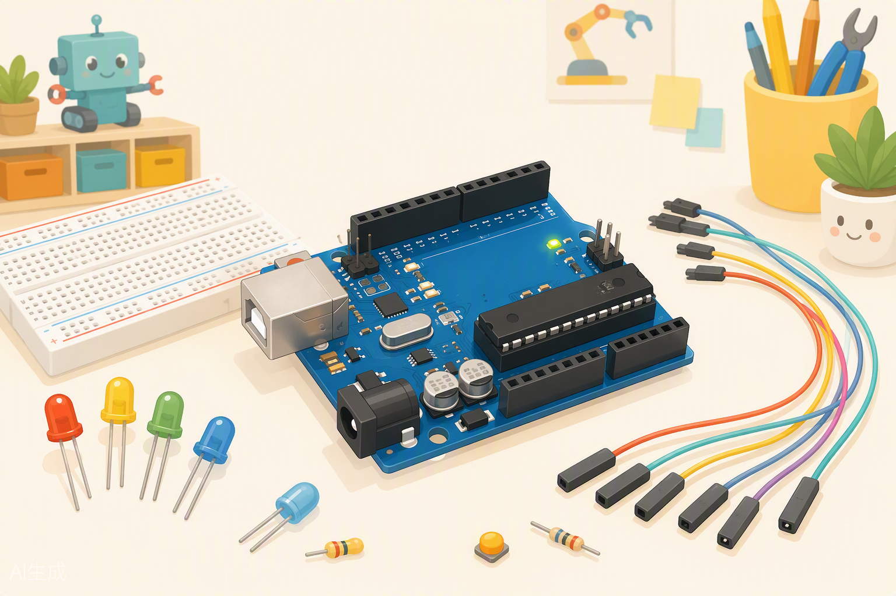
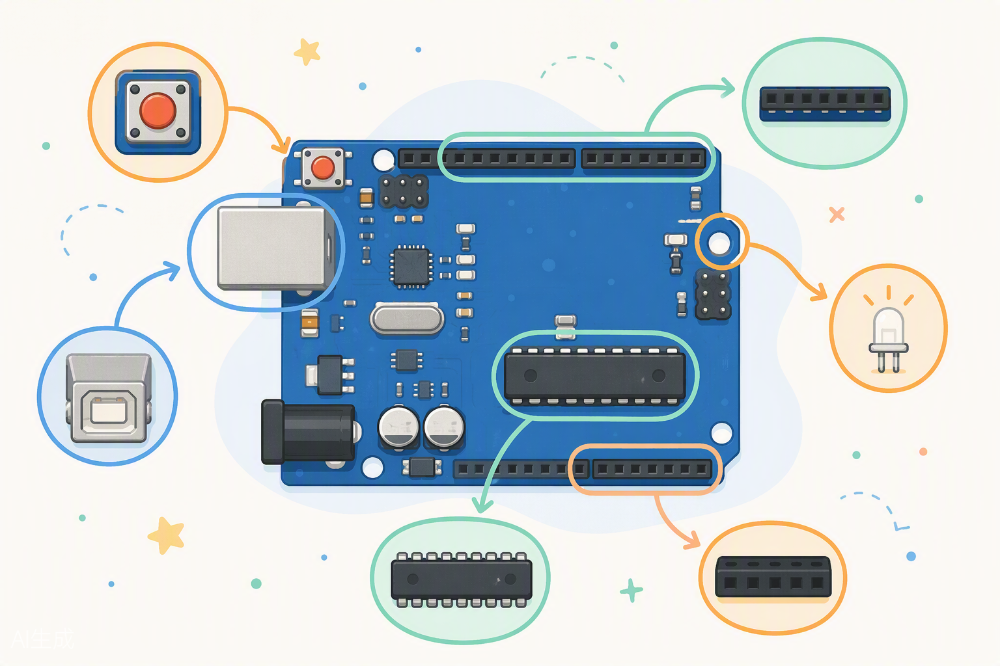
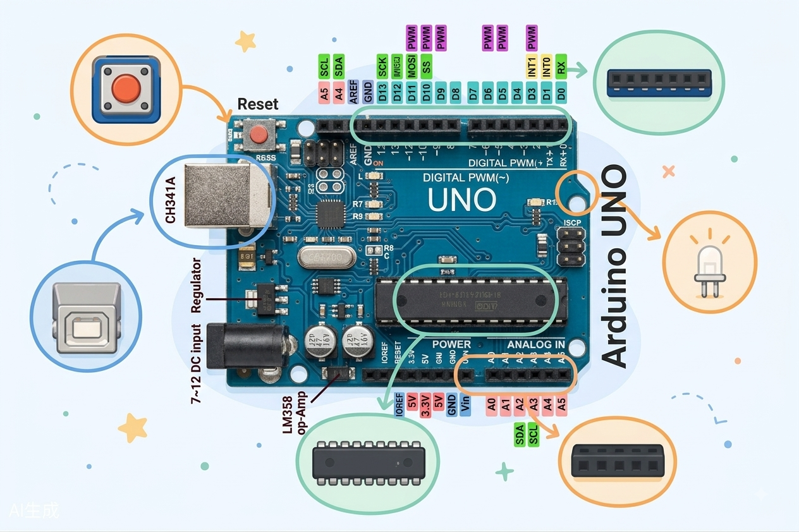

# Introducción al Arduino ☁️



¡Bienvenido, bienvenida! 🎉 Mira lo que tienes delante: una caja llena de piezas que parecen sacadas del taller de un inventor. LEDs, cables de colores, sensores, un motorcito, una pantalla... y en el centro de todo, una placa azul que va a ser tu mejor amiga durante todo este curso: **el Arduino UNO**.

Pero espera... ¿y si te dijera que hoy NO vamos a sacar nada de la caja? 😱 Hoy vamos a hacer algo todavía mejor: vamos a tener un **Arduino virtual** dentro del ordenador, usando un simulador gratuito llamado **Tinkercad Circuits**. Podrás montar circuitos, conectar LEDs y programarlos exactamente igual que con la placa real — pero sin miedo a quemar nada, sin cables que se pierden y con botón de "deshacer" incluido. Cuando dominemos el simulador, la placa real (que llegará en la Clase 03) será pan comido. Vamos allá. 💪

---

## 🎯 Objetivos de la clase

Al terminar esta clase vas a poder:

1. Explicar con tus propias palabras qué es Arduino y qué lo hizo tan revolucionario.
2. Identificar las partes importantes de la placa UNO: pines digitales, analógicos, alimentación, USB, LED del pin 13 y botón reset.
3. Distinguir un microcontrolador de un microprocesador (y entender por qué eso importa).
4. Crear tu cuenta en **Tinkercad**, montar circuitos en el simulador y cargar tu primer sketch: el mítico **Blink**.
5. Programar varios circuitos con LEDs en el simulador... ¡y pedirle ayuda a la IA como un maker moderno! 🤖

---

## 🧰 Materiales que usaremos

Hoy la lista es cortita (¡disfrútala, que no siempre será así! 😄):

| Material | ¿Para qué hoy? |
|---|---|
| Tu ordenador con acceso a internet | Todo pasará aquí 💻 |
| Una cuenta gratuita de **Tinkercad** | La creamos juntos en la Práctica 1 |
| Navegador actualizado (Chrome, Edge o Firefox) | Tinkercad funciona 100% en el navegador |
| Tu cuaderno / bitácora maker | Los ingenieros de verdad toman notas ✏️ |

> 📦 **Hoy NO necesitas el kit físico.** Ni la placa, ni los LEDs, ni las resistencias: todo lo simularemos. Guarda el kit con cariño — lo estrenaremos en la **Clase 03**, cuando ya seas un/a experto/a y no haya riesgo de que nada eche humo. 💨

---

## 🧠 Conceptos

### 1. ¿Qué es Arduino? (y qué es eso del movimiento maker)


Imagina que quieres construir una alarma que suene cuando alguien abre la puerta de tu cuarto. O un robot que esquive obstáculos. O una maceta que te avise cuando la planta tenga sed. Hace veinte años, para hacer algo así necesitabas estudiar ingeniería electrónica durante años, soldar circuitos complicados y programar en lenguajes que parecen hechizos.

Entonces, en el año 2005, un grupo de profesores de una escuela de diseño en Ivrea, Italia (sí, el nombre "Arduino" viene del bar donde se reunían 🍻), se hizo una pregunta genial:

> "¿Y si crear un circuito inteligente fuera tan fácil como armar piezas de LEGO?"

Así nació Arduino: una **plataforma de hardware y software libre** que permite a cualquier persona —un niño, un artista, un abuelo curioso— crear objetos interactivos. La placa es barata, el software es gratis, los diseños son abiertos y hay millones de personas compartiendo sus proyectos en internet.

De ahí sale el **movimiento maker**: gente normal que fabrica cosas en casa, en escuelas y en "makerspaces" (talleres comunitarios), en vez de limitarse a comprarlas. ¿Impresoras 3D? ¿Drones caseros? ¿Disfraces de Halloween con luces que reaccionan al sonido? Todo eso es cultura maker. Y hoy, tú te unes oficialmente al club. 🛠️

### 2. Microcontrolador vs. microprocesador: el cerebro y el director de orquesta

Tu ordenador tiene un **microprocesador** (un Intel o similar). Es un genio, pero un genio que necesita ayuda para todo: necesita memoria RAM aparte, disco duro aparte, tarjeta gráfica aparte, sistema operativo... Es como un chef famoso: cocina de maravilla, pero necesita una cocina completa con ayudantes.

Un **microcontrolador**, en cambio, es un **ordenador completo dentro de un solo chip**: tiene su procesador, su memoria y sus "puertas de entrada y salida" todo en el mismo paquete. No necesita sistema operativo ni disco duro. Le cargas UN programa y lo ejecuta una y otra vez, fielmente, mientras tenga energía.

| | Microprocesador (tu PC) | Microcontrolador (tu Arduino) |
|---|---|---|
| ¿Qué es? | Solo el cerebro | Cerebro + memoria + pines, todo en un chip |
| ¿Qué ejecuta? | Millones de programas a la vez | Un solo programa, repetido sin descanso |
| ¿Necesita? | RAM, disco, sistema operativo... | Casi nada: energía y tu programa |
| ¿Ejemplo? | Intel Core, Ryzen | **ATmega328P** (el chip del UNO) |
| ¿Para qué brilla? | Navegar, jugar, editar video | Controlar LEDs, motores, sensores en tiempo real |

¿La analogía? El microprocesador es el **director gerente de una empresa**: maneja mil cosas a la vez. El microcontrolador es un **operario especializado**: hace UNA tarea, pero la hace rápido, barato y sin quejarse jamás. Para encender un LED cuando un sensor detecta luz, no necesitas un gerente: necesitas al operario.

### 3. Tour por la placa UNO 🗺️



Aunque hoy trabajemos en el simulador, la placa que verás en pantalla es una **copia exacta** de la real. Conócela pieza por pieza (en Tinkercad podrás girarla y acercarte todo lo que quieras):

- **ATmega328P** — El chip negro largo del centro. ES el cerebro. Cuando digamos "programar el Arduino", en realidad programamos a este señor.
- **Pines digitales (0–13)** — La fila de agujeritos de arriba. Son las "manos" de la placa: cada uno puede ser entrada (leer, ¿hay un botón pulsado?) o salida (escribir, ¿enciendo el LED?). Solo entienden dos estados: **HIGH (encendido, ~5V)** y **LOW (apagado, 0V)**. Como un interruptor de luz: o sí o no.
- **Pines analógicos (A0–A5)** — Los de abajo a la derecha. Estos sí leen "niveles": no solo "¿hay voltaje?" sino "¿cuánto voltaje?". Perfectos para sensores (los usaremos pronto).
- **Zona de alimentación (POWER)** — Pines **5V**, **3.3V**, **GND** (tierra, el negativo de todo) y **Vin**. Son la "nevera" del circuito: de ahí sacamos energía para los componentes.
- **Puerto USB** — El cuadrado metálico grande. En la placa real cumple dos misiones: darle energía y ser el "túnel" por el que viajan tus programas hasta el chip.
- **LED del pin 13 (marcado "L")** — Un LED diminuto YA soldado en la placa, conectado al pin 13 con su resistencia incluida. Es nuestro juguete de hoy: podemos programarlo sin montar nada. En el simulador también lo verás parpadear. ✨
- **LEDs "ON", "TX" y "RX"** — ON dice "tengo energía". TX y RX parpadean cuando la placa "habla" con el ordenador.
- **Botón RESET** — Reinicia el programa desde el principio, como el "empezar de nuevo" de un videojuego.

> 🔍 **Actividad relámpago (2 minutos):** Cuando tengas tu Arduino en la pantalla de Tinkercad, encuentra cada una de estas piezas y señálalas con el dedo... ¡en la pantalla! Conocer la placa de memoria te hará rapidísimo montando circuitos.

### 4. ¿Qué es Tinkercad Circuits? Tu laboratorio virtual 🧪

**Tinkercad** es una plataforma gratuita de Autodesk (una empresa gigante de software de diseño) hecha para aprender. Dentro tiene una sección llamada **Circuits** (Circuitos) que es un **simulador de electrónica**: arrastras componentes virtuales a una mesa de trabajo, los conectas con cables virtuales, escribes tu programa... y le das a "Iniciar simulación" para verlo funcionar EN VIVO.

¿Por qué es tan genial para aprender?

| Ventaja | ¿Qué significa para ti? |
|---|---|
| 💸 Es gratis | Solo necesitas una cuenta y un navegador |
| 🔥 Nada se quema | Si conectas mal un LED, el simulador te avisa en vez de echar humo |
| ↩️ Botón deshacer | `Ctrl + Z` arregla cualquier desastre (en la vida real no existe 😅) |
| 🧩 Todos los componentes | El simulador tiene infinitos LEDs, resistencias, sensores... nunca se agotan |
| 🔬 Simulación real | El Arduino virtual ejecuta tu código de verdad, igual que la placa física |
| 🏠 Practicas en casa | No necesitas llevar el kit a ningún lado |

Las partes de la pantalla de Tinkercad Circuits que usarás hoy:

1. **Mesa de trabajo** (el centro): ahí arrastras y conectas los componentes.
2. **Panel de componentes** (a la derecha): el "estante" con todos los componentes. Tiene buscador.
3. **Botón "Código"** (arriba a la derecha): abre el editor donde escribes tu programa. Puede ser por bloques (como Scratch) o por **texto** — nosotros usaremos texto, como los profesionales.
4. **Botón "Iniciar simulación"**: el botón de magia. ▶️ Enciende tu circuito virtual.
5. **Monitor serie**: una ventanita para ver mensajes que tu Arduino te envía (la estrenaremos pronto).

> ⚠️ **Ojo, maker del futuro:** el simulador es tu gimnasio, pero no olvides que los componentes reales tienen reglas (polaridad, resistencias, cables que se aflojan). Por eso en la Clase 03 pasaremos del mundo virtual al físico con todo lo que aprendas hoy.

### 5. Prototipar: pensar como un inventor

Último concepto, y quizá el más importante del curso. Un maker NO construye el proyecto final de golpe. Trabaja así:

```
💡 IDEA  →  🧪 PROTOTIPO MÍNIMO  →  ➕ MEJORAR PASO A PASO  →  🏆 PROYECTO FINAL
```

¿Quieres construir una alarma anti-intrusos para tu cuarto? No empieces con sensores, buzzer y pantalla LCD a la vez. Empieza con **lo más pequeño que funcione**: un LED que parpadee. Luego añade un botón. Luego un buzzer. Luego el sensor. Cada paso es pequeño, cada paso FUNCIONA, y si algo falla sabes exactamente dónde buscar.

Los ingenieros de la NASA trabajan así. Los desarrolladores de videojuegos trabajan así. Y tú vas a trabajar así. Hoy nuestro prototipo mínimo es gloriosamente simple: **un LED parpadeando**. Suena humilde, pero es el "¡Hola, mundo!" de la electrónica programable.

---

## 💻 Código: nuestro primer sketch

A los programas de Arduino se les llama **sketches** (bocetos). Este es el Blink completo, comentado línea a línea. No te preocupes por memorizar la sintaxis: en las clases 2 y 3 la desmontaremos pieza por pieza. Hoy solo quiero que lo veas, lo copies y lo sientas.

```cpp
// =====================================================
// Blink — Mi primer sketch 🎉
// Hace parpadear el LED integrado del pin 13
// =====================================================

// --- setup(): se ejecuta UNA sola vez, al encender la placa ---
void setup() {
  pinMode(13, OUTPUT);   // Le digo a la placa: "el pin 13 será una SALIDA"
                         // (una puerta por la que yo mando voltaje)
}

// --- loop(): se repite INFINITAS veces, una tras otra ---
void loop() {
  digitalWrite(13, HIGH);  // Mando 5V al pin 13 → el LED se ENCIENDE
  delay(1000);             // Espero 1000 milisegundos (1 segundo) sin hacer nada
  digitalWrite(13, LOW);   // Quito el voltaje del pin 13 → el LED se APAGA
  delay(1000);             // Espero otro segundo...
  // ...y vuelta a empezar: loop() se repite sola, para siempre
}
```

¿Ves la estructura? Todo sketch tiene dos "habitaciones":

- **`setup()`** = los preparativos. Se ejecuta una vez, como calentar antes de hacer deporte.
- **`loop()`** = la rutina. Se repite sin parar, como un corazón latiendo.

Y tres instrucciones clave (solo nómbralas, ya las dominarás):

- **`pinMode()`** → configura un pin (¿entrada o salida?).
- **`digitalWrite()`** → escribe en un pin (HIGH = encender, LOW = apagar).
- **`delay()`** → hace una pausa (en milisegundos: 1000 ms = 1 s).

---

## 🔧 Manos a la obra

### Práctica 1: Tu cuenta de Tinkercad y el Blink virtual 🖥️

**Paso 1 — Crea tu cuenta.** Ve a `https://www.tinkercad.com` y pulsa **"Join Now" / "Registrarse"**. Puedes registrarte con una cuenta de Google o con un correo. *(Si eres menor, pide permiso a un adulto — es rápido y gratis.)*

**Paso 2 — Entra a Circuits.** Una vez dentro, en el menú de la izquierda busca **"Circuits" / "Circuitos"** y pulsa **"Create new Circuit" / "Crear nuevo circuito"**. Se abrirá tu mesa de trabajo vacía. Ponle un nombre épico arriba a la izquierda, como `Mi primer circuito`.

**Paso 3 — Coloca tu Arduino.** En el panel de componentes de la derecha, escribe `Arduino` en el buscador. Arrastra el **Arduino Uno R3** a la mesa de trabajo. ¡Ya tienes tu placa! Prueba a girarla con la tecla `R` y a acercarte con la rueda del ratón. Haz el tour del concepto 3: encuentra el pin 13, el LED "L", los pines GND...

**Paso 4 — Abre el editor de código.** Pulsa el botón **"Código"** (arriba a la derecha). Tinkercad puede programar con bloques de colores, pero nosotros vamos a lo profesional: arriba del editor, cambia de **"Bloques"** a **"Texto"** (te avisará de que el cambio no se puede deshacer para ese diseño; acepta sin miedo). Borra lo que haya y escribe (¡escribe, no copies y pegues! así aprende tu cerebro) el sketch **Blink** de la sección de código.

**Paso 5 — ¡Inicia la simulación!** Pulsa **"Iniciar simulación"** ▶️.

**✅ Qué debería pasar:** El LED "L" de tu Arduino virtual parpadea: 1 segundo encendido, 1 segundo apagado. Para siempre. Felicidades: acabas de programar un cerebro electrónico... sin tocar un solo cable. 🧠✨

**🔩 Si no funciona:**

| Síntoma | Probable causa | Solución |
|---|---|---|
| Error rojo al iniciar simulación | Fallo de sintaxis en el código | Lee el mensaje de error: suele ser un `;` olvidado o una llave `{}` sin cerrar |
| El LED no parpadea | Código no guardado / no editado | Asegúrate de haber escrito el Blink completo en modo Texto |
| No encuentro el Arduino | Estás en la sección equivocada | Debes estar en **Circuits**, no en 3D Designs |
| Todo va muy lento | El navegador está sufriendo | Cierra otras pestañas; Tinkercad necesita algo de memoria |

**🎛️ Mini-experimento:** Cambia los dos `delay(1000)` por `delay(100)` y vuelve a iniciar la simulación. ¿Qué pasa? Luego prueba `delay(2000)`. Estás controlando el RITMO del latido. Eso que acabas de hacer —modificar, simular, observar— es el ciclo de trabajo de todo maker.

---

### Práctica 2: Un LED externo en la breadboard virtual 🍞

El LED integrado es cómodo, pero un maker de verdad monta sus propios circuitos. Vamos a poner un LED DE VERDAD (bueno, virtual-de-verdad 😄) en una protoboard y a controlarlo. Usaremos el **pin 8**.

**Paso 1 — Añade los componentes.** En el buscador del panel, encuentra y arrastra a la mesa:

- 1 **Breadboard small** (placa de pruebas pequeña)
- 1 **LED** (elige el color que más te guste haciendo clic en él)
- 1 **Resistor / Resistencia** — haz clic en ella y escribe **220** en el valor, con unidad **Ω**

**Paso 2 — Conecta el circuito.** Haz clic en un punto y luego en el otro para crear cables:

| Desde | Hasta | Nota |
|---|---|---|
| Pin 8 del Arduino | Pata LARGA del LED (ánodo, +) pasando por la **resistencia de 220 Ω** | La resistencia va en serie; da igual si va antes o después del LED |
| Pata CORTA del LED (cátodo, −) | Pin **GND** del Arduino | La pata corta / lado plano del LED es el negativo |

Montaje detallado en la breadboard:

1. Pincha el LED con las dos patas en **filas distintas** (recuerda: los agujeros de una misma fila están unidos por dentro).
2. Conecta la resistencia entre el pin 8 (con un cable) y la fila de la pata larga del LED.
3. Conecta un cable desde la fila de la pata corta hasta **GND**.
4. Repasa: pin 8 → resistencia → LED(+) ... LED(−) → GND. Circuito cerrado. ✔️

> 💡 **Trucos de Tinkercad:** haz clic en un cable para cambiarle el color (usa rojo para positivo y negro para GND, como los profesionales). Si te equivocas, selecciónalo y bórralo, o `Ctrl + Z`. ¿El componente está torcido? Tecla `R` para rotarlo.

**Paso 3 — El código.** Cambia el pin de tu sketch del 13 al 8 (en `pinMode` y en los dos `digitalWrite`), y de paso ponle ritmo de discoteca:

```cpp
// =====================================================
// Blink externo — LED en el pin 8 con breadboard
// =====================================================

void setup() {
  pinMode(8, OUTPUT);    // Ahora el pin 8 es nuestra salida
}

void loop() {
  digitalWrite(8, HIGH); // LED encendido
  delay(500);            // medio segundo
  digitalWrite(8, LOW);  // LED apagado
  delay(500);            // medio segundo
}
```

**✅ Qué debería pasar:** Tu LED de la protoboard parpadea dos veces por segundo... ¡y el LED integrado NO! Has creado tu primer circuito controlado por software. 🥹

**🔩 Si no funciona:**

| Síntoma | Probable causa | Solución |
|---|---|---|
| LED no enciende nunca | LED al revés | Gíralo: pata larga hacia la resistencia y el pin 8 (los LED tienen polaridad, como las pilas) |
| LED no enciende nunca (2) | ¿Cambiaste `13` por `8` en AMBAS funciones? | Revisa `pinMode` y los dos `digitalWrite` |
| Aviso de corriente en el simulador | Te falta la resistencia o su valor es muy bajo | Asegúrate de que es de **220 Ω** |
| Nada pasa | Circuito abierto: cable en fila equivocada | Revisa que ambas patas del LED están en filas distintas y que la cadena llega hasta GND |

---

### Práctica 3: Luces de policía 🚔

Un LED está bien. Dos LEDs turnándose ya es un espectáculo. Vamos a crear el clásico efecto de luces de emergencia: un LED rojo y uno azul que parpadean alternados.

**El circuito:** repite el montaje de la Práctica 2 dos veces:

- LED **rojo** en el **pin 8** (con su resistencia de 220 Ω a la fila del ánodo, cátodo a GND)
- LED **azul** en el **pin 9** (con su propia resistencia de 220 Ω, cátodo a GND)

**El código:**

```cpp
// =====================================================
// Luces de policía — dos LEDs alternados
// Rojo en pin 8, azul en pin 9
// =====================================================

void setup() {
  pinMode(8, OUTPUT);   // LED rojo
  pinMode(9, OUTPUT);   // LED azul
}

void loop() {
  // Fase 1: rojo encendido, azul apagado
  digitalWrite(8, HIGH);
  digitalWrite(9, LOW);
  delay(300);

  // Fase 2: azul encendido, rojo apagado
  digitalWrite(8, LOW);
  digitalWrite(9, HIGH);
  delay(300);
}
```

**✅ Qué debería pasar:** Rojo... azul... rojo... azul... tres veces por segundo. Tu mesa de trabajo parece la escena de una persecución. 🚨

**🎛️ Mini-experimento:** ¿Puedes hacer que parpadeen DOS veces cada uno antes de cambiar? (Pista: repite las fases con delays más cortos antes de cambiar de LED). ¿Y que se enciendan los dos a la vez en modo "fiesta" cada 4 ciclos?

---

### Práctica 4: ¡Semáforo completo! 🚦

El proyecto estrella de hoy: un semáforo de verdad con tres LEDs — rojo, amarillo y verde — funcionando con la secuencia correcta.

**El circuito:** tres LEDs, cada uno con su resistencia de 220 Ω:

| LED | Pin | Color de cable sugerido |
|---|---|---|
| 🔴 Rojo | 8 | Naranja |
| 🟡 Amarillo | 9 | Amarillo |
| 🟢 Verde | 10 | Verde |

Todos los cátodos (patas cortas) van a GND. Con tres componentes iguales en fila, tu breadboard empieza a parecer un circuito de verdad.

**El código** — fíjate en la secuencia real de un semáforo:

```cpp
// =====================================================
// Semáforo — secuencia completa
// Rojo: pin 8 | Amarillo: pin 9 | Verde: pin 10
// =====================================================

void setup() {
  pinMode(8, OUTPUT);    // Rojo
  pinMode(9, OUTPUT);    // Amarillo
  pinMode(10, OUTPUT);   // Verde
}

void loop() {
  // 1. VERDE: los coches pasan (3 segundos)
  digitalWrite(10, HIGH);
  digitalWrite(8, LOW);
  digitalWrite(9, LOW);
  delay(3000);

  // 2. AMARILLO: ¡precaución! (1 segundo)
  digitalWrite(10, LOW);
  digitalWrite(9, HIGH);
  delay(1000);

  // 3. ROJO: todos quietos (3 segundos)
  digitalWrite(9, LOW);
  digitalWrite(8, HIGH);
  delay(3000);

  // 4. ROJO + AMARILLO: prepárense... (1 segundo)
  digitalWrite(9, HIGH);
  delay(1000);

  // ...y vuelta al verde: loop() se repite solo
}
```

**✅ Qué debería pasar:** Verde 3 s → amarillo 1 s → rojo 3 s → rojo+amarillo 1 s → verde... Exactamente como el semáforo de tu calle. Acabas de programar infraestructura urbana. 🏙️

**🤔 Pregunta de examen (que no es examen):** ¿Por qué en el paso 1 apagamos explícitamente los pines 8 y 9 aunque "ya deberían estar apagados"? Porque cuando el loop vuelve a empezar, el amarillo venía ENCENDIDO del paso 4. En programación, nunca des nada por sentado: deja cada pin en el estado exacto que quieres.

---

## 🤖 Desafío extra: programa con ayuda de la IA

Sorpresa: los makers de hoy tienen un superpoder que los inventores de antes no tenían — la **inteligencia artificial**. Vamos a usar **Gemini** (el chat gratuito de Google, en `gemini.google.com`) como copiloto para generar código. La regla de oro: **la IA propone, tú dispones**. Nunca uses código que no entiendas o no hayas probado.

### Ejemplo guiado: el semáforo mejorado 🚦✨

Copia este prompt tal cual en Gemini:

```
Tengo un Arduino UNO en el simulador Tinkercad. Conecté tres LEDs:
rojo al pin 8, amarillo al pin 9 y verde al pin 10, cada uno con una
resistencia de 220 ohmios a GND. Escribe un sketch comentado en español
que haga esto: el semáforo funciona normal (verde 3 s, amarillo 1 s,
rojo 3 s), pero por la noche (simulado con una variable booleana
llamada "modoNoche") solo parpadea el amarillo cada segundo.
Explícame el código línea a línea al final.
```

**Tu misión:**

1. Lee la respuesta de Gemini y **compara** el código con el semáforo que hiciste en la Práctica 4. ¿Qué tiene de nuevo? (Busca el `if` y la variable `modoNoche` — en la Clase 02 los estudiaremos a fondo).
2. Monta el circuito en Tinkercad (ya lo tienes de la Práctica 4 😉) y pega el código.
3. **Verifica con la checklist del piloto:** ¿los pines coinciden? ¿entiendes cada bloque? ¿compila y simula sin errores? ¿hace lo que pediste?
4. Cambia `modoNoche` de `false` a `true`, vuelve a simular y observa la diferencia.

¿Funcionó? Acabas de completar el ciclo profesional: **pedir → revisar → probar → ajustar**. Eso es programar con IA de verdad.

### Ahora te toca a ti: escribe TU prompt ✍️

Un buen prompt siempre incluye: **la placa**, **los componentes con sus pines**, **el comportamiento exacto paso a paso** y la petición de que te explique el código. Elige UNO de estos retos (o los tres, si te pica la curiosidad) y escribe tu propio prompt para Gemini:

1. **💡 Luces de discoteca:** 4 LEDs (pines 8, 9, 10 y 11) que se enciendan en secuencias rítmicas: primero en orden, luego en orden inverso, luego todos a la vez parpadeando. Tú defines los tiempos.
2. **🔢 Contador binario:** 3 LEDs (pines 8, 9 y 10) que cuenten del 0 al 7 en binario (apagado=0, encendido=1), cambiando cada segundo. Pista para tu prompt: dile a Gemini qué combinación de LEDs representa cada número.
3. **📡 Tu nombre en morse:** el LED integrado del pin 13 transmitiendo las iniciales de tu nombre en código morse (corto = 200 ms, largo = 600 ms). Tendrás que buscar el morse de tus letras e incluirlo en el prompt.

> 🏆 **Para presumir en la próxima clase:** trae tu prompt, el código que te dio la IA y una captura de tu circuito funcionando en Tinkercad. Premio honorífico al prompt mejor escrito. 📝

---

## 🚀 Retos

**Reto 1 — El latido acelerado (fácil) 💓**
Haz que un LED parpadee imitando el ritmo de un corazón: *toc-toc..... toc-toc.....* (dos parpadeos rápidos y una pausa larga). Pista: copia el bloque `digitalWrite` + `delay` varias veces dentro del `loop()` con delays distintos.

**Reto 2 — El coche fantástico mini (medio) 🚗💨**
Con los 3 LEDs del semáforo (pines 8, 9 y 10), programa el efecto "ping-pong": se enciende el 8, se apaga y se enciende el 9, se apaga y se enciende el 10, luego vuelve: 9, 8, y otra vez hacia adelante. Como la luz delantera de KITT. Si le pones delays de 100 ms, el efecto es hipnótico.

**Reto 3 — S.O.S. (difícil) 🆘**
El código morse de socorro es: tres cortos, tres largos, tres cortos (`··· --- ···`). Programa tu LED para que transmita S.O.S. eternamente: corto = 200 ms encendido, largo = 600 ms encendido, 200 ms apagado entre señales, y 1,5 segundos de pausa al final de cada S.O.S. Si lo consigues, oficialmente podrías pedir ayuda desde una isla desierta con un Arduino y un LED. Prioridades. 🏝️

---

## 📝 Mini-quiz

1. ¿Qué diferencia principal hay entre un microcontrolador y un microprocesador?
2. ¿Cuántas veces se ejecuta la función `setup()`? ¿Y `loop()`?
3. ¿Para qué sirve el LED marcado con "L" en la placa UNO?
4. En la Práctica 2 pusimos una resistencia de 220 Ω con el LED. ¿Por qué no conectamos el LED directamente al pin 8?
5. Nombra DOS ventajas de aprender primero en un simulador como Tinkercad antes de usar la placa física.
6. Según la filosofía del prototipado, si quieres construir un robot que esquiva obstáculos, ¿cuál debería ser tu primer paso?

<details>
<summary><strong>🔑 Ver respuestas</strong> (¡inténtalo primero sin mirar!)</summary>

1. El microcontrolador es un ordenador completo en un solo chip (procesador + memoria + pines de entrada/salida) que ejecuta un único programa repetidamente. El microprocesador es solo el cerebro y necesita componentes externos (RAM, disco, sistema operativo) para funcionar.
2. `setup()` se ejecuta **una sola vez**, al encender o reiniciar la placa. `loop()` se repite **infinitamente**, una y otra vez, mientras la placa tenga energía.
3. Es un LED ya soldado en la placa, conectado al pin 13 con su resistencia incluida. Permite probar programas (como el Blink) sin montar ningún circuito externo.
4. Porque un LED sin resistencia recibiría demasiada corriente y se quemaría (¡Ley de Ohm, vieja amiga!). La resistencia limita la corriente y protege tanto al LED como al pin del Arduino.
5. Por ejemplo: es imposible quemar componentes (el simulador avisa de los errores sin humo), puedes deshacer cualquier cambio con Ctrl+Z, tienes componentes infinitos y puedes practicar desde casa sin llevar el kit encima.
6. Empezar por el prototipo mínimo: por ejemplo, hacer que un LED o un motor respondan a una orden sencilla. Nunca montar todo el robot de golpe; se construye paso a paso, verificando que cada etapa funciona.

</details>

---

## 🏠 Para la casa

1. **El diario del inventor 📓:** Consigue una libreta (será tu "bitácora maker" durante todo el curso) y dibuja la placa UNO a mano, etiquetando todas las partes que aprendimos hoy: ATmega328P, pines digitales, analógicos, alimentación, USB, LED L, reset. Dibujar es la mejor forma de memorizar — y los grandes inventores, de Da Vinci a Edison, llenaban cuadernos con sus garabatos.
2. **Reconstruye el semáforo de memoria 🚦:** Entra en Tinkercad desde casa e intenta montar el semáforo de la Práctica 4 **sin mirar la guía**. ¿Atascado? Apunta en tu bitácora exactamente dónde te atascaste — eso es lo que repasaremos.
3. **Caza-makers 🕵️:** Busca en casa TRES aparatos que probablemente lleven un microcontrolador dentro (pistas: microondas, mando de tele, lavadora, coche juguete, timbre...). Escríbelos en tu bitácora y explica en una frase qué "programa repetitivo" hace cada uno.

---

## ⏭️ En la próxima clase...

Ya tienes un laboratorio virtual y LEDs que te obedecen. Pero ese código que escribiste... ¿qué significa DE VERDAD cada línea? En la **Clase 02 — "Aprendiendo a pensar como un programador"**, abriremos el capó del lenguaje: algoritmos, variables, condicionales y bucles, explicados sin miedo y con ejemplos que entenderás a la primera. Tu LED parpadea; ahora aprenderás a pensar como quien lo programa. ¡Nos vemos ahí, maker! 👋

---

*Curso Arduino XL · Etapa Arduino básico · Clase 01 de la serie*
