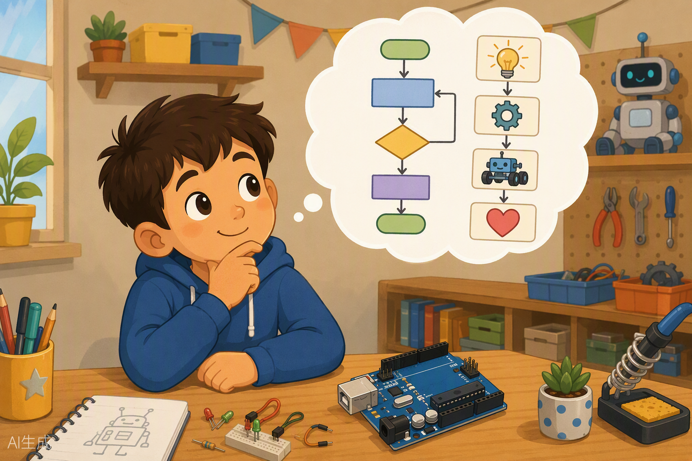
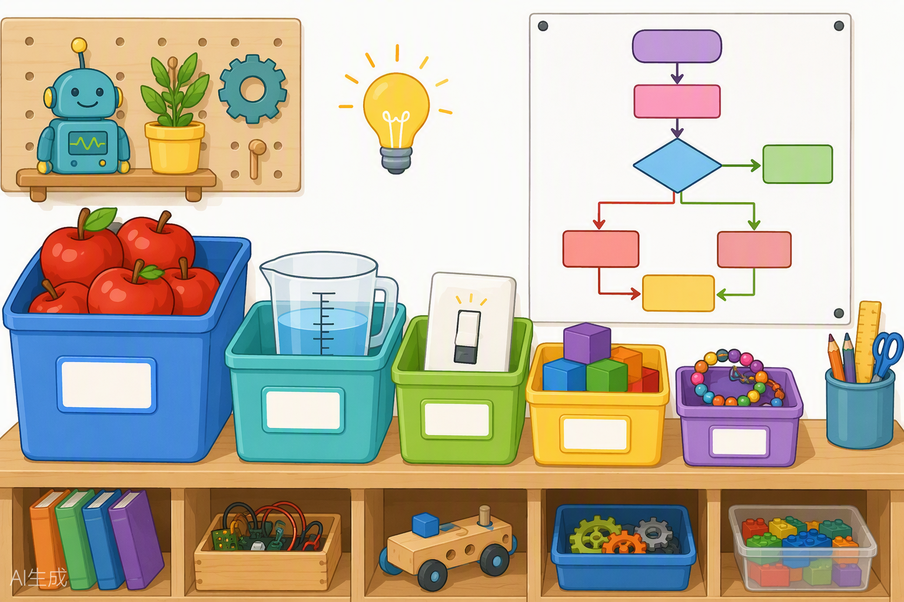

# Aprendiendo a pensar como un programador 🧠💡



¡Hola de nuevo, maker! 👋 En la clase anterior encendiste tu primer LED y viste que tú puedes mandar sobre la electricidad. Hoy vamos a dar un salto gigante: **vamos a aprender a pensar como piensa una computadora**.

Te cuento un secreto: las computadoras son muy rápidas, pero también muy, muy "literales". Si tú le dices a un amigo "calienta la leche", él entiende que debe tomar la leche, ponerla en una olla, encender la estufa... Pero una computadora necesita que le expliques **cada mini-paso**, en orden, sin saltarte nada. Eso es programar. Y hoy vas a aprender a hacerlo. 🚀

---

## 🎯 Objetivos de la clase

Al terminar esta clase serás capaz de:

1. **Explicar qué es programar y qué es un algoritmo** usando ejemplos de tu vida diaria (¡sí, como una receta de cocina! 🍳).
2. **Escribir pseudocódigo** y leer diagramas de flujo sencillos.
3. **Usar variables y tipos de datos** (`int`, `float`, `bool`, `char`, `String`) entendiéndolos como cajas etiquetadas.
4. **Tomar decisiones con `if/else` y repetir cosas con `for` y `while`** en un programa de verdad.
5. **Detectar y corregir los errores más comunes** de todo principiante (el famoso punto y coma, las llaves y las mayúsculas).

---

## 🧰 Materiales que usaremos

Hoy casi todo pasa en la pantalla, pero saca esto de tu kit XL:

| Material | ¿Para qué? |
|---|---|
| Placa Arduino UNO compatible | El cerebro que ejecutará tus programas |
| Cable USB | Para hablar con la placa y usar el Monitor Serie |
| Breadboard (protoboard) | Para la práctica con LED |
| 1 LED (cualquier color) | Nuestro "semáforo de respuestas" |
| 1 resistencia de 220 Ω | Protege al LED (¡Ley de Ohm en acción!) |
| 2-3 cables jumper | Para conectar el LED |
| Papel y lápiz ✏️ | ¡Sí! Los mejores programadores empiezan en papel |

> 💡 **Dato de profe:** hoy no necesitas sensores ni nada raro. La estrella de la clase es el **Monitor Serie**, una "ventana mágica" donde tu Arduino te escribe mensajes por el cable USB.

---

## 🧠 Conceptos

### 1. ¿Qué es programar? ¿Y qué es un algoritmo? 🍳

Un **algoritmo** es simplemente una **lista de pasos ordenados para resolver algo**. ¡Y ya los usas todos los días! Cuando sigues la receta de un sándwich:

```
1. Toma dos rebanadas de pan
2. Unta mantequilla en cada una
3. Pon queso y jamón
4. Junta las rebanadas
5. ¡Come feliz!
```

Eso es un algoritmo. Y **programar** es escribir algoritmos en un idioma que la computadora entienda (nosotros usaremos el lenguaje de Arduino, que es como un "C++ simplificado").

Imagina que le das indicaciones a un amigo para llegar a tu casa: "camina dos cuadras, gira a la derecha en la farmacia, toca el timbre azul". Si te saltas un paso o lo dices en desorden, tu amigo termina en la casa del vecino. 😅 Con Arduino pasa igual: **cada paso importa y el orden importa**.

### 2. Pseudocódigo y diagramas de flujo ✏️

Antes de escribir código "de verdad", los programadores ensayan con dos herramientas:

- **Pseudocódigo**: el algoritmo escrito en español normal, casi como código. Ejemplo:

```
SI está lloviendo ENTONCES
    llevar paraguas
SI NO
    llevar gorra
FIN
```

- **Diagrama de flujo**: el mismo algoritmo dibujado con figuras:

| Figura | Significado |
|---|---|
| Óvalo | Inicio o Fin |
| Rectángulo | Acción (hacer algo) |
| Rombo | Pregunta (decisión: sí/no) |
| Flecha | Orden en que van los pasos |



### 3. Variables: cajas con etiqueta 📦

Una **variable** es una **caja donde guardas un dato**. Cada caja tiene:

- **Un nombre** (la etiqueta): por ejemplo, `edad`.
- **Un tipo** (qué tamaño de caja y qué puede guardar).
- **Un valor** (lo que hay dentro ahora mismo).

Piensa en las cajas de la imagen de arriba: una caja grande para manzanas enteras, una jarra medidora para líquidos con decimales, un interruptor que solo vale "encendido/apagado"... ¡Cada tipo de dato tiene su caja!

| Tipo | La caja guarda... | Ejemplo | Analogía |
|---|---|---|---|
| `int` | Números enteros | `int edad = 11;` | Caja de manzanas enteras 🍎 |
| `float` | Números con decimales | `float estatura = 1.45;` | Jarra medidora 🥤 |
| `bool` | Solo `true` o `false` | `bool lloviendo = true;` | Interruptor de luz 💡 |
| `char` | Una sola letra | `char inicial = 'A';` | Una ficha de Scrabble |
| `String` | Texto completo | `String nombre = "Alex";` | Un collar de letras |

> ⚠️ **Ojo:** `char` usa comillas simples `'A'` y `String` usa comillas dobles `"Alex"`. No son intercambiables, ¡a Arduino le molesta mucho que las confundas!

### 4. Operadores: hacer cuentas y preguntar 🔢

**Operadores aritméticos** (para calcular):

| Operador | Hace | Ejemplo |
|---|---|---|
| `+` | Suma | `5 + 3` → 8 |
| `-` | Resta | `10 - 4` → 6 |
| `*` | Multiplica | `6 * 7` → 42 |
| `/` | Divide | `10 / 2` → 5 |
| `%` | Residuo (lo que sobra) | `10 % 3` → 1 |

El `%` parece raro, pero es un superhéroe: `10 % 3` pregunta "si reparto 10 caramelos entre 3 amigos, ¿cuántos sobran?" → sobra 1. Lo usaremos para saber si un número es par o impar. 😉

**Operadores de comparación** (para hacer preguntas que responden verdadero o falso):

| Operador | Pregunta... | Ejemplo |
|---|---|---|
| `==` | ¿Son iguales? | `edad == 11` |
| `!=` | ¿Son diferentes? | `edad != 10` |
| `>` | ¿Es mayor? | `edad > 5` |
| `<` | ¿Es menor? | `edad < 18` |
| `>=` | ¿Es mayor o igual? | `edad >= 11` |
| `<=` | ¿Es menor o igual? | `edad <= 12` |

> 🚨 **TRAMPA CLÁSICA:** `=` (un solo igual) es "guarda esto en la caja" y `==` (doble igual) es "¿son iguales?". Escribir `if (edad = 11)` NO pregunta nada: ¡le cambia el valor a la caja! Todo el mundo cae en esta trampa alguna vez. Hasta tu profe. 😅

### 5. Condicionales: el "si... entonces" ☔

La vida está llena de decisiones: *si llueve, llevo paraguas; si no, llevo gorra*. En código eso se escribe así:

```cpp
if (lloviendo == true) {
  // llevar paraguas ☔
} else {
  // llevar gorra 🧢
}
```

El `if` revisa la pregunta entre paréntesis. Si es verdadera, ejecuta lo de la primera llave `{ }`. Si es falsa, ejecuta lo del `else`. Las **llaves `{ }` son como los paréntesis de las ideas**: encierran todo lo que pertenece a ese bloque.

### 6. Bucles: repetir sin volverte loco 🔁

Imagina que tu profe de gimnasia dice: "haz 10 sentadillas". Nadie te dice "haz una sentadilla, haz otra sentadilla, haz otra..." diez veces. Los bucles son eso: **repetir algo varias veces sin escribirlo mil veces**.

**El bucle `for`** (cuando sabes cuántas veces repetir):

```cpp
for (int i = 1; i <= 10; i++) {
  // esto se repite 10 veces
}
```

Se lee así: "empieza con `i` valiendo 1; mientras `i` sea menor o igual a 10, ejecuta lo de las llaves; y al final de cada vuelta, súmale 1 a `i`". El `i++` es un atajo que significa "`i = i + 1`".

**El bucle `while`** (cuando repites *mientras* algo sea verdad):

```cpp
while (tengoHambre == true) {
  // comer un bocado 🍪
}
```

> ⚠️ **Cuidado con el bucle infinito:** si dentro del `while` nada cambia la condición, ¡el programa repite para siempre! Es como un lavado de platos donde nunca se acaban los platos. Terrorífico. 🍽️

### 7. Funciones: recetas reutilizables 📖

Una **función** es una mini-receta que guardas con un nombre y usas cuando quieras. Ya conoces dos: `setup()` (se ejecuta una vez al encender) y `loop()` (se repite para siempre).

Puedes crear las tuyas propias:

```cpp
int sumar(int a, int b) {   // recibe dos números...
  return a + b;             // ...y devuelve su suma
}
```

Es como la receta de "hacer chocolate caliente": la escribes una vez en tu libreta y la usas cada invierno sin tener que re-inventarla. 🍫

### 8. Los errores favoritos de todo principiante 🐛

Memoriza esta lista, te ahorrará horas de dolor de cabeza:

1. **El punto y coma `;`**: casi cada línea termina en `;`. Es el punto final de cada oración. Olvidarlo es EL error número 1.
2. **Las llaves `{ }`**: cada `{` que abres necesita su `}` que cierra. Como los paréntesis: no dejes ninguno huérfano.
3. **Mayúsculas y minúsculas**: para Arduino, `Edad`, `edad` y `EDAD` son tres cajas DIFERENTES. `serial.print` no existe: es `Serial.print` (con S y P mayúsculas).
4. **Confundir `=` con `==`**: ya lo sabes, pero te tropezarás igual. Todos lo hacemos. 😄

---

## 💻 Código

### Sketch 1: Calculadora de edad 🎂

Copia esto en el IDE de Arduino, súbelo y abre el **Monitor Serie** (el icono de lupa 🔍 arriba a la derecha; asegúrate de poner **9600 baudios** abajo):

```cpp
// ============================================
// CLASE 02 - Sketch 1: Calculadora de edad
// ============================================

void setup() {
  Serial.begin(9600);            // Abre el "telefono" con la compu a 9600 baudios

  int anioNacimiento = 2014;     // Caja con tu año de nacimiento (cámbialo por el tuyo)
  int anioActual = 2025;         // Caja con el año actual
  int edad = anioActual - anioNacimiento;  // Restamos y guardamos el resultado

  Serial.print("Naciste en: ");  // Escribe texto SIN bajar de linea
  Serial.println(anioNacimiento); // Escribe el numero y baja de linea (println = print + linea nueva)

  Serial.print("Entonces tienes: ");
  Serial.print(edad);
  Serial.println(" anios. Wow, ya eres todo un maker!");

  if (edad >= 10) {              // Pregunta: ¿tu edad es 10 o mas?
    Serial.println("Puedes con este curso y mas! 💪");
  } else {                       // Si no...
    Serial.println("Eres pequenio pero valiente, adelante!");
  }
}

void loop() {
  // Hoy no necesitamos repetir nada: el loop se queda vacio
}
```

### Sketch 2: ¿Par o impar? 🎲

```cpp
// ============================================
// CLASE 02 - Sketch 2: Detector de par/impar
// ============================================

void setup() {
  Serial.begin(9600);              // Abre el Monitor Serie

  int numero = 7;                  // El numero que vamos a revisar (¡cámbialo!)

  Serial.print("El numero ");
  Serial.print(numero);

  if (numero % 2 == 0) {           // Si el residuo de dividir entre 2 es 0...
    Serial.println(" es PAR ✅");  // ...es par
  } else {                         // Si no...
    Serial.println(" es IMPAR 🎲"); // ...es impar
  }
}

void loop() {
  // Nada que repetir por ahora
}
```

### Sketch 3: Tabla de multiplicar con `for` 🔁

```cpp
// ============================================
// CLASE 02 - Sketch 3: Tabla de multiplicar
// ============================================

int tablaDel = 7;                  // ¿De qué numero quieres la tabla? (cámbialo)

void setup() {
  Serial.begin(9600);

  Serial.print("=== LA TABLA DEL ");
  Serial.print(tablaDel);
  Serial.println(" ===");

  // Repite 10 veces: i vale 1, luego 2, 3... hasta 10
  for (int i = 1; i <= 10; i++) {
    Serial.print(tablaDel);        // Escribe "7"
    Serial.print(" x ");           // Escribe " x "
    Serial.print(i);               // Escribe el numero de la vuelta
    Serial.print(" = ");
    Serial.println(tablaDel * i);  // Escribe el resultado y baja de linea
  }

  Serial.println("=== ¡FIN! Facil, ¿no? ===");
}

void loop() {
  // La tabla ya se escribio en el setup
}
```

### Sketch 4: Mi primera función propia 📖

```cpp
// ============================================
// CLASE 02 - Sketch 4: Funcion "cuadrado"
// ============================================

// Esta es NUESTRA funcion: recibe un numero y devuelve su cuadrado
int cuadrado(int numero) {         // "int" al inicio = la funcion devuelve un entero
  int resultado = numero * numero; // Multiplica el numero por si mismo
  return resultado;                // Entrega el resultado a quien la llamó
}

void setup() {
  Serial.begin(9600);

  for (int i = 1; i <= 5; i++) {   // Repite 5 veces
    Serial.print("El cuadrado de ");
    Serial.print(i);
    Serial.print(" es ");
    Serial.println(cuadrado(i));   // ¡Llamamos a nuestra receta reutilizable!
  }
}

void loop() {
  // Todo listo en el setup
}
```

---

## 🔧 Manos a la obra

### Práctica 1: Conversando con tu Arduino por el Monitor Serie 💬

**¿Qué haremos?** Que tu Arduino te escriba mensajes y haga cuentas por ti, sin conectar ni un solo componente.

**Conexión física:** ¡Súper fácil hoy!

| Conexión | Detalle |
|---|---|
| Arduino ↔ Computadora | Solo el cable USB. ¡Eso es todo! |

**Pasos:**

1. Abre el IDE de Arduino y crea un sketch nuevo.
2. Copia el **Sketch 1 (Calculadora de edad)** de arriba.
3. Cambia `anioNacimiento` por TU año de nacimiento. 📅
4. Presiona el botón de la flecha ➡️ ("Subir") y espera a que diga "Subido".
5. Abre el Monitor Serie (lupa 🔍 arriba a la derecha) y verifica que abajo diga **9600 baud**.
6. Presiona el botón **RESET** de la placa (el botoncito rojo cerca del USB) para ver el mensaje otra vez.

**¿Qué debería pasar?** En la ventana del Monitor Serie aparece tu año de nacimiento, tu edad calculada y un mensaje motivador. 🎉

**¿No funciona?** Lista de rescate:
- ¿La ventana está llena de símbolos raros como `⸮⸮⸮`? → Los baudios están mal: pon **9600** en el menú desplegable de abajo.
- ¿No aparece nada? → Presiona RESET en la placa, o verifica que subiste el sketch correcto.
- ¿Error al compilar con "expected ';'"? → Te falta un punto y coma. Lee el mensaje de error: te dice la línea exacta. 😉

### Práctica 2: El LED que detecta pares 💡

**¿Qué haremos?** Combinar TODO lo de hoy: el Arduino revisa si un número es par y, si lo es, enciende un LED. ¡Tu primera mezcla de cerebro (código) y músculo (electrónica)!

**Conexión física:**

| Componente | Conexión |
|---|---|
| Pin 13 de Arduino | → Pata larga (ánodo, +) del LED **a través de la resistencia de 220 Ω** |
| Pata corta (cátodo, −) del LED | → GND de Arduino |
| Resistencia 220 Ω | En serie entre el pin 13 y el ánodo del LED |

> Recuerda la clase 1: el LED tiene una pata larga (+) y una corta (−), y la resistencia es su "cinturón de seguridad". Sin ella, el LED se quema. 🔥

**Código:** copia esto en un sketch nuevo:

```cpp
// ============================================
// PRACTICA 2: LED detector de numeros pares
// ============================================

int ledPin = 13;    // Caja que guarda el numero del pin del LED
int numero = 8;     // El numero a revisar: ¡CÁMBIALO y observa!

void setup() {
  Serial.begin(9600);        // Abre el Monitor Serie
  pinMode(ledPin, OUTPUT);   // Configura el pin 13 como SALIDA (manda voltaje)

  Serial.print("Revisando el numero ");
  Serial.println(numero);

  if (numero % 2 == 0) {              // ¿El residuo entre 2 es cero?
    digitalWrite(ledPin, HIGH);       // ¡PAR! Enciende el LED (manda 5V)
    Serial.println("Es PAR: LED encendido 💡");
  } else {
    digitalWrite(ledPin, LOW);        // ¡IMPAR! LED apagado
    Serial.println("Es IMPAR: LED apagado 🌙");
  }
}

void loop() {
  // La decision ya se tomo en el setup
}
```

**Pasos:**

1. Monta el LED con su resistencia según la tabla (¡con la placa desconectada del USB mientras armas!).
2. Conecta el USB, copia el código y súbelo.
3. Observa el LED y abre el Monitor Serie.
4. Ahora el juego: cambia `numero = 8` por `7`, sube de nuevo, presiona RESET y mira qué pasa. Prueba con `100`, con `33`, con tu edad...

**¿Qué debería pasar?** Con número par → LED encendido + mensaje "Es PAR". Con impar → LED apagado + mensaje "Es IMPAR".

**¿No funciona?** Lista de rescate:
- ¿El LED nunca enciende ni con números pares? → Revisa que la pata larga vaya hacia el pin 13 (quizá lo pusiste al revés) y que la resistencia esté bien conectada.
- ¿Compila pero no sube? → Revisa que elegiste el puerto COM correcto en *Herramientas → Puerto*.
- ¿Dice "'digitalWrite' was not declared"? → Seguro escribiste `DigitalWrite` o `digitalwrite`. ¡Mayúsculas y minúsculas importan!

---

## 🚀 Retos

### Reto 1: La máquina de las edades futuras ⭐
Modifica el Sketch 1 para que, además de tu edad actual, te diga cuántos años tendrás **dentro de 10 años** y cuántos años **tenías hace 5**. Pista: solo necesitas sumar y restar a la variable `edad`. Sin tocar el LED, puro Monitor Serie.

### Reto 2: Semáforo de calificaciones ⭐⭐
Crea un programa con una variable `nota` (un `int` del 0 al 10) que imprima en el Monitor Serie:
- "Reprobaste 😢" si la nota es menor que 6
- "Pasaste raspando 😅" si es 6 o 7
- "¡Excelente! 🏆" si es 8 o más

Pista: puedes poner un `if` dentro del `else` de otro `if`. Se llama "if anidado" y suena a comida de pájaro, pero funciona de maravilla. 🐦

### Reto 3: El parpadeo multiplicador ⭐⭐⭐
Combina bucles con el LED de la Práctica 2: escribe un programa que haga parpadear el LED del pin 13 **tantas veces como diga una variable `veces`** (prueba con 3, 5, 7...). Usa un `for`, `digitalWrite` y `delay(300)` entre encendido y apagado. Si logras que parpadee exactamente el número de veces que pides, felicidades: oficialmente piensas como programador. 🎓

---

## 📝 Mini-quiz

1. ¿Qué es un algoritmo?
2. Si escribo `int edad = 11;`, ¿qué es `int`, qué es `edad` y qué es `11`?
3. ¿Cuál es la diferencia entre `=` y `==`?
4. ¿Qué imprime `Serial.println(14 % 4);`? ¿Y para qué sirve ese operador?
5. Nombra los tres errores más comunes del principiante que vimos en clase.

<details>
<summary>👉 Haz clic aquí para ver las respuestas (¡pero intenta primero!)</summary>

1. Una lista de pasos ordenados para resolver un problema o lograr algo, como una receta de cocina.
2. `int` es el **tipo** (el tamaño de la caja: números enteros), `edad` es el **nombre** (la etiqueta de la caja) y `11` es el **valor** (lo que guardamos dentro).
3. `=` **guarda** un valor en una variable (asignación). `==` **pregunta** si dos cosas son iguales (comparación).
4. Imprime `2` (porque 14 entre 4 cabe 3 veces y sobran 2). El operador `%` da el **residuo** de una división; sirve, por ejemplo, para saber si un número es par (`numero % 2 == 0`).
5. Olvidar el punto y coma `;`, dejar llaves `{ }` sin cerrar, y equivocarse de mayúsculas/minúsculas (también vale mencionar confundir `=` con `==`).
</details>

---

## 🏠 Para la casa

1. **Algoritmo de la vida real** ✏️: en una hoja de papel, escribe el pseudocódigo (mínimo 8 pasos) de cómo te preparas para ir al colegio por la mañana. Debe incluir **al menos una decisión** (por ejemplo: "si está lloviendo, busco el paraguas") y **una repetición** (por ejemplo: "cepilla los dientes durante 2 minutos"). Trae tu hoja a la próxima clase: ¡la vamos a revisar entre todos!

2. **Detective de errores** 🕵️: copia este código a mano en tu cuaderno y encuentra los **4 errores** escondidos (no lo subas al IDE todavía: usa tus ojos de detective). En la próxima clase lo compilamos y comprobamos si los encontraste todos:

```cpp
int numero = 5

void setup() {
  serial.begin(9600);
  if (numero = 5) {
    Serial.println("Es cinco");
  }
```

---

## ⏭️ Adelanto de la siguiente clase

En la **Clase 03** por fin nos ponemos serios con el IDE de Arduino: vas a conocer a fondo `setup()` y `loop()`, los pines digitales de verdad, `pinMode`, `digitalWrite`, `digitalRead`... y conectarás tu primer **pulsador**: el momento en que tú le hablas al Arduino con el dedo y él te responde con luz. 💡👆 Empieza la era de la interacción, ¡no te la pierdas!

---

*¡Nos vemos en la próxima clase, futuro programador! Recuerda: los errores no son fallas, son pistas. 🕵️‍♂️*
