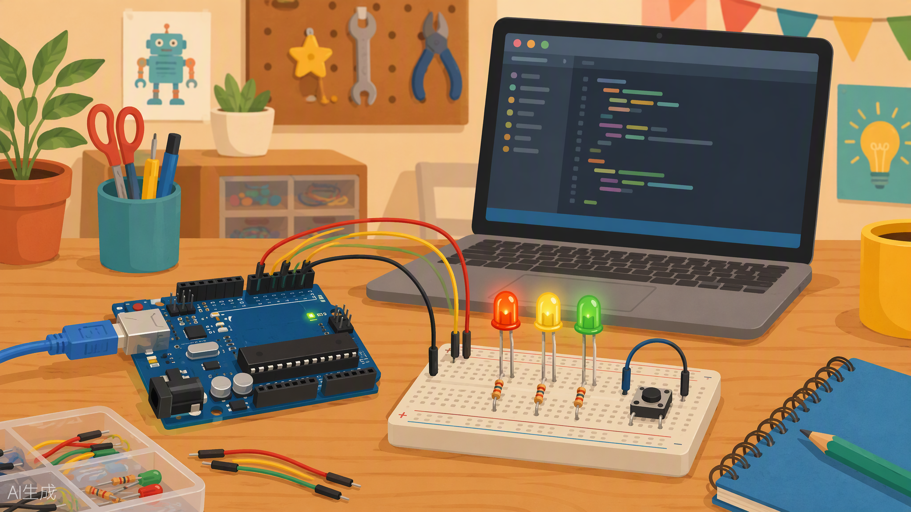
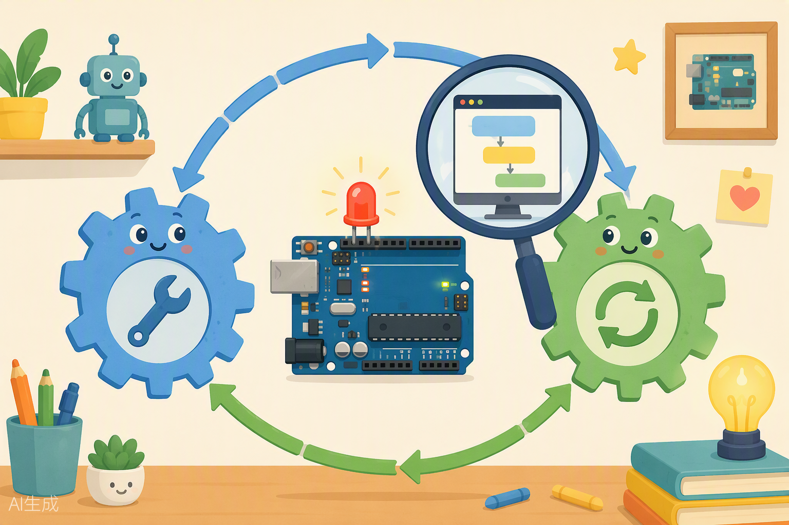

# Clase 03 — Tus primeros programas de verdad: LEDs, botones y Monitor Serie



¡Hola de nuevo, maker! 👋 Llegó el día que tanto esperábamos: hoy **por fin sacamos el kit físico de la caja**. 🎉 En las clases 1 y 2 dominaste el simulador de Tinkercad; hoy ese conocimiento salta al mundo real. Vas a instalar el IDE de Arduino, conectar tu placa de verdad por primera vez y descubrir que todo lo que hacías en la pantalla funciona IGUAL en la mesa... solo que ahora los LEDs brillan de verdad y puedes tocarlos. Además, construiremos un semáforo, haremos que un botón controle la luz y abriremos una "ventana mágica" llamada Monitor Serie para espiar lo que tu Arduino está pensando. Agarra tu kit, que esto se pone bueno. 🚦

---

## 🎯 Objetivos de la clase

Al terminar esta clase vas a poder:

1. Instalar el **Arduino IDE**, conectar tu placa real y cargarle un programa por USB.
2. Explicar con tus propias palabras qué son `setup()` y `loop()` y por qué TODO sketch de Arduino los necesita.
3. Usar `pinMode()`, `digitalWrite()` y `digitalRead()` para controlar y leer pines digitales.
4. Entender qué significan `HIGH` y `LOW` (los niveles lógicos) y por qué importan.
5. Conectar un pulsador correctamente usando una resistencia pull-down (y entender por qué sin ella tu Arduino "alucina").
6. Usar el Monitor Serie para depurar tus programas como un/a profesional.

---

## 🧰 Materiales que usaremos

De tu kit Arduino XL saca esto y déjalo sobre la mesa:

- 1 × Placa Arduino UNO (compatible) + cable USB
- 1 × Breadboard (protoboard)
- 3 × LEDs: 1 rojo 🔴, 1 amarillo 🟡, 1 verde 🟢
- 4 × Resistencias de 220Ω (franjas rojo-rojo-marrón)
- 1 × Resistencia de 10kΩ (franjas marrón-negro-naranja) — si tu kit solo trae 220Ω, no pasa nada: te explico el plan B
- 1 × Pulsador (botón de 4 patitas)
- Cables jumper macho-macho (unos 10)
- Tu computadora con el IDE de Arduino instalado

> 💡 **Dato de profe:** el botón del kit tiene 4 patitas, pero por dentro solo son 2 contactos. Las patitas del mismo lado están unidas entre sí. Ya lo veremos en la práctica 2.

---

## 🧳 Del simulador a la realidad: estrenamos el kit físico

Llevas dos clases montando circuitos en Tinkercad. Ahora toca el momento de la verdad: **la placa física**. La buena noticia es que ya sabes el 90% de lo necesario — el simulador copia la realidad con mucha fidelidad. El otro 10% son las diferencias entre el mundo virtual y el mundo real, y hoy las dominarás todas.

### Simulador vs. placa real: lo que cambia

| | Tinkercad (virtual) | Tu kit (real) |
|---|---|---|
| Si te equivocas | `Ctrl + Z` y a otra cosa 😌 | Un LED puede quemarse 💨 (tranqui, son baratos) |
| Resistencias | Un clic y escribes el valor | Tienes que identificarlas por sus franjas de colores |
| Cables | Siempre perfectos | Se aflojan, se doblan, se pierden debajo de la mesa |
| El programa llega por... | El botón "Iniciar simulación" | El **cable USB** y el botón "Subir" del IDE |
| Energía | Infinita y mágica | Del USB del ordenador o de un adaptador |

> ⚠️ **Las 3 reglas de oro de la placa real:**
> 1. **Nunca** unas 5V y GND con un cable directo (cortocircuito).
> 2. **Siempre** resistencia de 220 Ω con cada LED. Sin excepciones.
> 3. **Desconecta el USB** (o al menos no subas programas) mientras cambias cables. Monta con la placa "fría".

### Práctica 0: instalar el IDE y encender el Blink real 🖥️

Esto es lo que en la Clase 01 hicimos virtual; ahora lo hacemos con tu placa física.

**Paso 1 — Instala el Arduino IDE.** Ve a `https://www.arduino.cc/en/software` y descarga el Arduino IDE para tu sistema (Windows, Mac o Linux). Instálalo como cualquier programa. *(Alternativa: si no puedes instalar nada, existe el Arduino Web Editor, que funciona desde el navegador.)*

**Paso 2 — Conecta la placa.** Con el cable USB, une tu UNO al ordenador. Debería encenderse el LED verde "ON". Si es la primera vez, quizá también parpadee el LED "L" (¡muchas placas vienen de fábrica con el Blink ya cargado!).

**Paso 3 — Dile al IDE qué placa tienes.** En el menú **Herramientas → Placa**, elige **"Arduino Uno"**.

**Paso 4 — Elige el puerto.** En **Herramientas → Puerto**, selecciona el puerto que diga "Arduino Uno" (en Windows verás algo como `COM3`, `COM5`...; en Mac/Linux algo como `/dev/ttyUSB0` o `/dev/cu.usbmodem...`).

**Paso 5 — Abre el ejemplo Blink.** Menú **Archivo → Ejemplos → 01.Basics → Blink**. Es el mismo código que conoces de la Clase 01 (quizá use `LED_BUILTIN` en vez de `13`: es lo mismo, es el nombre oficial del LED integrado).

**Paso 6 — ¡Carga!** Pulsa el botón de la **flecha →** (Subir). Verás abajo "Compilando..." y luego "Subiendo...", y los LEDs TX/RX de la placa bailarán unos segundos.

**✅ Qué debería pasar:** El LED "L" de tu placa REAL parpadea: 1 segundo encendido, 1 segundo apagado. Míralo bien: ese brillo es tuyo, lo programaste tú. Y sí, se siente distinto al simulador. 🥹✨

**🔩 Si no funciona:**

| Síntoma | Probable causa | Solución |
|---|---|---|
| El LED "ON" no enciende | Cable USB solo de carga o mal puerto | Prueba otro cable y otro puerto USB |
| "Error al subir" / no aparece puerto | Falta el driver (en algunas placas compatibles con chip CH340) | Instala el driver CH340 (busca "CH340 driver" + tu sistema) |
| Puerto en gris / no seleccionable | Placa no reconocida | Desconecta, reconecta, reinicia el IDE |
| Compila pero no sube | Puerto equivocado elegido | Revisa Herramientas → Puerto |
| Sube pero el LED no parpadea | El parpadeo es lento | Obsérvalo 5 segundos |

**🎛️ Debería sonarte:** modifica los `delay()`, sube de nuevo y observa. Es exactamente el mismo ciclo —modificar, cargar, observar— que hacías en Tinkercad. El simulador te entrenó para esto. 💪

---

## 🧠 Conceptos



### 1. La anatomía de un sketch: `setup()` y `loop()`

Un **sketch** es el nombre que le damos a un programa de Arduino. Todo sketch, desde el más simple hasta el más sofisticado, tiene esta estructura:

```cpp
void setup() {
  // Esto se ejecuta UNA sola vez, al encender la placa
}

void loop() {
  // Esto se ejecuta en CÍRCULO, una y otra vez, para siempre
}
```

Piensa en tu rutina de la mañana:

- **`setup()` = preparar todo antes de empezar el día.** Te vistes, desayunas, metes los cuadernos en la mochila. Lo haces **una sola vez**. No te vistes ocho veces seguidas (espero 😄).
- **`loop()` = el día en sí.** Vas a clases, juegas, comes, y al día siguiente... se repite. Y se repite. Y se repite. Tu Arduino ejecuta el `loop()` **millones de veces por segundo** mientras tenga energía.

En el `setup()` normalmente le dices a la placa *cómo va a usar cada pin*. En el `loop()` pones la lógica de tu invento: qué encender, qué leer, qué decidir.

### 2. Los tres mosqueteros: `pinMode`, `digitalWrite`, `digitalRead`

| Comando | ¿Qué hace? | Analogía |
|---|---|---|
| `pinMode(pin, MODO)` | Le dice al pin si será **entrada** (`INPUT`) o **salida** (`OUTPUT`) | Como ponerle un letrero a una puerta: "SOLO ENTRADA" o "SOLO SALIDA" |
| `digitalWrite(pin, VALOR)` | Saca voltaje por un pin: `HIGH` (5V) o `LOW` (0V) | Como un interruptor de luz: lo mueves tú con el dedo... ¡pero aquí lo mueve tu código! |
| `digitalRead(pin)` | Lee qué voltaje hay en un pin y devuelve `HIGH` o `LOW` | Como preguntarle a alguien: "¿la luz está prendida o apagada?" |

**Regla de oro:** antes de usar un pin, configúralo con `pinMode()` en el `setup()`. Es como llegar a la cocina: primero decides si vas a cocinar (salida) o a probar lo que hizo otro (entrada).

### 3. HIGH y LOW: los niveles lógicos

En el mundo digital no hay "más o menos encendido": solo hay **dos estados**, como un interruptor de pared:

| Nivel lógico | Voltaje (UNO) | Significado | En un LED |
|---|---|---|---|
| `HIGH` | 5 voltios | "Sí", "encendido", 1 | ✨ Brilla |
| `LOW` | 0 voltios (GND) | "No", "apagado", 0 | ⚫ Apagado |

A estos dos estados les llamamos **niveles lógicos**. Cuando tú escribes `digitalWrite(13, HIGH)` estás diciendo: "pin 13, dame 5 voltios". El LED conectado ahí recibe corriente y se enciende. Con `LOW` cortas el suministro y se apaga.

### 4. El problema del pin flotante (y la resistencia pull-down/pull-up)

Aquí viene el concepto más importante del día, así que presta atención. 👀

Imagina que conectas un pin como `INPUT` a un botón, pero **sin resistencia a ningún lado**. Cuando NO presionas el botón, el pin no está conectado a nada: ni a 5V ni a GND. Ese pin queda **flotando**, como un globo suelto en el viento. Y un pin flotante lee valores locos: a veces `HIGH`, a veces `LOW`, aunque nadie toque nada. Tu Arduino empieza a "alucinar" porque el pin actúa como una antena que capta ruido eléctrico del ambiente (¡hasta tu mano cerca puede cambiarlo!).

La solución es anclar el pin a un estado conocido:

- **Resistencia pull-down** ("tira hacia abajo"): conecta el pin a **GND** a través de una resistencia (10kΩ es el valor clásico). Así, cuando el botón NO está presionado, el pin lee `LOW` con seguridad. Al presionar, el botón conecta el pin directamente a 5V y lee `HIGH`. La resistencia evita un cortocircuito entre 5V y GND.
- **Resistencia pull-up** ("tira hacia arriba"): lo contrario. Ancla el pin a **5V**, así que en reposo lee `HIGH` y al presionar el botón (que lo conecta a GND) lee `LOW`.

> 🤔 **¿Por qué una resistencia y no un cable directo?** Porque si unieras el pin directo a GND con un cable, al presionar el botón conectarías 5V directo a GND: **cortocircuito**. La resistencia deja pasar solo una corriente minúscula (por la Ley de Ohm: I = 5V / 10.000Ω = 0,5 mA) y todo queda seguro. Es un "amarrar suave", no un "amarrar con cadena".

**Truco de profe:** el Arduino UNO ya trae pull-ups internos que puedes activar con `pinMode(pin, INPUT_PULLUP)` sin poner ninguna resistencia externa. Pero hoy lo haremos "a la antigua", con resistencia física, para que veas y entiendas qué está pasando.

### 5. Debounce: cuando un botón es más ruidoso que tu prima en un cumpleaños

Los botones mecánicos no hacen contacto limpio y perfecto. Al presionarlos, las láminas metálicas **rebotan** durante unas milésimas de segundo, como una pelota al caer. Para el Arduino, que es rapidísimo, un solo "clic" puede verse como 5 o 6 pulsaciones. A eso se le llama **rebote** (*bounce*), y corregirlo se llama **debounce**.

La técnica básica es facilísima: después de detectar un cambio, esperas un ratito (por ejemplo, 50 milisegundos) antes de volver a mirar el botón. Es como cuando tocas el timbre de una casa: presionas una vez y esperas; no presionas 20 veces por segundo. Hoy usaremos la versión sencilla con `delay()`. Más adelante aprenderemos formas más elegantes.

### 6. El Monitor Serie: la ventana de depuración

Tu Arduino no tiene pantalla (todavía 😏). ¿Cómo sabes qué está "pensando"? Con la **comunicación serie**: el Arduino manda mensajes de texto por el mismo cable USB que usas para programarlo, y tú los lees en el **Monitor Serie** del IDE.

Los tres comandos clave:

| Comando | ¿Qué hace? |
|---|---|
| `Serial.begin(9600);` | Abre la comunicación a 9600 baudios (la velocidad de la conversación). Va en el `setup()`. |
| `Serial.print("Hola");` | Escribe texto **sin** salto de línea (el siguiente texto sale pegado). |
| `Serial.println("Hola");` | Escribe texto **con** salto de línea al final (cada mensaje en su renglón). |

**Analogía:** es como el panel de mensajes de un videojuego. Cuando algo no funciona, no adivinas: abres el panel y lees qué está pasando por dentro. A esto le llamamos **depurar** (debugging), y es el superpoder número 1 de todo programador.

> ⚠️ **Importante:** en el Monitor Serie debes seleccionar **9600 baudios** abajo a la derecha, igual que en el `Serial.begin()`. Si las velocidades no coinciden, verás jeroglíficos raros, como sintonizar mal una radio.

---

## 💻 Código

### Sketch A — Semáforo (Práctica 1)

```cpp
// ============================================
// SEMÁFORO — Clase 03
// Rojo en pin 8, Amarillo en pin 9, Verde en pin 10
// ============================================

// --- Constantes: nombres bonitos para los pines ---
const int PIN_ROJO     = 8;    // LED rojo conectado al pin 8
const int PIN_AMARILLO = 9;    // LED amarillo conectado al pin 9
const int PIN_VERDE    = 10;   // LED verde conectado al pin 10

void setup() {
  // Configuramos los tres pines como SALIDA (vamos a "sacar" voltaje por ellos)
  pinMode(PIN_ROJO, OUTPUT);
  pinMode(PIN_AMARILLO, OUTPUT);
  pinMode(PIN_VERDE, OUTPUT);
}

void loop() {
  // --- FASE 1: VERDE (pasan los coches) ---
  digitalWrite(PIN_VERDE, HIGH);    // Enciende el verde (le da 5V)
  delay(4000);                      // Espera 4 segundos sin hacer nada
  digitalWrite(PIN_VERDE, LOW);     // Apaga el verde (0V)

  // --- FASE 2: AMARILLO (¡precaución!) ---
  digitalWrite(PIN_AMARILLO, HIGH); // Enciende el amarillo
  delay(1500);                      // El amarillo siempre dura menos: 1,5 s
  digitalWrite(PIN_AMARILLO, LOW);  // Apaga el amarillo

  // --- FASE 3: ROJO (alto total) ---
  digitalWrite(PIN_ROJO, HIGH);     // Enciende el rojo
  delay(4000);                      // Espera 4 segundos
  digitalWrite(PIN_ROJO, LOW);      // Apaga el rojo

  // Al llegar aquí, el loop() vuelve a empezar: verde otra vez 🔄
}
```

### Sketch B — LED controlado por pulsador con pull-down (Práctica 2)

```cpp
// ============================================
// BOTÓN QUE ENCIENDE UN LED — Clase 03
// Pulsador en pin 2 (con pull-down), LED en pin 13
// ============================================

const int PIN_BOTON = 2;   // El pulsador se lee en el pin 2
const int PIN_LED   = 13;  // El LED está en el pin 13

void setup() {
  pinMode(PIN_BOTON, INPUT);    // El botón es una ENTRADA: el Arduino "escucha"
  pinMode(PIN_LED, OUTPUT);     // El LED es una SALIDA: el Arduino "ordena"
}

void loop() {
  int estadoBoton = digitalRead(PIN_BOTON);  // Leemos el botón: HIGH o LOW

  if (estadoBoton == HIGH) {      // Si el botón está presionado...
    digitalWrite(PIN_LED, HIGH);  // ...enciende el LED
  } else {                        // Si no...
    digitalWrite(PIN_LED, LOW);   // ...apágalo
  }
}
```

### Sketch C — Contador de pulsaciones con Monitor Serie (Práctica 3, opcional)

```cpp
// ============================================
// CONTADOR DE PULSACIONES — Clase 03
// Botón en pin 2 (pull-down). Cuenta en el Monitor Serie.
// ============================================

const int PIN_BOTON = 2;       // Pin donde leemos el pulsador
int contador = 0;              // Aquí guardamos cuántas veces se presionó
int estadoAnterior = LOW;      // Memoria del estado del botón en la vuelta anterior

void setup() {
  pinMode(PIN_BOTON, INPUT);   // El botón es entrada
  Serial.begin(9600);          // Abrimos la comunicación serie a 9600 baudios
  Serial.println("Contador listo. Presiona el boton!");  // Mensaje de bienvenida
}

void loop() {
  int estadoActual = digitalRead(PIN_BOTON);   // Leemos el botón ahora

  // Solo contamos cuando el botón PASA de no presionado a presionado
  if (estadoActual == HIGH && estadoAnterior == LOW) {
    contador = contador + 1;   // Sumamos 1 al contador
    Serial.print("Pulsacion numero: ");  // Imprime la etiqueta (sin salto)
    Serial.println(contador);            // Imprime el número (con salto)
    delay(50);                 // DEBOUNCE: esperamos 50 ms para ignorar rebotes
  }

  estadoAnterior = estadoActual;  // Guardamos el estado para la próxima vuelta
}
```

---

## 🔧 Manos a la obra

### Práctica 1 — Semáforo de verdad 🚦

Vas a construir un semáforo que funciona solo, como el de la esquina de tu casa.

**Paso 1 — Conexión física.** Con la placa DESENCHUFADA del USB, arma esto en la breadboard:

| Desde | Hacia |
|---|---|
| Pin 8 del Arduino | Resistencia 220Ω → ánodo (pata larga) del LED rojo |
| Cátodo (pata corta) del LED rojo | Riel GND de la breadboard |
| Pin 9 del Arduino | Resistencia 220Ω → ánodo del LED amarillo |
| Cátodo del LED amarillo | Riel GND de la breadboard |
| Pin 10 del Arduino | Resistencia 220Ω → ánodo del LED verde |
| Cátodo del LED verde | Riel GND de la breadboard |
| Pin GND del Arduino | Riel GND de la breadboard |

> 🦵 Recuerda: la pata larga del LED es el ánodo (+), la corta el cátodo (−). Y la resistencia siempre en serie, ¡es el cinturón de seguridad del LED!

**Paso 2 — Carga el código.** Abre el IDE, copia el **Sketch A**, verifica (✓) y sube (→).

**Paso 3 — ¿Qué debería pasar?** Verde 4 segundos → amarillo 1,5 segundos → rojo 4 segundos → y vuelve a empezar, para siempre. Cronometra tu semáforo con el reloj del celular y presúmelo. 😎

**Paso 4 — Si no funciona, revisa en orden:**

1. ¿Algún LED al revés? Gíralo 180°.
2. ¿La resistencia está en la misma fila de la breadboard que la pata del LED? La breadboard une las 5 perforaciones de cada fila, pero las columnas de arriba y abajo del canal central NO se tocan.
3. ¿El GND del Arduino llega al riel negativo? Sin GND común no hay circuito cerrado.
4. ¿El sketch se subió sin errores? Mira el mensaje de abajo en el IDE.

### Práctica 2 — Tú mandas: LED con pulsador 👆

Ahora el jefe eres tú: el LED solo obedece a tu dedo.

**Paso 1 — Conexión física.** Placa desenchufada, otra vez. El pulsador se coloca **a horcajadas sobre el canal central** de la breadboard (dos patitas a cada lado del canal):

| Desde | Hacia |
|---|---|
| Una patita del pulsador (lado A) | Riel 5V (alimentado desde el pin 5V del Arduino) |
| La patita diagonal del pulsador (lado B) | Pin 2 del Arduino **y también** una punta de la resistencia de 10kΩ |
| Otra punta de la resistencia 10kΩ | Riel GND |
| Pin 13 del Arduino | Resistencia 220Ω → ánodo de un LED (cualquier color) |
| Cátodo del LED | Riel GND |
| Pin GND del Arduino | Riel GND de la breadboard |

> 🔍 **¿Por qué la diagonal?** Las patitas del mismo lado del botón están unidas por dentro. Usando la diagonal te aseguras de usar los dos contactos que realmente se unen al presionar. Si tu botón "no hace nada", casi seguro es esto.

**Paso 2 — Carga el Sketch B.**

**Paso 3 — ¿Qué debería pasar?** LED apagado en reposo. Presionas el botón → LED encendido. Sueltas → se apaga. Tú eres el interruptor.

**Paso 4 — Experimento científico (¡hazlo!):** quita temporalmente la resistencia de 10kΩ y vuelve a probar. Con el botón suelto, acerca la mano al cable del pin 2 sin tocarlo... ¿ves el LED parpadear o encenderse solo? ¡Eso es el pin flotando! Vuelve a poner la resistencia y verifica que todo queda estable. Acabas de *sentir* por qué existe el pull-down. 🧪

**Si no funciona:** revisa que el botón esté sobre el canal central, que 5V y GND lleguen a los rieles correctos, y que el pin 2 esté en la fila del lado B del botón.

### Práctica 3 (opcional) — El contador mágico 🔢

**Paso 1 — Conexión física.** Usa exactamente el mismo circuito del botón de la Práctica 2 (el LED puedes dejarlo o quitarlo, no lo usaremos aquí).

**Paso 2 — Carga el Sketch C.**

**Paso 3 — Abre el Monitor Serie:** menú *Herramientas → Monitor Serie* (o la lupa 🔍 arriba a la derecha). Verifica que diga **9600 baudios** abajo.

**Paso 4 — ¿Qué debería pasar?** Aparece "Contador listo. Presiona el boton!" y cada vez que presionas, aparece "Pulsacion numero: 1", "Pulsacion numero: 2"... ¡Tu Arduino te está hablando!

**Paso 5 — ¿Qué pasa si quitas el `delay(50)`?** Pruébalo: comenta esa línea poniéndole `//` delante y sube de nuevo. Verás que a veces un solo clic cuenta 2 o 3. ¡Ese es el rebote en acción! Descomenta la línea y vuelve a subir. Lección aprendida: el debounce importa.

---

## 🚀 Retos

**Reto 1 — Semáforo peatonal.** Agrega un segundo LED rojo y uno verde (puedes usar los pines 11 y 12, con sus resistencias 220Ω) que representen el paso de peatones: cuando el semáforo de coches está en verde, el peatón está en rojo, y viceversa. El amarillo pone todo en rojo. Dibuja primero en tu cuaderno la tabla de tiempos antes de programar.

**Reto 2 — El interruptor que se queda.** Modifica el Sketch B para que el botón funcione como **interruptor de habitación**: una pulsación enciende el LED y se queda encendido aunque sueltes; la siguiente pulsación lo apaga. Pista: necesitas una variable que recuerde si el LED está encendido, la técnica de "estado anterior" del Sketch C y tu amigo el debounce.

**Reto 3 — Semáforo hablador.** Combina todo lo de hoy: al semáforo de la Práctica 1 agrégale mensajes por Monitor Serie que digan "VERDE: avanza", "AMARILLO: precaucion" y "ROJO: alto", cada uno en su momento exacto. Bonus: haz que el Monitor muestre también cuántos ciclos completos lleva el semáforo.

---

## 📝 Mini-quiz

1. ¿Cuántas veces se ejecuta el código dentro de `setup()`? ¿Y el de `loop()`?
2. Si escribo `pinMode(5, INPUT);`, ¿el pin 5 será usado para leer un botón o para encender un LED?
3. ¿Qué voltaje representa `HIGH` en el Arduino UNO? ¿Y `LOW`?
4. ¿Qué le pasa a un pin configurado como `INPUT` si no tiene resistencia pull-down ni pull-up y nada lo conecta a 5V o GND?
5. ¿Cuál es la diferencia entre `Serial.print()` y `Serial.println()`?

<details>
<summary><strong>✅ Ver respuestas</strong></summary>

1. `setup()` se ejecuta **una sola vez** al encender o reiniciar la placa. `loop()` se ejecuta **en ciclo infinito**, una y otra vez mientras la placa tenga energía.
2. Para **leer un botón** (o cualquier señal de entrada). `INPUT` significa que el pin "escucha". Para un LED usarías `OUTPUT`.
3. `HIGH` = 5 voltios. `LOW` = 0 voltios (GND).
4. Queda **flotando**: lee valores aleatorios (`HIGH`/`LOW` impredecibles) por el ruido eléctrico del ambiente. Por eso siempre se ancla con una resistencia.
5. `Serial.print()` escribe **sin** salto de línea (lo siguiente sale en el mismo renglón); `Serial.println()` agrega un **salto de línea** al final (lo siguiente sale en un renglón nuevo).

</details>

---

## 🏠 Para la casa

**Tarea 1 — Semáforo de tu ciudad.** Investiga cuánto duran las fases de un semáforo real cerca de tu casa (sal con un cronómetro y mide). Programa tu semáforo con esos tiempos reales, divididos entre 10 para no aburrirte esperando (si el verde dura 40 s reales, usa 4 s). Trae tus medidas anotadas para la próxima clase y compáralas con las de tus compañeros.

**Tarea 2 — Diario de depuración.** Escribe en tu cuaderno de taller: ¿qué es el Monitor Serie y para qué sirve? Pon un ejemplo inventado por ti de cuándo lo usarías (por ejemplo: "si mi robot no gira, usaría el Monitor para ver si el sensor está leyendo bien"). Un párrafo corto basta, pero tiene que ser con TUS palabras.

---

## ⏭️ En la próxima clase...

Ya dominas el mundo digital: encender, apagar, leer botones y espiar al Arduino por el Monitor Serie. Pero la vida no es solo "todo o nada", ¿verdad? En la **Clase 04** entraremos al mundo **analógico**: leeremos el potenciómetro y el sensor de luz LDR para obtener valores con matices (no solo sí/no, sino "¿cuánto?"), y aprenderemos a variar el brillo de un LED suavemente con la técnica PWM. Prepárate para hacer una lámpara que se regula con una perilla, como las de verdad. 💡🎛️

---

*¡Nos vemos en la próxima, maker! Recuerda: todo experto en robótica empezó exactamente donde estás tú ahora — con un LED, un botón y muchas ganas.* 🚀
