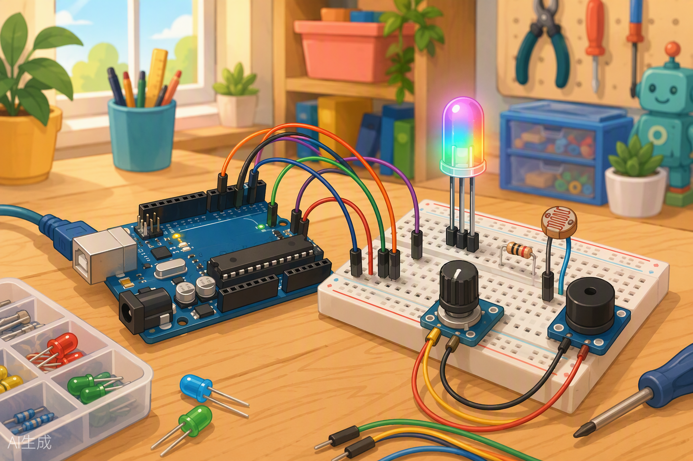
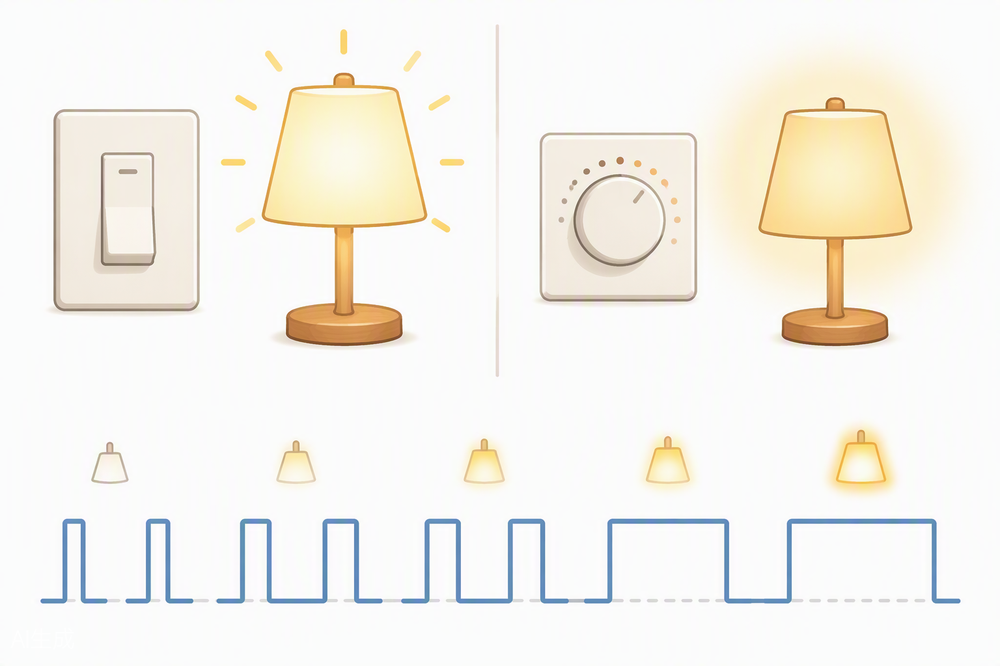

# Clase 04 — El mundo analógico: sensores, PWM y colores 🌈



¡Hola de nuevo, inventor! Hasta ahora nuestro Arduino solo entendía dos cosas: **encendido** y **apagado**. Como un interruptor de luz: o hay luz o no hay luz. Pero el mundo real no funciona así. El mundo real tiene **todos los tonos intermedios**: la luz del atardecer que baja despacito, el volumen de la música que subes poco a poco, la temperatura que cambia durante el día.

Hoy vamos a enseñarle a tu Arduino a ver esos matices. Vamos a leer sensores de verdad, a controlar el brillo de los LEDs como un regulador de luz, a mezclar colores como un pintor… ¡y a tocar música! Prepárate, que esta clase es de las que más molan. 🎨🎵

---

## 🎯 Objetivos de la clase

Al terminar hoy, serás capaz de:

1. Explicar la diferencia entre una señal **digital** y una **analógica** (y no volverte a confundir jamás).
2. Leer sensores analógicos con `analogRead()` y entender qué significa ese número de **0 a 1023**.
3. Escalar valores con `map()` para convertir lecturas en cosas útiles.
4. Controlar el brillo de un LED con **PWM** y `analogWrite()` (¡el truco del parpadeo ultra rápido!).
5. Mezclar colores con un **LED RGB** y hacer sonar una melodía con el **buzzer** usando `tone()`.

---

## 🧰 Materiales que usaremos

Saca de tu kit XL todo esto y ponlo sobre la mesa:

| Componente | Cantidad | ¿Para qué lo usamos hoy? |
|---|---|---|
| Placa Arduino UNO compatible | 1 | El cerebro de todo 🧠 |
| Cable USB | 1 | Programar y alimentar |
| Breadboard | 1 | Nuestro campo de pruebas |
| Cables jumper | ~12 | Conectarlo todo |
| Potenciómetro | 1 | Nuestro primer "mando" analógico |
| LDR (sensor de luz) | 1 | Detectar oscuridad |
| LED (cualquier color) | 2 | Detector de oscuridad y efecto respiración |
| LED RGB | 1 | Mezclar colores como un pintor |
| Buzzer (zumbador) | 1 | ¡Música! 🎵 |
| Resistencias 220 Ω | 4 | Proteger los LEDs |
| Resistencia 10 kΩ | 1 | Compañera inseparable del LDR |

> 💡 **Truco de profesor:** antes de empezar, separa las resistencias por colores. 220 Ω = rojo-rojo-marrón. 10 kΩ = marrón-negro-naranja. Tu yo del futuro te lo agradecerá.

---

## 🧠 Conceptos

### 1. Digital vs. analógico: el interruptor y el regulador

Imagina dos lámparas en tu casa:

- La del pasillo tiene un **interruptor**: o encendida o apagada. No hay término medio. Eso es lo **digital**: solo dos estados, `HIGH` o `LOW`, 1 o 0.
- La del salón tiene un **regulador giratorio**: puedes dejar la luz al 10 %, al 43 %, al 87 %... infinitos valores entre apagado y encendido. Eso es lo **analógico**.



| | Digital | Analógico |
|---|---|---|
| Valores posibles | Solo 2 (0 o 1) | Infinitos (todos los intermedios) |
| Ejemplo de casa | Interruptor de luz | Regulador de luz, grifo, volumen |
| En Arduino | `digitalRead()` / `digitalWrite()` | `analogRead()` / `analogWrite()` |
| Pines | Todos los digitales (0-13) | Entrada: A0-A5 · Salida "falsa": pines con ~ |

Hasta la clase pasada solo usamos el modo interruptor. Hoy pasamos al modo regulador. 💪

### 2. El ADC: el traductor de 10 bits

Aquí viene una pregunta importante: si el mundo analógico tiene infinitos valores, ¿cómo los entiende un Arduino, que solo piensa en números?

Respuesta: con un **ADC** (*Conversor Analógico-Digital*). Es como un traductor que toma el voltaje en un pin (entre 0 y 5 voltios) y lo convierte en un número. El ADC del UNO es de **10 bits**, y eso significa que puede dar **2¹⁰ = 1024 valores distintos**: del **0 al 1023**.

| Voltaje en el pin | Número que te da `analogRead()` |
|---|---|
| 0 V | 0 |
| 1,25 V | ~255 |
| 2,5 V | ~511 |
| 3,75 V | ~767 |
| 5 V | 1023 |

O sea: `analogRead()` no te dice voltios, te dice un número de 0 a 1023. Si algún día quieres voltios, la conversión es:

```
voltios = lectura × 5.0 / 1023
```

Los pines que pueden hacer esta magia son los **A0, A1, A2, A3, A4 y A5**. Los demás pines digitales no saben leer analógico, igual que yo no sé hacer malabares: no está en su naturaleza. 🤹

### 3. La función `map()`: la regla de tres automática

Vas a ver un problema muy típico: `analogRead()` te da valores de **0 a 1023**, pero `analogWrite()` solo acepta de **0 a 255**. ¿Cómo convertimos una escala en otra?

Podrías hacer la regla de tres a mano… o usar `map()`, que es básicamente una regla de tres empaquetada:

```cpp
int brillo = map(lectura, 0, 1023, 0, 255);
```

Se lee así: *"toma el valor `lectura`, que vive entre 0 y 1023, y conviértelo a la escala de 0 a 255"*. Como convertir de kilómetros a millas, pero sin dolor de cabeza.

### 4. PWM: el truco del parpadeo invisible

Y ahora, la gran pregunta: si los pines digitales solo saben dar 0 V o 5 V… ¿cómo sacamos brillo intermedio?

Con un truco genial llamado **PWM** (*Modulación por Ancho de Pulso*). Arduino enciende y apaga el pin **súper rápido** (unas 490 veces por segundo). Tan rápido que tu ojo no ve el parpadeo: solo ve el promedio.

- Si está encendido el 10 % del tiempo → el LED se ve al 10 % de brillo.
- Si está encendido el 50 % del tiempo → brillo medio.
- Si está encendido el 100 % → brillo total.

Es como cuando mueves la mano rapidísimo delante de la cara: no ves los dedos, ves una "mano difuminada". El PWM es eso, pero con electricidad. ⚡

**¡Ojo!** No todos los pines saben hacer PWM. Solo los que llevan una **ondita (~)** impresa al lado en la placa:

| Pines PWM del UNO | ~3, ~5, ~6, ~9, ~10, ~11 |
|---|---|

`analogWrite(pin, valor)` acepta valores de **0 (apagado) a 255 (a tope)**.

### 5. El LDR: un ojo que mide la luz

El **LDR** (*Light Dependent Resistor*) es una resistencia que cambia con la luz:

- Mucha luz → poca resistencia → pasan más voltios.
- Oscuridad → mucha resistencia → pasan menos voltios.

Pero Arduino no mide resistencias, mide **voltajes**. Así que montamos un **divisor de tensión**: el LDR hace equipo con una resistencia fija de 10 kΩ, y leemos el voltaje en el punto medio. Es como un balancín en el parque: según quién "pese" más (el LDR o la resistencia), el punto medio sube o baja.

### 6. El LED RGB: tres LEDs disfrazados de uno

Mira bien tu LED RGB: tiene **4 patitas**. Por dentro son en realidad **tres LEDs** (rojo, verde y azul) que comparten una patita común (la más larga). En los kits suele ser de **cátodo común**: la patita larga va a GND.

¿Y cómo hacemos morado, naranja o turquesa? Mezclando la intensidad de cada color con PWM, como un pintor mezcla pintura:

| Rojo | Verde | Azul | Color resultante |
|---|---|---|---|
| 255 | 0 | 0 | 🔴 Rojo |
| 0 | 255 | 0 | 🟢 Verde |
| 0 | 0 | 255 | 🔵 Azul |
| 255 | 0 | 255 | 🟣 Morado |
| 255 | 165 | 0 | 🟠 Naranja |
| 255 | 255 | 255 | ⚪ Blanco (más o menos 😄) |

### 7. El buzzer y `tone()`: Arduino se pone a cantar

El buzzer es un altavoz en miniatura. Si le mandas electricidad que vibra a una frecuencia, suena esa nota. La función estrella:

```cpp
tone(pin, frecuencia, duracion);  // frecuencia en Hz, duración en ms
```

Cada nota musical tiene su frecuencia: el **LA** de tocar el violín en la orquesta son 440 Hz, el **DO** agudo son 523 Hz… Con una tabla de frecuencias y `tone()`, tu Arduino es básicamente un piano. 🎹

---

## 💻 Código: tu chuleta de funciones nuevas

Hoy cada práctica lleva su propio sketch completo y comentado. Aquí tienes la referencia rápida de las funciones nuevas para cuando las necesites:

| Función | ¿Qué hace? | Ejemplo |
|---|---|---|
| `analogRead(pin)` | Lee un pin analógico (A0-A5) y devuelve 0-1023 | `int v = analogRead(A0);` |
| `map(v, a, b, c, d)` | Convierte `v` de la escala a-b a la escala c-d | `map(v, 0, 1023, 0, 255)` |
| `analogWrite(pin, v)` | Saca PWM (0-255) por un pin con ~ | `analogWrite(9, 128);` |
| `tone(pin, Hz, ms)` | Suena una nota en el buzzer | `tone(8, 440, 500);` |
| `noTone(pin)` | Silencia el buzzer | `noTone(8);` |

> ⚠️ Recuerda: los pines analógicos **A0-A5 no necesitan `pinMode()`** para leer. Se conectan y se leen, así de fácil.

---

## 🔧 Manos a la obra

### 🧪 Práctica 1: El potenciómetro habla por el Monitor Serie

Vamos a leer el potenciómetro y a ver los números en pantalla. Es el "¡Hola, mundo!" del mundo analógico.

**Paso 1 — Conexiones:**

| Desde | Hacia |
|---|---|
| Potenciómetro, patita exterior 1 | 5 V de Arduino |
| Potenciómetro, patita central | Pin A0 |
| Potenciómetro, patita exterior 2 | GND |

> 💡 El potenciómetro es un regulador de voltaje: la patita central entrega un voltaje entre 0 y 5 V según giras. Si da igual qué patita exterior va a 5 V o a GND… solo cambia el sentido del giro.

**Paso 2 — El código:**

```cpp
// Práctica 1: leer el potenciómetro
int lectura;    // aquí guardamos lo que leemos (0 a 1023)
int escalado;   // aquí guardamos la versión de 0 a 255

void setup() {
  Serial.begin(9600);   // abrimos el Monitor Serie a 9600 baudios
}

void loop() {
  lectura = analogRead(A0);                 // leemos el pin A0
  escalado = map(lectura, 0, 1023, 0, 255); // convertimos a escala 0-255

  Serial.print("Lectura: ");   // print NO baja de línea...
  Serial.print(lectura);       // ...así vemos todo en una sola línea
  Serial.print("  ->  Escala 0-255: ");
  Serial.println(escalado);    // println SÍ baja de línea al final

  delay(200);   // una pausa para no ahogarnos en números
}
```

**Paso 3 — Qué debería pasar:** abre el Monitor Serie (el icono de la lupa 🔍 arriba a la derecha del IDE), comprueba que abajo pone **9600 baudios** y gira el potenciómetro. Verás la lectura ir de 0 a 1023 y su equivalente de 0 a 255. ¡Estás viendo el mundo analógico en directo!

**🔍 ¿No funciona?**
- ¿Números siempre en 0? → Revisa que la patita central va a A0 y una exterior a 5 V.
- ¿Números locos que saltan solos? → Algún cable suelto. La patita central mal conectada deja el pin "flotando" y lee ruido.
- ¿Símbolos raros en pantalla? → Los baudios del monitor no coinciden con `Serial.begin(9600)`.

---

### 🧪 Práctica 2: Detector de oscuridad con el LDR

Vamos a construir una "luz nocturna automática": cuando tapemos el sensor con la mano, se enciende un LED. Como las farolas que se encienden solas al anochecer. 🌃

**Paso 1 — Conexiones:**

| Desde | Hacia |
|---|---|
| LDR, una patita | 5 V |
| LDR, otra patita | Pin A0 **y** una patita de la resistencia 10 kΩ |
| Resistencia 10 kΩ, otra patita | GND |
| LED ánodo (pata larga) | Pin 8 mediante resistencia 220 Ω |
| LED cátodo (pata corta) | GND |

**Paso 2 — Primero, espía a tu sensor.** Carga el código de la Práctica 1 (cambiando `A0` si hace falta) y anota: ¿qué número marca con luz normal? ¿Y tapándolo con la mano? En mi taller marca ~700 con luz y ~200 tapado. Ese número mágico será nuestro **umbral**.

**Paso 3 — El código:**

```cpp
// Práctica 2: detector de oscuridad
const int UMBRAL = 400;   // ¡ajusta este número según lo que anotaste!
int nivelLuz;             // lectura del LDR (0 a 1023)

void setup() {
  pinMode(8, OUTPUT);     // el LED es una salida
  Serial.begin(9600);     // para espiar los valores en directo
}

void loop() {
  nivelLuz = analogRead(A0);        // leemos cuánta luz hay
  Serial.println(nivelLuz);         // lo vemos en el monitor

  if (nivelLuz < UMBRAL) {          // ¿menos luz que el umbral?
    digitalWrite(8, HIGH);          // ¡oscuridad! Encendemos el LED
  } else {
    digitalWrite(8, LOW);           // hay luz, LED apagado
  }

  delay(100);
}
```

**Paso 4 — Qué debería pasar:** con luz normal, LED apagado. Tapa el LDR con la mano y… 💡 ¡se enciende! Acabas de construir un sensor automático de verdad.

**🔍 ¿No funciona?**
- ¿LED siempre encendido o siempre apagado? → Tu `UMBRAL` no vale. Mira el Monitor Serie y ajústalo a un valor intermedio entre "luz" y "tapado".
- ¿Lecturas raras? → Revisa el divisor: el punto de unión LDR + resistencia 10 kΩ debe ir a A0, no a otro sitio.

---

### 🧪 Práctica 3: El LED que respira (efecto fade con PWM)

Ahora vamos a hacer que un LED se encienda y se apague **suavemente**, como si respirara. Es el efecto de las luces de los ordenadores en reposo. 😮‍💨

**Paso 1 — Conexiones:**

| Desde | Hacia |
|---|---|
| LED ánodo (pata larga) | Pin ~9 mediante resistencia 220 Ω |
| LED cátodo (pata corta) | GND |

> ⚠️ ¡Tiene que ser un pin con `~`! Si lo pones en el pin 8, no respirará: solo parpadeará. El pin 9 es PWM.

**Paso 2 — El código:**

```cpp
// Práctica 3: LED que respira
int brillo = 0;      // brillo actual (0 a 255)
int paso = 5;        // cuánto cambia el brillo en cada vuelta

void setup() {
  pinMode(9, OUTPUT);   // pin PWM para el LED
}

void loop() {
  analogWrite(9, brillo);   // aplicamos el brillo actual
  brillo = brillo + paso;   // subimos (o bajamos) un paso

  // si llegamos a un extremo, cambiamos de dirección
  if (brillo <= 0 || brillo >= 255) {
    paso = -paso;   // de subir a bajar, o de bajar a subir
  }

  delay(15);   // pausa cortita para que el cambio se vea suave
}
```

**Paso 3 — Qué debería pasar:** el LED sube de brillo poco a poco hasta el máximo y luego baja hasta apagarse, en un ciclo infinito y relajante. Casi da hipnosis. 🌀

**🔍 ¿No funciona?**
- ¿Solo parpadea de golpe? → Estás en un pin sin PWM o usaste `digitalWrite`. Revisa ambas cosas.
- ¿Va demasiado rápido o lento? → Juega con `paso` (prueba 2 o 10) y con el `delay`.

---

### 🧪 Práctica 4: LED RGB controlado con el potenciómetro

Aquí juntamos TODO lo aprendido: leeremos el potenciómetro (analógico) y lo usaremos para cambiar el color del LED RGB (PWM). Gira el mando y recorre el arcoíris. 🌈

**Paso 1 — Conexiones:**

| Desde | Hacia |
|---|---|
| LED RGB, patita larga (cátodo común) | GND |
| LED RGB, patita R | Pin ~9 mediante resistencia 220 Ω |
| LED RGB, patita G | Pin ~10 mediante resistencia 220 Ω |
| LED RGB, patita B | Pin ~11 mediante resistencia 220 Ω |
| Potenciómetro, exterior 1 | 5 V |
| Potenciómetro, central | Pin A0 |
| Potenciómetro, exterior 2 | GND |

> 💡 Para identificar las patitas del RGB: la más larga es la común. Mirando el LED con la patita larga como referencia, el orden habitual es **R – común – G – B**. Si los colores salen cambiados, solo intercambia los cables: ¡sin miedo!

**Paso 2 — El código:**

```cpp
// Práctica 4: arcoíris con potenciómetro
const int PIN_R = 9;    // patita roja (PWM)
const int PIN_G = 10;   // patita verde (PWM)
const int PIN_B = 11;   // patita azul (PWM)

void setup() {
  pinMode(PIN_R, OUTPUT);
  pinMode(PIN_G, OUTPUT);
  pinMode(PIN_B, OUTPUT);
}

void loop() {
  int lectura = analogRead(A0);          // 0 a 1023
  int zona = map(lectura, 0, 1023, 0, 2); // dividimos en 3 zonas: 0, 1 o 2

  if (zona == 0) {
    ponerColor(255, 0, 0);    // primera parte del giro: rojo
  } else if (zona == 1) {
    ponerColor(0, 255, 0);    // segunda parte: verde
  } else {
    ponerColor(0, 0, 255);    // última parte: azul
  }
}

// Función propia: pone el color de una vez
void ponerColor(int r, int g, int b) {
  analogWrite(PIN_R, r);   // brillo del canal rojo
  analogWrite(PIN_G, g);   // brillo del canal verde
  analogWrite(PIN_B, b);   // brillo del canal azul
}
```

**Paso 3 — Qué debería pasar:** al girar el potenciómetro, el LED cambia de rojo a verde a azul. Ahora prueba a cambiar los valores dentro de `ponerColor()`: ¿consigues morado? ¿amarillo? ¿un blanco rarito?

**🔍 ¿No funciona?**
- ¿No enciende nada? → Quizá tu RGB es de **ánodo común**: la patita larga iría a 5 V y la lógica se invierte (255 = apagado). Pregunta al profesor y lo adaptamos.
- ¿Colores cambiados? → Las patitas R, G y B no están donde creías. Intercambia cables hasta cuadrar.

---

### 🧪 Práctica 5: ¡Cumpleaños feliz con el buzzer! 🎂

El gran final: tu Arduino va a tocar una melodía. Usaremos una tabla de notas con sus frecuencias y `tone()`.

**Paso 1 — Conexiones:**

| Desde | Hacia |
|---|---|
| Buzzer, patita + (o la más larga) | Pin 8 |
| Buzzer, otra patita | GND |

**Paso 2 — El código:**

```cpp
// Práctica 5: Cumpleaños Feliz
const int BUZZER = 8;   // pin del buzzer

// Frecuencias de las notas que necesitamos (en Hz)
#define SOL4 392
#define LA4  440
#define SI4  494
#define DO5  523
#define RE5  587
#define MI5  659
#define FA5  698
#define SOL5 784

// La melodía, nota a nota
int melodia[] = {
  SOL4, SOL4, LA4, SOL4, DO5, SI4,        // "Cum-ple-a-ños fe-liz"
  SOL4, SOL4, LA4, SOL4, RE5, DO5,        // "Cum-ple-a-ños fe-liz"
  SOL4, SOL4, SOL5, MI5, DO5, SI4, LA4,   // "Cum-ple-a-ños fe-liiiz"
  FA5, FA5, MI5, DO5, RE5, DO5            // "Cum-ple-a-ños fe-liz"
};

// Duración de cada nota: 4 = negra, 8 = corchea, 2 = blanca...
int duraciones[] = {
  8, 8, 4, 4, 4, 2,
  8, 8, 4, 4, 4, 2,
  8, 8, 4, 4, 4, 4, 4,
  8, 8, 4, 4, 4, 2
};

void setup() {
  int totalNotas = sizeof(melodia) / sizeof(melodia[0]);  // ¿cuántas notas hay?

  for (int i = 0; i < totalNotas; i++) {
    int duracion = 1000 / duraciones[i];   // negra = 1 segundo, corchea = medio...
    tone(BUZZER, melodia[i], duracion);    // ¡suena la nota!
    delay(duracion * 1.3);                 // pausita entre notas (suena mejor)
    noTone(BUZZER);                        // silenciamos antes de la siguiente
  }
}

void loop() {
  // vacío: la canción se toca una vez al arrancar.
  // ¿Quieres repetirla? Pulsa el botón RESET de la placa 😉
}
```

**Paso 3 — Qué debería pasar:** al cargar el sketch, tu Arduino canta el Cumpleaños Feliz. Aplausos, por favor. 👏

**🔍 ¿No funciona?**
- ¿Silencio total? → Revisa la polaridad del buzzer y que esté en el pin 8.
- ¿Suena pero "desafina"? → Probablemente suena bien y el buzzer simplemente no es un piano de cola. Es parte de su encanto. 🎶

---

## 🚀 Retos

**Reto 1 — El regulador de brillo (fácil):** une la Práctica 1 y la 3: usa el potenciómetro para controlar el brillo de un LED en tiempo real con `map()` y `analogWrite()`. Gira el mando = cambia el brillo. ¡Tu primer regulador de luz casero!

**Reto 2 — Luz nocturna suave (medio):** modifica la Práctica 2 para que, en vez de encenderse de golpe, el LED brille **más cuanta más oscuridad haya** (pista: `map(nivelLuz, ...)` al revés, de modo que poca luz = mucho brillo con `analogWrite()` en un pin ~).

**Reto 3 — DJ de bolsillo (difícil):** mezcla las Prácticas 4 y 5: haz que el LED RGB cambie de color según la zona del potenciómetro, y que cada zona toque además una nota distinta con el buzzer. Tres colores, tres notas, un solo mando. ¡Monta el concierto! 🎧

---

## 📝 Mini-quiz

1. ¿Qué rango de valores devuelve `analogRead()` en el Arduino UNO y por qué?
2. Si `analogRead(A0)` devuelve 512, ¿qué voltaje hay aproximadamente en ese pin?
3. ¿Por qué `analogWrite()` solo funciona en los pines con el símbolo `~`?
4. ¿Qué hace exactamente esta línea? `int x = map(lectura, 0, 1023, 0, 255);`
5. En un LED RGB de cátodo común, ¿a dónde va conectada la patita más larga?

<details>
<summary>👉 Pulsa aquí para ver las respuestas</summary>

1. De **0 a 1023**, porque el ADC es de **10 bits** (2¹⁰ = 1024 valores posibles).
2. Aproximadamente **2,5 V** (la mitad del rango: 512/1023 × 5 V ≈ 2,5 V).
3. Porque esos pines tienen hardware **PWM**: pueden encenderse y apagarse cientos de veces por segundo para simular brillo intermedio. Los demás pines solo saben dar 0 V o 5 V.
4. Convierte el valor `lectura` (que está entre 0 y 1023) a la escala de **0 a 255**, para poder usarlo con `analogWrite()`.
5. A **GND** (es el cátodo común que comparten los tres LEDs internos).

</details>

---

## 🏠 Para la casa

1. **Arcoíris automático:** sin tocar el potenciómetro, haz un programa que recorra SOLO un arcoíris completo en el LED RGB (rojo → naranja → amarillo → verde → azul → morado → otra vez) usando `ponerColor()` y pausas. Pista: crea una tabla de colores como hicimos con la melodía.
2. **Compon tu himno:** busca las frecuencias de las notas de una canción que te guste (una intro famosa, el himno de tu equipo…) y prográmala con la técnica de la Práctica 5. La semana que viene habrá "concierto" voluntario al final de la clase. 🎤

---

## ⏭️ En la próxima clase…

Ya dominas los números del 0 al 1023 y los brillos del 0 al 255. Pero… ¿y si quisiéramos **ver** esos datos sin abrir el Monitor Serie? En la próxima clase estrenamos la **pantalla LCD 16x2**: aprenderás a escribir mensajes, valores de sensores y hasta dibujitos en caracteres. Además, le daremos movimiento a todo con el **servomotor**, ese motor obediente que gira exactamente el ángulo que le pidas. ¡Tu Arduino está a punto de empezar a hablar y a moverse! 🤖

---

*¡Nos vemos en la próxima clase, maker! Guarda bien tu LED RGB, que lo vamos a usar mucho.* 🌈
