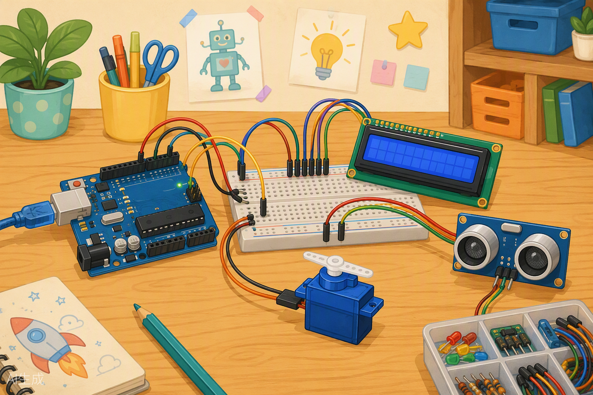
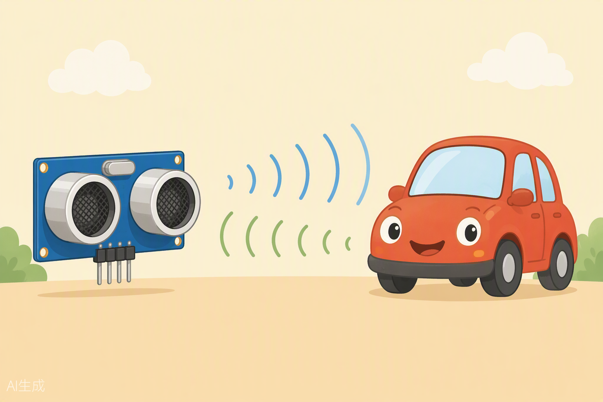

# Clase 05 — Explorando el kit XL: pantalla LCD, servo y sensor ultrasónico 🖥️🦾📡



¡Hola de nuevo, inventor! 👋 Hasta ahora has hecho parpadear LEDs, has leído botones y potenciómetros... pero hoy vamos a abrir tres regalos de tu kit XL de una sola vez: una **pantalla** para que tu Arduino pueda hablarte, un **motor articulado** para que tus inventos se muevan y un **sensor que mide distancias como los murciélagos**. Al final de la clase vas a construir un **radar de parking** de verdad, igualito al que tienen los coches nuevos cuando pitan "¡pi, pi, pi-pi-pi!" al dar marcha atrás. 🚗💨

Agarra tu kit, tu protoboard y prepara un montón de cables. Esto va a ser épico.

---

## 🎯 Objetivos de la clase

Al terminar hoy, tú serás capaz de:

1. Explicar qué es una **librería** de Arduino e instalar/usar dos de ellas: `LiquidCrystal` y `Servo`.
2. Conectar y programar una **pantalla LCD 16x2** para mostrar mensajes y valores de sensores.
3. Controlar un **servo motor** moviéndolo a cualquier ángulo entre 0° y 180° con un potenciómetro.
4. Medir distancias con el **sensor ultrasónico HC-SR04** y construir un radar de parking con buzzer.
5. Saber que existe el **DHT11** (temperatura y humedad) y tener un plan para domarlo por tu cuenta.

---

## 🧰 Materiales que usaremos

Saca de tu kit XL esto (¡y nada más por ahora!):

| Componente | ¿Para qué práctica? |
|---|---|
| Placa Arduino UNO + cable USB | Todas (es el cerebro) 🧠 |
| Protoboard + cables jumper (¡muchos!) | Todas |
| Pantalla LCD 16x2 | Práctica 1 |
| Potenciómetro | Prácticas 1 (contraste) y 2 (servo) |
| Resistencia de 220 Ω | Práctica 1 (retroiluminación) |
| Servo motor (con su brazo/blanco) | Práctica 2 |
| Sensor ultrasónico HC-SR04 | Práctica 3 |
| Buzzer (zumbador) | Práctica 3 |
| LED + resistencia 220 Ω (opcional) | Reto del radar |
| Sensor DHT11 | Reto estrella ⭐ / tarea |

---

## 🧠 Conceptos

### 1. ¿Qué es una librería? 📚

Imagina que quieres hornear un pastel. Podrías inventar la harina tú solo desde trigo... o puedes comprar una **caja de mezcla preparada** que ya hizo alguien y solo echar los huevos. Una **librería** es exactamente eso: una "caja de código ya escrito" que te regala funciones listas para usar, para que no tengas que escribir tú las instrucciones complicadas.

- Sin librería, controlar la LCD serían cientos de líneas enrevesadas.
- Con la librería `LiquidCrystal`, escribes `lcd.print("Hola")` y listo. ¡Magia! ✨

**Las dos de hoy:**

| Librería | Sirve para... | ¿Ya viene instalada? |
|---|---|---|
| `LiquidCrystal` | Pantallas LCD de texto | Sí, viene con el IDE |
| `Servo` | Mover servomotores por ángulos | Sí, viene con el IDE |

**¿Y cómo instalo una que no venga?** (te pasará con el DHT11 😉):

1. En el IDE de Arduino ve a **Herramientas → Administrar bibliotecas** (o el icono de libros 📚 de la barra lateral en Arduino IDE 2).
2. En el buscador escribe el nombre (por ejemplo, `DHT sensor library` de Adafruit).
3. Pulsa **Instalar**. Y ya está: ahora puedes "importarla" en tu sketch con `#include`.

En el código, usar una librería se hace así:

```cpp
#include <LiquidCrystal.h>  // "Oye Arduino, tráeme la caja de la pantalla"
```

---

### 2. La pantalla LCD 16x2 🖥️

Es esa pantallita azul con letras blancas. El nombre es literal: **16 columnas × 2 filas** de caracteres. Tiene **16 pines** (uff, lo sé) pero solo usaremos unos pocos:

| Pin LCD | Nombre | ¿Qué hace? |
|---|---|---|
| 1 | VSS | Tierra (GND) |
| 2 | VDD | Alimentación (5V) |
| 3 | V0 | **Contraste** (lo controlamos con un potenciómetro) |
| 4 | RS | Le dice a la pantalla: "esto es un comando" o "esto es un texto" |
| 5 | RW | Lo ponemos a GND (siempre vamos a ESCRIBIR) |
| 6 | E | Enable: la "palmada en la espalda" para que la pantalla lea |
| 7-10 | D0-D3 | Los dejamos libres (modo de 4 bits: usamos menos cables) |
| 11-14 | D4-D7 | Los 4 cables de datos que sí usamos |
| 15 | A (LED+) | Retroiluminación (+) → 5V con resistencia 220 Ω |
| 16 | K (LED-) | Retroiluminación (−) → GND |

**¿Y el potenciómetro del contraste?** El pin V0 es como el "filtro de Instagram" de la pantalla: gira el potenciómetro y verás cómo las letras pasan de invisibles a perfectas. Si alguna vez ves la pantalla encendida pero "en blanco", el 90% de las veces es el contraste. 😄

---

### 3. El servo motor 🦾

Un servo no es un motor normal que gira y gira sin parar. Es un motor **con cerebrito incluido**: tú le dices "vete a 90 grados" y él solito se coloca ahí y se queda firme. Es lo que usan los coches teledirigidos para girar las ruedas delanteras o los brazos de los robots para... bueno, para ser brazos.

- **Rango típico:** de 0° a 180° (media vuelta).
- **Solo necesita 3 cables:**

| Cable del servo | Color típico | Conecta a |
|---|---|---|
| Alimentación | Rojo | 5V |
| Tierra | Marrón o negro | GND |
| Señal | Naranja o amarillo | Pin digital (usaremos el 9) |

Con la librería `Servo`, moverlo es una línea:

```cpp
miServo.write(90);  // "¡Servo, ponte en 90 grados!"
```

⚠️ **Consejo de oro:** no fuerces el brazo con la mano mientras está enchufado. Se ofende (y se puede quemar).

---

### 4. El sensor ultrasónico HC-SR04 📡



Míralo bien: tiene dos "ojos" plateados. En realidad son **oreja y boca**:

- **TRIG (disparador):** es la boca. Grita un "¡PUM!" ultrasónico (tan agudo que tú no lo oyes).
- **ECHO (eco):** es la oreja. Espera a que el "¡PUM!" rebote contra un objeto y vuelva.

¿Y cómo sabe la distancia? **Cronometrando el viaje del sonido.** El sonido viaja a unos **343 metros por segundo** (unos 0,0343 cm por microsegundo). Si el grito tarda, digamos, 1000 microsegundos en ir y volver:

$$\text{distancia} = \frac{\text{tiempo} \times 0{,}0343}{2}$$

**¿Por qué entre 2?** Porque el sonido hace un viaje de IDA Y VUELTA: el tiempo mide el camino completo, pero nosotros solo queremos la ida. Es como si gritaras en un cañón: el eco cuenta el doble del camino.

- **Mide desde ~2 cm hasta ~400 cm.** Más cerca de 2 cm, se vuelve "ciego".
- **Es el mismo truco de los murciélagos** 🦇 y de los sensores de parking de los coches. Por eso nuestro proyecto de hoy se llama así.

| Pin del HC-SR04 | Conecta a |
|---|---|
| VCC | 5V |
| TRIG | Pin digital 7 |
| ECHO | Pin digital 8 |
| GND | GND |

---

## 💻 Código

Aquí van los sketches completos y comentados. Cópialos tal cual al IDE.

### Sketch A — Hola Mundo en la LCD

```cpp
#include <LiquidCrystal.h>              // Traemos la librería de la pantalla

// Creamos el objeto "lcd" indicando los pines: (RS, E, D4, D5, D6, D7)
LiquidCrystal lcd(12, 11, 5, 4, 3, 2);

void setup() {
  lcd.begin(16, 2);                     // Le decimos: pantalla de 16 columnas x 2 filas
  lcd.print("Hola Mundo!");             // Escribimos en la primera fila
  lcd.setCursor(0, 1);                  // Movemos el cursor a columna 0, fila 1 (segunda fila)
  lcd.print("Soy un Arduino");          // Escribimos en la segunda fila
}

void loop() {
  // No necesitamos repetir nada: el texto se queda quieto en pantalla
}
```

### Sketch B — Servo controlado con potenciómetro

```cpp
#include <Servo.h>                      // Traemos la librería del servo

Servo miServo;                          // Creamos nuestro servo (le ponemos nombre)
const int pinPot = A0;                  // El potenciómetro va a la entrada analógica A0

void setup() {
  miServo.attach(9);                    // Conectamos el servo al pin 9 (señal)
}

void loop() {
  int lectura = analogRead(pinPot);     // Leemos el potenciómetro (0 a 1023)
  int angulo = map(lectura, 0, 1023, 0, 180);  // Traducimos a grados (0 a 180)
  miServo.write(angulo);                // ¡Servo, colócate en ese ángulo!
  delay(15);                            // Mini pausa para que el servo llegue tranquilo
}
```

💡 La función `map()` es tu nueva mejor amiga: **traduce** un número de una escala a otra, como convertir pesos mexicanos a euros. Aquí convierte la escala del potenciómetro (0-1023) a la escala del servo (0-180).

### Sketch C — Radar de parking (ultrasónico + buzzer)

```cpp
// Pines del sensor ultrasónico
const int pinTrig = 7;                  // TRIG: la "boca" que grita
const int pinEcho = 8;                  // ECHO: la "oreja" que escucha
const int pinBuzzer = 10;               // El zumbador que hará pi-pi-pi

void setup() {
  pinMode(pinTrig, OUTPUT);             // TRIG es salida (nosotros gritamos)
  pinMode(pinEcho, INPUT);              // ECHO es entrada (nosotros escuchamos)
  pinMode(pinBuzzer, OUTPUT);           // El buzzer es salida
  Serial.begin(9600);                   // Para ver la distancia en el Monitor Serie
}

// Función que mide la distancia en centímetros
long medirDistancia() {
  digitalWrite(pinTrig, LOW);           // Aseguramos el silencio
  delayMicroseconds(2);
  digitalWrite(pinTrig, HIGH);          // ¡GRITAMOS! (pulso de 10 microsegundos)
  delayMicroseconds(10);
  digitalWrite(pinTrig, LOW);           // Dejamos de gritar

  long duracion = pulseIn(pinEcho, HIGH);  // Cronometramos cuánto tarda el eco
  long distancia = duracion * 0.0343 / 2;  // Fórmula del viaje ida y vuelta
  return distancia;                     // Devolvemos la distancia en cm
}

void loop() {
  long cm = medirDistancia();           // Medimos la distancia

  Serial.print("Distancia: ");          // La mostramos en el ordenador
  Serial.print(cm);
  Serial.println(" cm");

  // Si el objeto está entre 2 y 50 cm, pita más rápido cuanto más cerca
  if (cm > 2 && cm < 50) {
    int pausa = map(cm, 2, 50, 30, 500);  // Cerca = pausa corta (pita rápido)
    tone(pinBuzzer, 1000, 50);          // Pitido de 50 ms a 1000 Hz
    delay(pausa);                       // Esperamos según la distancia
  } else {
    delay(300);                         // Lejos: descanso tranquilo sin pitar
  }
}
```

---

## 🔧 Manos a la obra

### Práctica 1: "Hola Mundo" en la pantalla LCD 🖥️

**Paso 1 — Conexión física.** Con la placa DESENCHUFADA del USB, sigue esta tabla con calma (son muchos cables, respira, uno por uno):

| Pin de la LCD | Conecta a... |
|---|---|
| 1 (VSS) | GND |
| 2 (VDD) | 5V |
| 3 (V0) | Pata central del potenciómetro |
| 4 (RS) | Pin digital 12 |
| 5 (RW) | GND |
| 6 (E) | Pin digital 11 |
| 11 (D4) | Pin digital 5 |
| 12 (D5) | Pin digital 4 |
| 13 (D6) | Pin digital 3 |
| 14 (D7) | Pin digital 2 |
| 15 (A) | 5V **a través de una resistencia de 220 Ω** |
| 16 (K) | GND |

**Potenciómetro de contraste:** pata izquierda → 5V, pata derecha → GND, pata central → pin 3 (V0) de la LCD.

**Paso 2 — Código.** Copia el **Sketch A** y súbelo.

**Paso 3 — ¿Qué debería pasar?** La pantalla se enciende con luz azul y aparece:

```
Hola Mundo!
Soy un Arduino
```

**🔍 ¿No funciona? Checklist de rescate:**
- ¿Pantalla encendida pero sin letras? → **Gira el potenciómetro** del contraste. Es el fallo nº 1 de la historia.
- ¿Cuadraditos blancos pero sin texto? → Revisa los cables de datos D4-D7 y RS/E. Uno suelto y todo falla.
- ¿Ni siquiera enciende la luz de fondo? → Revisa pines 15 y 16 y la resistencia.
- ¿Todo al revés o letras raras? → Probablemente intercambiaste RS y E, o D4 con D5.

**Paso 4 — Subamos el nivel: valores en pantalla.** Ahora modifica el `loop()` del Sketch A así y abre el Monitor Serie para comparar:

```cpp
void loop() {
  int valor = analogRead(A0);           // Usa el potenciómetro en A0 (¡el del contraste déjalo quieto!
                                        // usa OTRO potenciómetro o mueve este a A0 y puentea V0 a GND)
  lcd.setCursor(0, 1);                  // Segunda fila
  lcd.print("Valor: ");                 // Etiqueta
  lcd.print(valor);                     // El número
  lcd.print("    ");                    // Espacios para "borrar" dígitos viejos
  delay(200);
}
```

⚠️ **Truco del profesor:** verás que cuando el valor pasa de 1023 a 99 quedan restos de números viejos. Por eso imprimimos espacios al final: es nuestra "goma de borrar". 🧽

---

### Práctica 2: El servo bailarín 🦾

**Paso 1 — Conexión física** (puedes dejar la LCD montada o desmontarla, tú eliges):

| Cable del servo | Conecta a... |
|---|---|
| Rojo (alimentación) | 5V |
| Marrón/negro (tierra) | GND |
| Naranja/amarillo (señal) | Pin digital 9 |

**Potenciómetro:** pata izquierda → 5V, pata derecha → GND, pata central → **A0**.

**Paso 2 — Antes de subir el código**, coloca el brazo blanco del servo de forma que apunte "hacia adelante". Si lo pones chueco, tu servo bailará chueco. 😅

**Paso 3 — Código.** Sube el **Sketch B**.

**Paso 4 — ¿Qué debería pasar?** Gira el potenciómetro y el brazo del servo te seguirá como un espejo obediente: a la izquierda → 0°, en medio → 90°, a la derecha → 180°.

**🔍 ¿No funciona?**
- ¿El servo tiembla o vibra? → Normal un poquito; si es mucho, revisa que GND del servo y de Arduino estén bien conectados.
- ¿No se mueve nada? → ¿Pusiste `attach(9)`? ¿El cable de señal está en el 9 de verdad?
- ¿Hace ruido de engranajes forzados en los extremos? → Algunos servos no llegan a 0° o 180°. Cambia el `map()` a `map(lectura, 0, 1023, 10, 170)` para protegerlo.

---

### Práctica 3: ¡Radar de parking! 🚗📡

**Paso 1 — Conexión física:**

| Componente | Pin | Conecta a... |
|---|---|---|
| HC-SR04 | VCC | 5V |
| HC-SR04 | TRIG | Pin digital 7 |
| HC-SR04 | ECHO | Pin digital 8 |
| HC-SR04 | GND | GND |
| Buzzer | Pata larga (+) | Pin digital 10 |
| Buzzer | Pata corta (−) | GND |

Coloca el HC-SR04 en el borde de la protoboard, con los "ojos" mirando hacia afuera, como un faro.

**Paso 2 — Código.** Sube el **Sketch C** y abre el **Monitor Serie** (9600 baudios).

**Paso 3 — ¿Qué debería pasar?**
- Pon tu mano a 40 cm: pitidos lentos... *pi... pi... pi...*
- Acércala a 10 cm: *pi-pi-pi-pi* ¡se acelera!
- A 5 cm: *pipipipipi* ¡PELIGRO, VAS A CHOCAR! 💥
- Mira el Monitor Serie: verás la distancia en centímetros en tiempo real.

**🔍 ¿No funciona?**
- ¿Distancias de 0 cm o números locos? → El objeto está a menos de 2 cm (zona ciega) o a más de 4 metros. Prueba entre 5 y 50 cm.
- ¿No pita? → Revisa la polaridad del buzzer (pata larga al pin 10).
- ¿Valores que saltan mucho? → Las superficies blandas (ropa, cojines) "tragan" el sonido. Usa un libro o una caja como "coche".
- ¿Todo quieto y sin lecturas? → TRIG y ECHO intercambiados es el clásico. ¡Intercámbialos y prueba!

---

## 🚀 Retos

### Reto 1 — El centinela LCD 🟢 (fácil)
Combina la Práctica 1 y la 3: muestra la **distancia en la pantalla LCD** en vez de solo en el Monitor Serie. Primera fila: `"Distancia:"`, segunda fila: el número + `" cm"`. Cuidado con el truco de la "goma de borrar" (los espacios).

### Reto 2 — Radar con semáforo 🟡 (medio)
Añade un LED al radar de parking:
- Objeto a más de 30 cm → LED **apagado**, buzzer callado.
- Entre 30 y 15 cm → LED **parpadea lento**, pitidos lentos.
- A menos de 15 cm → LED **fijo encendido**, pitidos rapidísimos.

*Pista: usa `if / else if / else` y un pin libre para el LED (el 13 o el 6, si la LCD no lo usa).*

### Reto 3 — El servo puerta de garaje ⭐⭐ (difícil + DHT11)
**Parte A:** haz que el servo actúe como la **barrera de un parking**: si el objeto está a menos de 10 cm, la barrera sube (servo a 90°); si no, está bajada (0°).

**Parte B (misión DHT11):** el DHT11 mide temperatura y humedad, pero necesita que instales su librería (`DHT sensor library` de Adafruit, como aprendiste arriba). Investiga el ejemplo **DHTtester** que se instala con ella (Archivo → Ejemplos) y logra que la LCD muestre la temperatura de la habitación. Conexión: VCC → 5V, DATA → pin 6, GND → GND. ¡Serás el primero de la clase en tener una estación meteorológica! 🌡️

---

## 📝 Mini-quiz

1. ¿Qué es una librería de Arduino y para qué sirve?
2. ¿Qué ajusta el potenciómetro conectado al pin V0 de la LCD?
3. ¿Cuál es el rango de ángulos típico de un servo del kit?
4. En la fórmula de la distancia, ¿por qué dividimos entre 2?
5. ¿Qué hace la función `map(lectura, 0, 1023, 0, 180)`?

<details>
<summary><b>👀 Respuestas (¡haz clic solo después de pensar!)</b></summary>

1. Es código ya escrito por otra persona que nos regala funciones listas para usar (como una caja de mezcla para pastel): nos ahorra escribir las instrucciones complicadas para manejar componentes como la LCD o el servo.
2. El **contraste** de la pantalla: hace que las letras se vean más o menos oscuras. Si la pantalla está en blanco, casi siempre es culpa suya.
3. De **0° a 180°** (media vuelta).
4. Porque el sonido viaja **ida y vuelta** (va al objeto y regresa). El tiempo medido cuenta el camino doble, así que dividimos entre 2 para quedarnos solo con la distancia real al objeto.
5. Convierte la lectura del potenciómetro (que va de 0 a 1023) a la escala de grados del servo (0 a 180), manteniendo la proporción.
</details>

---

## 🏠 Para la casa

1. **Termómetro con nombre propio 🌡️:** si lograste el Reto 3 con el DHT11, personalízalo: que la LCD muestre `"Temp: 24C"` en la primera fila y `"Hola, [tu nombre]"` en la segunda. Si no tienes el DHT11 a mano, haz lo mismo mostrando el valor del potenciómetro con tu nombre.
2. **Detector de intrusos 🕵️:** pon tu radar de parking mirando hacia la puerta de tu habitación. Modifica el código para que SOLO pite cuando alguien esté a menos de 20 cm. ¡Ahora nadie podrá entrar sin que te enteres! Apunta en tu cuaderno qué distancia elegiste y por qué.

---

## ⏭️ Adelanto de la próxima clase

En la **Clase 06** nos alejamos un momento de la pantalla y nos ponemos el equipo de verdad: llega el **taller de soldadura**. Aprenderás a usar el cautín con seguridad, a estañar la punta como un profesional y a dominar la técnica del "volcán brillante". ¿La misión? Dejar de depender de la breadboard y construir tu primer **circuito permanente en placa perforada**: un módulo de semáforo soldado por ti, con tus propias manos. Trae ganas de precisión… y ropa que no temas manchar. 🔥🔌 ¡No faltes!
