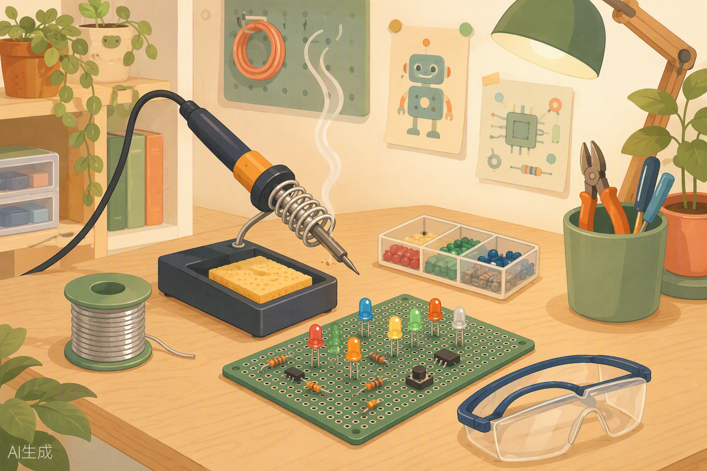
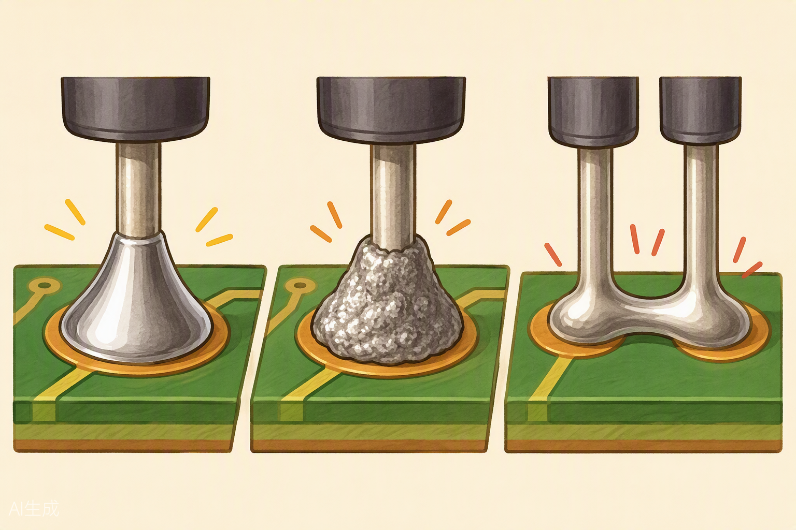

# Taller de soldadura: tu primer circuito permanente 🔥



¡Hola de nuevo, maker! Hasta ahora todos tus circuitos han vivido en la breadboard: pinchas, pruebas, despinchas, cambias. Es como construir con piezas de LEGO: divertido, rápido… pero si soplas fuerte, se desarma. Hoy das el salto a construir "con cemento": vamos a **soldar**. Al final de esta clase tendrás tu primer circuito **permanente**, un módulo de semáforo que podrás enchufar a tu Arduino una y otra vez sin que se suelte ni un cable. Sí, hoy te gradúas de "electricista de juguete" a "electricista de verdad". 😎

---

## 🎯 Objetivos de la clase

Al terminar esta clase serás capaz de:

1. Explicar por qué la soldadura es diferente (y mejor para ciertas cosas) que la breadboard.
2. Trabajar con el cautín de forma **segura**, sin quemaduras ni sustos.
3. Cuidar la punta del cautín: estañarla y limpiarla como un profesional.
4. Hacer una soldadura correcta con forma de "volcán brillante" y detectar los errores típicos.
5. Desoldar con bomba o malla cuando te equivoques (porque te vas a equivocar, y está bien).
6. Construir en placa perforada un **módulo de semáforo** permanente para tu Arduino.

---

## 🧰 Materiales que usaremos

De tu **kit de soldadura**:

| Material | Para qué |
|---|---|
| Cautín (soldador) | La estrella del día 🔥 |
| Estaño en rollo | El "pegamento metálico" |
| Soporte del cautín | Su cama: ahí descansa siempre |
| Esponja (húmeda) | Para limpiar la punta |
| Desoldador (bomba o malla) | La goma de borrar del soldador |

De tu **kit Arduino XL**:

| Material | Cantidad | Para qué |
|---|---|---|
| Placa Arduino UNO compatible | 1 | Cerebro del semáforo |
| Breadboard | 1 | Prototipar antes de soldar |
| LEDs rojo, amarillo y verde | 1 de cada | Las luces del semáforo |
| Resistencias 220 Ω | 3 | Proteger los LEDs |
| Cables / cable para pelar | varios | Conexiones y práctica |
| Pulsador | 1 (reto) | Botón de peatón |
| Cable USB | 1 | Programar la placa |

Además necesitarás una **placa perforada** (perfboard, la placa llena de agujeritos con islas de cobre). Si tu kit no trae una, no te preocupes: la práctica 1 la puedes hacer soldando cables entre sí y pidiéndole al profe un trozo de placa.

> ⚠️ **Regla de oro del día:** ponte las **gafas de seguridad** si las tienes, recoge el pelo si lo llevas largo, y nada de ropa suelta colgando sobre la mesa. Un trozo de estaño caliente que salta es pequeño… pero duele como un campeón.

---

## 🧠 Conceptos

### ¿Por qué soldar? Breadboard vs. soldadura

Piénsalo así:

| | Breadboard 🧱 | Soldadura 🔥 |
|---|---|---|
| Es como… | Piezas de LEGO | Cemento y ladrillos |
| Conexión | Los cables se "abrazan" por presión | Los metales se **funden juntos** |
| Se desarma | Sí, en 1 segundo | No (hay que desoldar) |
| Ideal para | Probar ideas | Proyectos finales que viajan en tu mochila |
| Si se cae al suelo | 💀 Lluvia de cables | 💪 Sobrevive |

La breadboard es tu **borrador**. La soldadura es tu **tinta definitiva**. Por eso el flujo de trabajo de todo maker es:

1. **Prototipar** en breadboard → probar que funciona.
2. **Soldar** en placa perforada → versión permanente.
3. Enchufar y presumir. ✨

### ¿Qué es exactamente la soldadura?

El **estaño** es una aleación de metales que se funde a temperatura relativamente baja (unos 180-230 °C, según el tipo). El cautín calienta mucho más (¡300 °C o más!) para que el estaño se derrita al instante.

Cuando sueldas bien, el estaño fundido **moja** el cobre de la placa y la patilla del componente, y al enfriarse forma una unión metálica continua. No es "pegamento": es como si los dos metales se dieran la mano y se quedaran así para siempre.

### Partes del cautín (conócelo antes de encenderlo)

- **Punta:** la parte que calienta. Es la que toca el estaño y la placa. Se gasta con el uso y se puede cambiar.
- **Resistencia calefactora:** dentro del cuerpo metálico; es la que genera el calor.
- **Mango:** lo que tú agarras. Aísla el calor. Si el mango se calienta, algo anda mal: apaga y avisa al profe.
- **Cable:** aléjalo de la punta caliente. Un cable derretido es una pésima sorpresa.

### El cuidado de la punta: estañar y limpiar

La punta del cautín es como la sartén de la abuela: si la cuidas, dura años; si la maltratas, se arruina.

- **Estañar la punta:** antes de soldar por primera vez (y siempre que la veas "seca"), derrite un poco de estaño directamente sobre la punta hasta que quede brillante y plateada. Esa capita de estaño transmite mejor el calor y protege la punta de la oxidación.
- **Limpiar en la esponja:** la esponja debe estar **húmeda, no chorreando** (como una esponja de cocina bien escurrida). Pasa la punta por la esponja antes de cada soldadura para quitar restos quemados. Escucharás un "tssss" satisfactorio. 🧽
- **Antes de apagar:** deja una bolita de estaño en la punta. Es como ponerle una mantita para que no se oxide mientras duerme.

> 🚫 **Nunca** rasques la punta con nada metálico ni la lijes. Le quitarías el baño protector y moriría joven.

### La técnica paso a paso: el volcán brillante 🌋



Una soldadura perfecta se parece a un **mini volcán brillante**: un conito suave de estaño que abraza la patilla. Aquí va la coreografía completa (practícala en seco primero, sin encender el cautín):

1. **Prepara:** punta limpia y estañada, componente colocado, esponja húmeda cerca.
2. **Calienta la unión, no el estaño:** toca con la punta **a la vez** la isla de cobre (el "pad") y la patilla del componente. Cuenta: *uno, dos*…
3. **Alimenta el estaño:** con la otra mano, acerca el estaño **al lado opuesto** de la unión (no a la punta del cautín). El calor de la placa y la patilla lo derretirá y fluirá hacia ellos.
4. **Una gota basta:** con 2-3 milímetros de estaño suele ser suficiente. Verás cómo se extiende como miel caliente.
5. **Retira el estaño primero, luego el cautín.** Todo el paso 2-5 dura unos 3 segundos.
6. **No soples ni muevas nada** durante 2 segundos. El estaño se solidifica casi al instante.
7. **Inspecciona:** ¿brillante, en forma de volcán, sin exceso? ¡Perfecta! ✨

### Los errores comunes (y cómo reconocerlos)

| Error | Aspecto | Causa | Solución |
|---|---|---|---|
| **Soldadura fría** | Mate, grisácea, arrugada, como arena | No calentaste suficiente la unión, o moviste el componente mientras enfriaba | Recalienta hasta que fluya de verdad |
| **Exceso de estaño** | Una bola gigante tipo chicle | Alimentaste demasiado estaño | Quita el sobrante con la bomba desoldadora |
| **Puente de estaño** | Dos pads vecinos unidos por estaño | Demasiado estaño o punta torpe | Desolda el puente con malla o bomba |
| **El componente no se pegó** | La patilla se mueve dentro del estaño | Calentaste el estaño pero no la patilla | Rehaz la soldadura calentando ambas partes |

### Cómo desoldar: la goma de borrar

Equivocarse soldando es parte del aprendizaje. Tienes dos herramientas:

- **Bomba desoldadora (chupón):** calienta la soldadura con el cautín hasta que se funda, acerca la bomba con el émbolo cargado, aprieta el botón y ¡FLUP! el estaño líquido viaja a la bomba. Quizá necesites 2-3 chupadas por punto.
- **Malla desoldadora:** es una cinta de cobre trenzado. Colócala sobre la soldadura, presiona con el cautín encima, y la malla "bebe" el estaño por capilaridad, como una servilleta con el agua derramada. Retira malla y cautín a la vez.

Después de desoldar, limpia la zona y vuelve a intentarlo. Los profesionales desoldan a diario; no es fracaso, es oficio. 💪

### Seguridad ante todo ⚠️

Lee esto dos veces. En serio.

1. **El cautín quema a más de 300 °C.** No toques nunca la parte metálica, ni "rapidito para probar". Spoiler: está caliente.
2. **Trata todo cautín como si estuviera encendido**, incluso si crees que está apagado. Pregunta o mide antes de tocar.
3. **El cautín siempre en su soporte**, nunca apoyado en la mesa ni colgando del borde.
4. **Ventila:** el humito que sale del estaño no es venenoso en pequeñas dosis, pero no es perfume. Trabaja cerca de una ventana abierta o con un ventilador alejando el humo de tu cara. No lo inhales a propósito, no es una bocanada de incienso.
5. **Gafas de seguridad** si las tienes: al cortar patillas o al desoldar, saltan trocitos.
6. **Lávate las manos** después de soldar, sobre todo antes de comer. El estaño puede contener plomo (si el tuyo dice "sin plomo", mejor, pero lava igual).
7. **Si te quemas:** mantén la calma. Ve al grifo y pon la zona bajo **agua fría corriente durante 10 minutos**. No pongas pasta de dientes, ni mantequilla, ni remedios de la abuela: solo agua fría. Avisa al profe o a un adulto siempre. Una quemadura pequeña de cautín suele ser susto y poco más, pero se trata bien o se infecta.
8. **Al terminar:** apaga el cautín, déjalo enfriar en su soporte (tarda varios minutos), y solo guárdalo cuando esté frío del todo.

### Normas del puesto de trabajo 🧹

Un buen maker deja su sitio mejor que como lo encontró:

- Mesa despejada: solo lo necesario. Nada de cuadernos ni cables por el suelo.
- Estaño enrollado, herramientas en su sitio, restos de patillas cortadas a la basura (esos trocitos pinchosos son el enemigo número 1 de los pies descalzos).
- Esponja escurrida y soporte vacío.
- Revisa que no queden pedacitos de estaño sueltos en la mesa: recógelos con los dedos (fríos, obvio) o con un papel.
- Cautín frío y guardado. **Compruébalo dos veces.** Tu yo del futuro te lo agradecerá.

---

## 💻 Código

El proyecto de hoy es un **módulo de semáforo** que soldaremos en placa perforada. El circuito se controla con este sketch. Léelo aunque aún no tengas el módulo soldado: primero lo probaremos en breadboard.

```cpp
// ============================================
// Clase 06 - Módulo de Semáforo Soldado
// Controla un semáforo de 3 LEDs (rojo, amarillo, verde)
// montado en placa perforada y conectado a Arduino UNO
// ============================================

// ----- Pines del módulo (los que soldaremos) -----
const int PIN_VERDE    = 8;   // LED verde del módulo
const int PIN_AMARILLO = 9;   // LED amarillo del módulo
const int PIN_ROJO     = 10;  // LED rojo del módulo

// ----- Tiempos del semáforo (en milisegundos) -----
const int TIEMPO_VERDE    = 4000;  // 4 segundos en verde
const int TIEMPO_AMARILLO = 1500;  // 1.5 segundos en amarillo
const int TIEMPO_ROJO     = 4000;  // 4 segundos en rojo

void setup() {
  // Los tres pines son SALIDAS porque mandan corriente a los LEDs
  pinMode(PIN_VERDE, OUTPUT);
  pinMode(PIN_AMARILLO, OUTPUT);
  pinMode(PIN_ROJO, OUTPUT);

  // Mensaje de bienvenida por el Monitor Serie (opcional pero divertido)
  Serial.begin(9600);
  Serial.println("Semaforo permanente v1.0 - soldado a mano!");
}

void loop() {
  // ---- Fase 1: VERDE (los coches avanzan) ----
  digitalWrite(PIN_VERDE, HIGH);    // enciende verde
  digitalWrite(PIN_AMARILLO, LOW);  // apaga amarillo
  digitalWrite(PIN_ROJO, LOW);      // apaga rojo
  delay(TIEMPO_VERDE);              // espera el tiempo del verde

  // ---- Fase 2: AMARILLO (¡ojo, que cambia!) ----
  digitalWrite(PIN_VERDE, LOW);     // apaga verde
  digitalWrite(PIN_AMARILLO, HIGH); // enciende amarillo
  delay(TIEMPO_AMARILLO);           // el amarillo siempre es cortito

  // ---- Fase 3: ROJO (alto total) ----
  digitalWrite(PIN_AMARILLO, LOW);  // apaga amarillo
  digitalWrite(PIN_ROJO, HIGH);     // enciende rojo
  delay(TIEMPO_ROJO);               // espera el tiempo del rojo

  // ...y vuelve a empezar el ciclo, para siempre jamás
}
```

> 💡 Fíjate en un detalle maker: en el código los pines tienen **nombres** (`PIN_VERDE`) y no números sueltos por ahí. Cuando sueldas un módulo permanente, documentar qué pin va a qué LED es ORO, porque mañana ya no te acordarás de qué color soldaste en cada esquina.

---

## 🔧 Manos a la obra

### Práctica 0 (rapidita): prototipo en breadboard

Antes de fundir metal, comprobamos que la idea funciona. Monta el semáforo en la breadboard:

| Conexión | Detalle |
|---|---|
| LED verde: ánodo (pata larga) | → pin 8 de Arduino, **mediante resistencia 220 Ω** |
| LED amarillo: ánodo | → pin 9, mediante resistencia 220 Ω |
| LED rojo: ánodo | → pin 10, mediante resistencia 220 Ω |
| Los 3 cátodos (patas cortas) | → riel GND de la breadboard |
| Riel GND | → pin GND de Arduino |

**Qué debería pasar:** al subir el sketch, el semáforo cicla verde → amarillo → rojo → verde…

**Si no funciona:** ¿LED al revés? (recuerda: pata larga = positivo). ¿Resistencia en la fila correcta? ¿Subiste el sketch a la placa correcta? Cuando funcione… respira hondo. Es hora del cautín. 🔥

### Práctica 1: calentamiento — soldar cables (15 min)

Nadie toca una placa de verdad sin calentar antes, igual que no juegas un partido sin estirar. Vamos a hacer "chatarra de entrenamiento":

1. **Puesta a punto:** con el cautín apagado y frío, colócalo en su soporte. Humedece la esponja y escúrrela bien. Desenrolla unos 20 cm de estaño. Ahora sí: enciende el cautín y espera 2-3 minutos.
2. **Estaña la punta:** toca la punta con el estaño hasta que quede plateada y brillante. Limpia el exceso en la esponja.
3. **Ejercicio A — unir dos cables:** pela 1 cm de punta de dos cables de colores distintos. Retuerce los pelitos de cada uno para que no se deshilachen. Primero **estaña cada cable por separado** (calienta el cable con la punta y alimenta estaño hasta que los pelitos queden plateados: esto se llama "pre-estañar"). Luego cruza los dos cables, caliéntalos juntos y añade una gotita de estaño. Debería quedar una unión brillante y sólida. Tira suavemente: si aguanta, ¡aprobado!
4. **Ejercicio B — cable a placa (si tienes placa perforada de práctica):** pre-estaña un cable, pásalo por un agujerito de la placa, y suéldalo a la isla de cobre usando la técnica del volcán. Repite 5 veces en agujeros distintos. Compara tu primer volcán con el quinto: verás la mejora. 📈
5. **Ejercicio C — desoldar:** ahora quita uno de esos cables con la bomba desoldadora. Recuerda: funde la soldadura, acerca la bomba, botón, ¡FLUP!

**Qué debería pasar:** uniones brillantes en forma de volcán, sin bolas gigantes ni grises.

**Si no funciona:** unión mate y arenosa → no calentaste suficiente (recalienta). Bola enorme → demasiado estaño (chúpalo con la bomba). El estaño no se pega al cobre → punta sucia (limpia y re-estaña).

### Práctica 2 (proyecto): módulo de semáforo permanente 🚦

Vamos a soldar el semáforo que ya probaste en la breadboard, pero esta vez **para siempre**. La idea: una placa perforada con los 3 LEDs y sus resistencias, más un "conector" de 4 pines (verde, amarillo, rojo, GND) hecho con tiras de pines o cables rígidos, que enchufarás directamente a tu Arduino.

**Distribución sugerida en la placa perforada** (vista desde el lado de los componentes):

```
        [R]   [A]   [V]        <- LEDs: rojo, amarillo, verde
         |     |     |          <- cada ánodo baja por su columna
        [220] [220] [220]       <- resistencias en serie
         |     |     |
        pin10  pin9  pin8       <- fila de conexión a Arduino
        GND común: una pista que une los 3 cátodos
```

**Esquema de conexión, pin a pin:**

| Punto del módulo | Va a | Nota |
|---|---|---|
| Ánodo LED rojo (pata larga) | resistencia 220 Ω → pin 10 de Arduino | |
| Ánodo LED amarillo | resistencia 220 Ω → pin 9 de Arduino | |
| Ánodo LED verde | resistencia 220 Ω → pin 8 de Arduino | |
| Cátodos de los 3 LEDs | unidos entre sí con puentes de estaño o cable | una sola "calle GND" |
| Calle GND del módulo | pin GND de Arduino | un solo cable basta |

**Pasos:**

1. **Dibuja antes de soldar:** con un rotulador, marca en la placa dónde irá cada LED y cada resistencia. Soldar sin plan es como cocinar sin receta: a veces sale, a veces es un desastre humeante.
2. **Coloca los LEDs:** respeta el orden rojo-amarillo-verde (¡como un semáforo real!) y la polaridad: pata larga (ánodo) hacia la resistencia, pata corta (cátodo) hacia la calle GND. Dobla un poco las patillas por detrás para que no se caigan al darle la vuelta a la placa.
3. **Suelda las patillas** de los LEDs, una por una, con la técnica del volcán. Corta las patillas sobrantes con un alicate de corte (o pide uno al profe). Ojo: los trocitos saltan, protégete los ojos con la mano al cortar.
4. **Coloca y suelda las resistencias** 220 Ω entre el ánodo de cada LED y su fila de conexión. Las resistencias no tienen polaridad: da igual en qué sentido vayan.
5. **Crea la calle GND:** une los cátodos de los tres LEDs. Puedes usar un cable pelado largo soldado a las tres islas, o puentes de estaño entre islas vecinas (¡pero cuidado de no hacer puentes donde no toca!).
6. **Suelda los pines de conexión:** usa una tira de 4 pines macho (o 4 cables rígidos pre-estañados) en una esquina de la placa: GND, verde, amarillo, rojo. Serán las "patas" con las que el módulo se enchufa a la breadboard o a cables hembra.
7. **Inspección final:** mira cada soldadura con lupa (o de cerca). ¿Volcanes brillantes? ¿Ningún puente entre islas vecinas? ¿Nada se mueve?
8. **El momento de la verdad:** conecta el módulo al Arduino según la tabla (pin 8 → verde, 9 → amarillo, 10 → rojo, GND → GND), sube el sketch del semáforo y… 🥁🥁🥁 ¡tu primer circuito soldado debería cobrar vida!

**Qué debería pasar:** el semáforo cicla exactamente igual que en la breadboard, pero ahora puedes zarandearlo, guardarlo en la mochila y enseñárselo a tu familia sin que se desarme.

**Si no funciona (orden de sospechosos):**
1. ¿Algún LED al revés? Compara con la tabla.
2. ¿Soldadura fría? Busca puntos mates/arrugados y recaliéntalos.
3. ¿Puente de estaño? Busca islas vecinas unidas sin querer, sobre todo en la calle GND.
4. ¿La calle GND llega de verdad a los 3 cátodos? Sigue el camino con el dedo.
5. ¿Los pines del módulo van a los pines correctos del Arduino? El clásico "corridos un pin".

---

## 🚀 Retos

### Reto 1 — Botón de peatón 🚶
Añade un **pulsador** (puedes soldarlo al módulo o dejarlo en breadboard conectado junto al módulo) en el pin 2 con `INPUT_PULLUP`. Modifica el código para que el semáforo solo pase a rojo cuando el peatón pulse el botón. Pista: usa `digitalRead(2) == LOW` para detectar la pulsación (con PULLUP, pulsado = LOW).

### Reto 2 — Semáforo nocturno 🌙
Programa un "modo noche": entre ciclo y ciclo, el amarillo **parpadea solo** (500 ms encendido, 500 ms apagado, 10 veces) como los semáforos reales de madrugada. Bonus: usa la LDR de tu kit en el pin A0 para activar el modo noche automáticamente cuando haya poca luz.

### Reto 3 — Doble semáforo con zumbador 🚗🔔
Soldadura nivel experto: añade al módulo un segundo LED rojo + resistencia (conectado al pin 11) y suelda también el **buzzer** (pin 12, respetando su polaridad si la tiene). Cuando el semáforo esté en rojo, el buzzer pita suave 2 veces (para avisar a peatones despistados) y el segundo rojo parpadea como luces de paso de peatones.

---

## 📝 Mini-quiz

1. ¿Por qué decimos que la breadboard es "temporal" y la soldadura "permanente"?
2. ¿Qué dos cosas debes calentar a la vez con la punta del cautín para soldar bien?
3. ¿Cómo se ve una soldadura fría y qué la causa normalmente?
4. ¿Para qué sirve estañar la punta del cautín antes de empezar?
5. ¿Qué es lo PRIMERO que haces si te quemas con el cautín?

<details>
<summary><b>Ver respuestas</b> (intenta responder antes de mirar 👀)</summary>

1. Porque en la breadboard los cables se sujetan solo por presión y se pueden sacar en cualquier momento; en la soldadura, los metales se funden juntos formando una unión sólida que no se deshace (a no ser que desueldes).
2. La isla de cobre de la placa (el pad) **y** la patilla del componente, al mismo tiempo. El estaño se derrite con el calor de ambas, no con la punta directamente.
3. Se ve mate, grisácea y arrugada, como arena. Suele deberse a no calentar suficiente la unión o a mover el componente mientras el estaño se solidificaba.
4. Para que la punta quede cubierta de una capa brillante de estaño que transmite mejor el calor y la protege de la oxidación.
5. Poner la zona bajo **agua fría corriente durante 10 minutos** y avisar al profe o a un adulto. Nada de remedios caseros: solo agua fría.

</details>

---

## 🏠 Para la casa

1. **Detector de soldaduras:** busca en casa un aparato electrónico viejo y roto (un juguete, un mando, una radio vieja… pide permiso primero 😅). Ábrelo con cuidado y observa la placa: identifica soldaduras buenas (volcanes brillantes), busca si hay puentes, y cuenta cuántos componentes reconoces de tu kit. Haz un dibujo de la placa y tráelo a la próxima clase.
2. **Planifica tu próximo módulo:** en una hoja, dibuja el esquema de un módulo que te gustaría soldar próximamente (¿luces de casa con LED RGB? ¿un módulo de buzzer musical?). Dibuja la distribución en placa perforada como hicimos hoy, con los pines de conexión marcados. El mejor plan de la clase se soldará la semana que viene. 🏆

---

## ⏭️ Adelanto de la siguiente clase

En la **Clase 07** volvemos a la breadboard (no temas, tu módulo seguirá vivo y lo usaremos) para conocer un componente que convierte electricidad en movimiento: el **servomotor**. Aprenderemos qué es una señal PWM, cómo decirle al servo "gira exactamente 43 grados", y construiremos una barrera de parking automática… que, quién sabe, quizá se sincronice con tu semáforo soldado. Trae tus dedos descansados: la próxima clase es de código puro y mecánica divertida. 🦾

---

*Fin de la Clase 06. Limpia tu puesto, guarda el cautín frío… y lávate las manos. 🧼*
