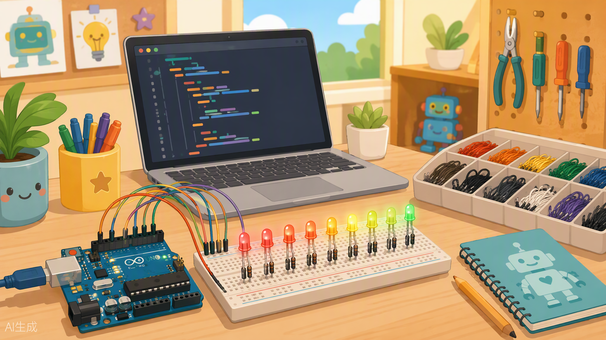
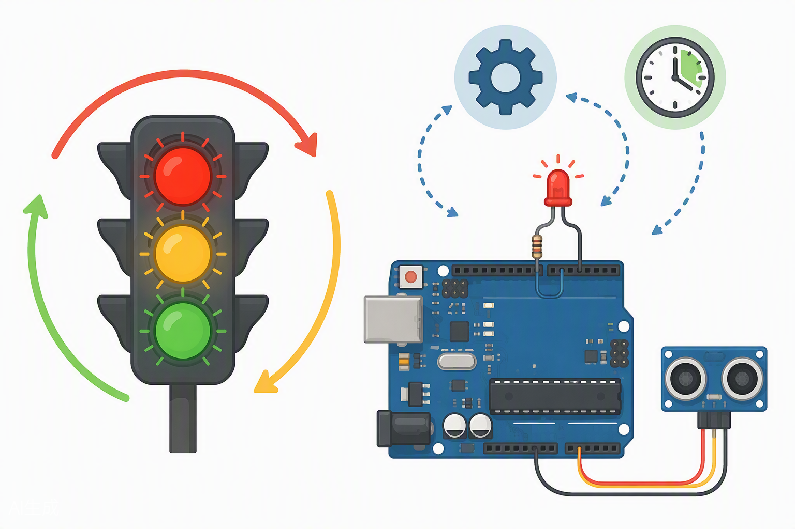

# Arduino avanzado: organiza tu código como un profesional 🧑‍💻



¡Hola de nuevo, maker! 🎉 Mira todo lo que has hecho hasta aquí: encendiste LEDs, leíste botones, moviste un servo, hiciste ruido con el buzzer, mediste distancia con el ultrasonidos y hasta escribiste en la pantalla LCD. Eso ya es muchísimo.

Pero hoy toca una clase distinta. Hoy no vamos a aprender un componente nuevo... vamos a aprender a **programar como los profesionales**. Porque te habrás dado cuenta de algo: tus sketches empiezan a ser largos, se repiten cosas, y a veces tu Arduino parece un cocinero que solo puede hacer UN plato a la vez (¡gracias, `delay()`! 😤).

Hoy vamos a arreglar eso. Al final de la clase tu código será más limpio, más corto y tu Arduino hará **varias cosas "a la vez"**. ¡Vamos allá!

---

## 🎯 Objetivos de la clase

1. Repasar en 5 minutos todo lo aprendido en las clases anteriores.
2. Crear **tus propias funciones** con parámetros y valores de retorno.
3. Usar **arrays** para controlar muchos LEDs con muy poco código.
4. Entender la diferencia entre variables **globales y locales**, y usar `const` y `#define` correctamente.
5. Descubrir el problema de `delay()` y resolverlo con la técnica **`millis()`**.
6. Programar una **máquina de estados** sencilla y usar **interrupciones** con `attachInterrupt()`.
7. Adoptar las **buenas prácticas** de los programadores profesionales.

---

## 🧰 Materiales que usaremos

De tu kit Arduino XL saca esto:

| Componente | Cantidad | Para qué |
|---|---|---|
| Placa Arduino UNO compatible | 1 | El cerebro de todo 🧠 |
| Breadboard | 1 | Nuestro campo de juego |
| LEDs (de varios colores) | 6 | El "coche fantástico" |
| Resistencias 220Ω | 6 | Proteger los LEDs |
| Pulsador | 1 | Interrupciones y proyecto final |
| Potenciómetro | 1 | Leer valores mientras parpadea un LED |
| LED RGB | 1 | Proyecto final |
| Buzzer | 1 | Proyecto final |
| Sensor ultrasónico HC-SR04 | 1 | Proyecto final |
| Cables jumper | Muchos | Como siempre 😄 |
| Cable USB | 1 | Cargar el código y ver el Monitor Serie |

---

## 🧠 Conceptos

### Repaso exprés: ¿qué sabes ya hacer? ⚡

Antes de subir de nivel, mira esta tabla. Si todo te suena, estás listo. Si algo se te escapa, ¡revisa la clase correspondiente!

| Ya sabes... | Función clave | Clase |
|---|---|---|
| Encender y apagar LEDs | `digitalWrite()`, `pinMode()` | Clase 2 |
| Leer botones y sensores digitales | `digitalRead()` | Clase 3 |
| Leer potenciómetros y LDR | `analogRead()` | Clase 4 |
| Brillo con PWM y tonos con el buzzer | `analogWrite()`, `tone()` | Clase 4-5 |
| Medir distancia y mostrar datos | `pulseIn()`, Monitor Serie, LCD | Clase 5-6 |
| Repetir y decidir | `for`, `while`, `if` | Todas 😄 |

Bien. Ahora, a organizar todo eso como un profesional. 👔

---

### 1. Crea tus propias funciones: tus recetas de cocina 🍳

Imagina que cada vez que quieres un bocadillo tienes que explicar: "abre la nevera, saca el pan, corta el pan, saca el queso..." Sería un rollo. En su lugar dices: **"hazme un bocadillo"** y listo. Eso es una función: le das un nombre a un grupo de instrucciones.

Hasta ahora usaste funciones que Arduino ya trae (`digitalWrite`, `tone`...). Hoy crearás las TUYAS:

```cpp
// Una función que hace parpadear un LED las veces y a la velocidad que TÚ digas
void parpadear(int pin, int veces, int velocidad) {
  for (int i = 0; i < veces; i++) {
    digitalWrite(pin, HIGH);   // enciende
    delay(velocidad);          // espera
    digitalWrite(pin, LOW);    // apaga
    delay(velocidad);          // espera
  }
}
```

Las partes importantes:

- **`void`**: es el "tipo de retorno". Significa "esta función no devuelve nada, solo hace cosas".
- **Parámetros** `(int pin, int veces, int velocidad)`: son como los ingredientes que le pasas a la receta. Cada llamada puede ser distinta: `parpadear(13, 3, 200)` → parpadea el pin 13, 3 veces, rápido.
- Las funciones que **sí devuelven algo** usan `return`:

```cpp
// Función que CONVIERTE y DEVUELVE un valor
float aCelsius(int lecturaAnalogica) {
  float voltios = lecturaAnalogica * 5.0 / 1023.0;
  return voltios * 100.0;   // ejemplo con sensor tipo TMP36
}
```

Aquí el tipo de retorno es `float` porque devuelve un número con decimales. Piensa en `return` como el camarero que te trae el plato terminado. 🍽️

---

### 2. Arrays: la caja de huevos de las variables 🥚

Una variable guarda UN dato. Un **array** guarda MUCHOS datos del mismo tipo, numerados desde 0. Es como una caja de huevos: una sola caja, 12 huecos, cada hueco con su número.

```cpp
int pinesLED[] = {4, 5, 6, 7, 8, 9};   // 6 pines en UNA sola variable
int cuantos = 6;

// Encenderlos TODOS con un bucle (¡en vez de escribir 6 líneas!)
for (int i = 0; i < cuantos; i++) {
  pinMode(pinesLED[i], OUTPUT);
}
```

⚠️ **Ojo con el detalle que muerde:** el primer hueco es el número **0**, no el 1. En un array de 6 elementos, las posiciones válidas son `0` a `5`. Si pides la posición 6... Arduino te dará basura y pasarán cosas raras. Es el error favorito de todos los programadores, incluidos los de la NASA. 😅

---

### 3. Variables globales vs locales: ¿dónde vive cada variable? 🏠

```cpp
int contadorGlobal = 0;    // GLOBAL: vive en todo el sketch, todos la ven

void setup() {
  int soloAqui = 5;        // LOCAL: solo existe dentro de setup()
}
```

- **Global** = la pizarra de la clase: todos pueden leerla y escribirla en cualquier momento.
- **Local** = tu cuaderno personal: solo existe mientras estás usándolo (dentro de su función) y luego desaparece.

**Regla de oro:** usa locales siempre que puedas, y globales solo para cosas que varias funciones necesiten compartir (como el pin de un LED o el estado actual de tu programa). Demasiadas globales = caos garantizado.

### 4. `const` y `#define`: los valores que NUNCA cambian 🔒

Hay cosas fijas en tu circuito: el pin del LED, el número de LEDs... Para eso tienes dos opciones:

```cpp
const int PIN_LED = 13;    // OPCIÓN RECOMENDADA: variable que no se puede cambiar
#define VELOCIDAD 200      // OPCIÓN ANTIGUA: el compilador reemplaza el texto
```

| | `const` | `#define` |
|---|---|---|
| Tiene tipo (`int`, `float`...) | ✅ Sí, más seguro | ❌ No, solo texto |
| El IDE detecta errores | ✅ Mejor | ⚠️ Peor |
| Uso recomendado | **Casi siempre** | Cosas muy específicas |

Consejo de profe: usa `const` y déjate de líos. Y fíjate en la costumbre: los `const` y `#define` se escriben en **MAYÚSCULAS** para verlos de un vistazo.

---

### 5. El gran problema de `delay()`... y su solución: `millis()` ⏱️

Aquí viene lo más importante del día. Presta atención. 🚨

`delay(1000)` NO significa "espera 1 segundo". Significa: **"Arduino, congélate y no hagas ABSOLUTAMENTE NADA durante 1 segundo"**. Ni leer botones, ni sensores, nada. Es como si el cocinero, mientras espera a que hierva el agua, se quedara mirando la olla sin poder cortar la cebolla.

**La solución profesional:** la función `millis()`. Devuelve cuántos milisegundos lleva encendido tu Arduino. Es como mirar el reloj de la cocina en vez de quedarte dormido:

> **Analogía del reloj de pared:** quieres hacer algo cada 2 minutos. No te duermes 2 minutos: anotas la hora en un papel y, cada vez que pasas por la cocina, miras el reloj. "¿Ya pasaron 2 minutos desde la última vez? Sí → lo hago y anoto la nueva hora. No → sigo con otras cosas."

En código, ese patrón es SIEMPRE el mismo (memorízalo, es oro puro):

```cpp
unsigned long ultimaVez = 0;         // "la hora que anoté en el papel"
const unsigned long INTERVALO = 500; // cada cuánto quiero hacerlo

void loop() {
  unsigned long ahora = millis();    // miro el reloj

  if (ahora - ultimaVez >= INTERVALO) {  // ¿ya pasó el tiempo?
    ultimaVez = ahora;                   // anoto la nueva hora
    // ... aquí hago mi tarea (por ejemplo, cambiar el LED)
  }

  // ¡Aquí puedo hacer MIL COSAS MÁS mientras tanto! 🎉
}
```

Fíjate en dos detalles:

- Usamos `unsigned long` porque `millis()` devuelve números grandes (hasta ~50 días de milisegundos).
- Restamos (`ahora - ultimaVez`) en vez de comparar directamente: así el código sigue funcionando incluso cuando el contador interno se reinicia.

Con esta técnica tu Arduino hace "dos cosas a la vez": en realidad las hace una tras otra MUY rápido, igual que tú puedes escuchar música y hacer los deberes... bueno, tú más o menos, el Arduino sí de verdad. 😂

---

### 6. Máquinas de estados: piensa como un semáforo 🚦



Un semáforo no piensa. Solo sabe en qué **estado** está (ROJO, AMARILLO o VERDE), qué luces encender en ese estado, y cuándo pasar al siguiente. Eso es una **máquina de estados**: una lista de situaciones posibles y las reglas para saltar entre ellas.

La forma profesional de programarla:

```cpp
// 1. Definimos los estados posibles con nombres claros
enum Estado { ROJO, AMARILLO, VERDE };

// 2. Guardamos el estado actual en una variable global
Estado estadoActual = ROJO;

void loop() {
  switch (estadoActual) {
    case ROJO:
      // encender luz roja, esperar, y luego: estadoActual = VERDE;
      break;
    case AMARILLO:
      // ...
      break;
    case VERDE:
      // ...
      break;
  }
}
```

`enum` es solo una forma elegante de crear "números con nombre": `ROJO` vale 0, `AMARILLO` vale 1, `VERDE` vale 2, pero tu código se lee como un libro. Combinada con `millis()`, la máquina de estados cambia de estado sin congelar el Arduino. 💪

---

### 7. Interrupciones: el timbre de tu casa 🔔

Cuando estás haciendo los deberes y suena el timbre, no esperas a terminar todo para abrir: dejas lo que haces, abres la puerta, y vuelves. Una **interrupción** es exactamente eso: un evento externo (un botón) que hace que Arduino deje TODO lo que esté haciendo (¡incluso un `delay()`!) y ejecute una función especial al instante.

```cpp
const int PIN_BOTON = 2;   // ⚠️ En el UNO solo los pines 2 y 3 aceptan interrupciones

volatile bool timbreSonado = false;  // volatile = "esta variable puede cambiar por sorpresa"

void setup() {
  pinMode(PIN_BOTON, INPUT_PULLUP);
  // Cuando el pin 2 BAJE (FALLING) por pulsar el botón, ejecuta atenderTimbre()
  attachInterrupt(digitalPinToInterrupt(PIN_BOTON), atenderTimbre, FALLING);
}

void atenderTimbre() {
  timbreSonado = true;   // función de interrupción: ¡CORTA y RÁPIDA!
}

void loop() {
  if (timbreSonado) {
    timbreSonado = false;
    // reaccionar al botón aquí, con calma
  }
}
```

Reglas de oro de las interrupciones:

1. La función de interrupción debe ser **rapidísima**: nada de `delay()`, nada de `Serial.print()` largos. Solo anota "pasó algo" y sal.
2. Las variables que compartes con ella deben ser `volatile`.
3. Modos posibles: `RISING` (el pin sube), `FALLING` (el pin baja), `CHANGE` (cambia en cualquier dirección).

Con `INPUT_PULLUP` el botón va conectado entre el pin 2 y GND, sin resistencia externa. ¡Un componente menos! 🎉

---

### 8. Buenas prácticas: el código también se ordena 🧹

Los profesionales no son mejores porque escriban más rápido, sino porque escriben **más claro**:

| Práctica | Mal 😬 | Bien 😎 |
|---|---|---|
| Nombres | `int x = 13;` | `const int PIN_LED = 13;` |
| Comentarios | (ninguno) | `// Lee la distancia en cm cada 100 ms` |
| Indentación | todo pegado a la izquierda | sangría dentro de cada `{ }` (Ctrl+T en el IDE lo hace solo) |
| Versiones | `proyecto_final_final2_AHORA_SI.ino` | `proyecto_v1.ino`, `proyecto_v2.ino`... guarda una copia cada vez que algo funcione |

Tu "yo del futuro" te lo agradecerá cuando retomes el proyecto dentro de un mes y entiendas todo a la primera. 🙏

---

## 💻 Código de ejemplo: la función `parpadear()` en acción

Copia esto en tu IDE y pruébalo con un LED en el pin 13 (¡o usa el LED integrado de la placa!):

```cpp
/*
 * Ejemplo 1: Mi primera función personalizada
 * Hace parpadear un LED con el ritmo que yo decida
 */

const int PIN_LED = 13;   // el LED integrado del UNO

void setup() {
  pinMode(PIN_LED, OUTPUT);
  Serial.begin(9600);
  Serial.println("¡Arrancando el show de luces!");
}

// MI FUNCIÓN: parpadea el pin indicado, tantas veces y tan rápido como le digan
void parpadear(int pin, int veces, int velocidad) {
  for (int i = 0; i < veces; i++) {   // repite "veces" veces
    digitalWrite(pin, HIGH);          // LED encendido
    delay(velocidad);                 // espera encendido
    digitalWrite(pin, LOW);           // LED apagado
    delay(velocidad);                 // espera apagado
  }
}

void loop() {
  Serial.println("Saludo corto: S O S lento");
  parpadear(PIN_LED, 3, 500);   // 3 parpadeos lentos
  delay(1000);

  Serial.println("¡Ahora rapidito!");
  parpadear(PIN_LED, 10, 80);   // 10 parpadeos rapidísimos
  delay(1000);
}
```

¿Ves qué limpio queda el `loop()`? Dos llamadas y todo el "trabajo sucio" vive dentro de la función. Si mañana quieres cambiar cómo parpadea, solo tocas UN sitio. Eso es programar como un profesional. 🧑‍🔧

---

## 🔧 Manos a la obra

### Práctica 1: El "coche fantástico" con un array 🚗💨

Vamos a montar la famosa luz de Kitt, el coche fantástico: 6 LEDs que se encienden de lado a lado como un escáner. Lo haremos con un **array** y un **bucle**, no con 40 líneas repetidas.

**Conexiones (tabla pin a pin):**

| Componente | Conexión |
|---|---|
| LED 1 ánodo (pata larga) | Pin 4 mediante resistencia 220Ω |
| LED 2 ánodo | Pin 5 mediante resistencia 220Ω |
| LED 3 ánodo | Pin 6 mediante resistencia 220Ω |
| LED 4 ánodo | Pin 7 mediante resistencia 220Ω |
| LED 5 ánodo | Pin 8 mediante resistencia 220Ω |
| LED 6 ánodo | Pin 9 mediante resistencia 220Ω |
| Todos los cátodos (pata corta) | Riel GND de la breadboard → GND del Arduino |

💡 Truco: pon los LEDs en fila en la breadboard, todos mirando al mismo lado, como un semáforo acostado.

**El código:**

```cpp
/*
 * Práctica 1: Coche fantástico (Knight Rider)
 * Un array de pines + un bucle = muchos LEDs con poco código
 */

int pinesLED[] = {4, 5, 6, 7, 8, 9};        // nuestro array de pines
const int NUM_LEDS = 6;                     // cuántos LEDs hay
const int VELOCIDAD = 70;                   // milisegundos entre paso y paso

void setup() {
  // Configuramos TODOS los pines con un bucle (¡magia del array!)
  for (int i = 0; i < NUM_LEDS; i++) {
    pinMode(pinesLED[i], OUTPUT);
  }
}

void loop() {
  // Ida: del LED 0 al LED 5
  for (int i = 0; i < NUM_LEDS; i++) {
    digitalWrite(pinesLED[i], HIGH);   // enciendo el LED actual
    delay(VELOCIDAD);
    digitalWrite(pinesLED[i], LOW);    // lo apago antes de seguir
  }
  // Vuelta: del LED 4 al LED 1 (sin repetir los extremos)
  for (int i = NUM_LEDS - 2; i > 0; i--) {
    digitalWrite(pinesLED[i], HIGH);
    delay(VELOCIDAD);
    digitalWrite(pinesLED[i], LOW);
  }
}
```

**¿Qué debería pasar?** La luz viaja de un extremo al otro y vuelve, una y otra vez, como el escáner rojo de Kitt. 🔴

**¿No funciona? Checklist de rescate:**

- ¿Nada enciende? → Revisa que los ánodos van al pin y los cátodos a GND (los LEDs solo funcionan en un sentido).
- ¿Un LED no enciende pero los demás sí? → Ese LED está al revés o la resistencia está en un agujero equivocado.
- ¿Se encienden varios a la vez o de forma rara? → Seguramente escribiste mal el array o un cable toca la fila vecina.
- ¿Va lentísimo o rapidísimo? → Cambia `VELOCIDAD`. ¡Esa es la gracia de usar constantes!

---

### Práctica 2: Dos cosas a la vez con `millis()` ⏱️🎛️

Ahora el gran salto. Un LED parpadeando solo **mientras** el Arduino lee el potenciómetro y muestra su valor por el Monitor Serie. Con `delay()` esto sería imposible sin que todo se congele. Con `millis()`, es pan comido.

**Conexiones:**

| Componente | Conexión |
|---|---|
| LED ánodo | Pin 13 mediante resistencia 220Ω (o usa el LED integrado) |
| LED cátodo | GND |
| Potenciómetro extremo 1 | 5V |
| Potenciómetro extremo 2 | GND |
| Potenciómetro pin central | A0 |

**El código:**

```cpp
/*
 * Práctica 2: Parpadear SIN delay() mientras leo un sensor
 * La técnica millis(): mirar el reloj en vez de dormirse
 */

const int PIN_LED = 13;
const int PIN_POT = A0;

// Variables para el parpadeo (globales porque el loop las usa siempre)
unsigned long ultimoCambio = 0;      // cuándo cambié el LED por última vez
const unsigned long INTERVALO = 500; // parpadea cada 500 ms
bool ledEncendido = false;           // estado actual del LED

// Variables para la lectura del sensor (¡con SU PROPIO reloj!)
unsigned long ultimaLectura = 0;
const unsigned long CADA_CUANTO_LEO = 200;  // leo el potenciómetro cada 200 ms

void setup() {
  pinMode(PIN_LED, OUTPUT);
  Serial.begin(9600);
  Serial.println("LED parpadeando + sensor leyendo. ¡A la vez!");
}

void loop() {
  unsigned long ahora = millis();   // miro el reloj UNA vez por vuelta

  // TAREA 1: el parpadeo del LED (su propio temporizador)
  if (ahora - ultimoCambio >= INTERVALO) {
    ultimoCambio = ahora;            // anoto la hora
    ledEncendido = !ledEncendido;    // invierto el estado (truquito con !)
    digitalWrite(PIN_LED, ledEncendido);
  }

  // TAREA 2: leer el potenciómetro (su propio temporizador, independiente)
  if (ahora - ultimaLectura >= CADA_CUANTO_LEO) {
    ultimaLectura = ahora;
    int valor = analogRead(PIN_POT);
    Serial.print("Potenciómetro: ");
    Serial.println(valor);
  }

  // El loop gira miles de veces por segundo atendiendo a las dos tareas 🌀
}
```

**¿Qué debería pasar?** Abre el Monitor Serie (9600 baudios). El LED parpadea a ritmo constante **y** los valores del potenciómetro se actualizan sin interrumpir el parpadeo. Gira el potenciómetro: los números cambian y el LED ni se inmuta. ¡Eso es multitarea, baby! 😎

**¿No funciona?**

- ¿El LED no parpadea? → ¿Usaste `unsigned long` para los tiempos? Con `int` los números grandes se desbordan.
- ¿No salen números en el Monitor Serie? → Revisa que está a 9600 baudios, igual que el `Serial.begin()`.
- ¿Los números bailan mucho? → Normal, es el ruido eléctrico. Prueba a imprimir solo cuando el valor cambie más de 5.

---

### Práctica 3 (final): Alarma de proximidad con 3 componentes coordinados 🚨

El plato fuerte: combinamos **sensor ultrasónico + LED RGB + buzzer**, todo coordinado con `millis()` (¡sin un solo `delay()`!). Cuanto más cerca esté tu mano, más rápido pita el buzzer y más cambia el color del LED RGB.

**Conexiones:**

| Componente | Pin/componente | Conexión |
|---|---|---|
| HC-SR04 VCC | → | 5V |
| HC-SR04 GND | → | GND |
| HC-SR04 TRIG | → | Pin 11 |
| HC-SR04 ECHO | → | Pin 12 |
| LED RGB pata R | → | Pin 6 mediante resistencia 220Ω |
| LED RGB pata G | → | Pin 5 mediante resistencia 220Ω |
| LED RGB pata B | → | Pin 3 mediante resistencia 220Ω |
| LED RGB pata larga (cátodo común) | → | GND |
| Buzzer + | → | Pin 8 |
| Buzzer − | → | GND |

**El código:**

```cpp
/*
 * Práctica final: Alarma de proximidad
 * HC-SR04 + LED RGB + buzzer, TODO con millis(), CERO delay()
 */

// ---- Pines (constantes en MAYÚSCULAS, como mandan las buenas prácticas) ----
const int PIN_TRIG  = 11;
const int PIN_ECHO  = 12;
const int PIN_R = 6, PIN_G = 5, PIN_B = 3;   // LED RGB (pines PWM)
const int PIN_BUZZER = 8;

// ---- Estados y temporizadores ----
unsigned long ultimaMedida = 0;        // cuándo medí distancia por última vez
unsigned long ultimoBip = 0;           // cuándo pité por última vez
bool pitando = false;

int distancia = 100;                   // última distancia medida (cm)

// ---- MI FUNCIÓN: mide la distancia y la DEVUELVE (return!) ----
int medirDistancia() {
  digitalWrite(PIN_TRIG, LOW);
  delayMicroseconds(2);
  digitalWrite(PIN_TRIG, HIGH);        // disparo el pulso ultrasónico
  delayMicroseconds(10);
  digitalWrite(PIN_TRIG, LOW);
  // pulseIn escucha el eco; 30000 = tiempo máximo de espera en µs
  long duracion = pulseIn(PIN_ECHO, HIGH, 30000);
  if (duracion == 0) return 400;       // sin eco = "muy lejos"
  return duracion / 58;                // convierto tiempo a centímetros
}

// ---- MI FUNCIÓN: pinta el LED RGB según el peligro ----
void pintarAlarma(int dist) {
  if (dist > 50) {        // lejos: verde tranquilo
    analogWrite(PIN_R, 0);   analogWrite(PIN_G, 80);  analogWrite(PIN_B, 0);
  } else if (dist > 20) { // cerca: amarillo aviso
    analogWrite(PIN_R, 120); analogWrite(PIN_G, 60);  analogWrite(PIN_B, 0);
  } else {                // ¡MUY cerca!: rojo pánico
    analogWrite(PIN_R, 255); analogWrite(PIN_G, 0);   analogWrite(PIN_B, 0);
  }
}

void setup() {
  pinMode(PIN_TRIG, OUTPUT);
  pinMode(PIN_ECHO, INPUT);
  pinMode(PIN_R, OUTPUT);
  pinMode(PIN_G, OUTPUT);
  pinMode(PIN_B, OUTPUT);
  pinMode(PIN_BUZZER, OUTPUT);
  Serial.begin(9600);
}

void loop() {
  unsigned long ahora = millis();

  // TAREA 1: medir la distancia cada 60 ms
  if (ahora - ultimaMedida >= 60) {
    ultimaMedida = ahora;
    distancia = medirDistancia();
    pintarAlarma(distancia);
    Serial.println(distancia);
  }

  // TAREA 2: pitar más rápido cuanto más cerca (¡intervalo variable!)
  // map convierte la distancia (5..100 cm) en pausa entre bips (80..800 ms)
  int pausaBip = map(constrain(distancia, 5, 100), 5, 100, 80, 800);

  if (ahora - ultimoBip >= (unsigned long)pausaBip) {
    ultimoBip = ahora;
    pitando = !pitando;
    if (pitando && distancia < 100) {
      tone(PIN_BUZZER, 1200);    // empieza el bip
    } else {
      noTone(PIN_BUZZER);        // para el bip
    }
  }
}
```

**¿Qué debería pasar?** Acerca la mano al sensor: el LED pasa de verde → amarillo → rojo y los pitidos se aceleran como el radar de marcha atrás de un coche. Aleja la mano: todo se calma. Y no hay NI UN `delay()`: las tres cosas están coordinadas con el reloj. 🎯

**¿No funciona?**

- ¿Distancia siempre 400 o 0? → Revisa TRIG y ECHO (fácil cruzarlos) y que el sensor apunta a algo sólido.
- ¿El RGB muestra colores raros? → Quizá tu RGB es de ánodo común (pata larga a 5V). Pregunta y adaptamos los valores (se invierten: 255 = apagado).
- ¿El buzzer suena continuo? → Revisa que la pata va al pin 8 y no directo a 5V (si no, sonará siempre 😅).

---

## 🚀 Retos

### Reto 1 (fácil): Coche fantástico con estrella fugaz 🌠
Modifica la Práctica 1 para que, en vez de encender solo un LED, quede una "cola": el LED actual brilla fuerte y el anterior se queda encendido un momento más antes de apagarse. Pista: no apagues el LED inmediatamente; apágalo un paso después.

### Reto 2 (medio): Semáforo real con máquina de estados 🚦
Monta un semáforo con 3 LEDs (rojo, amarillo, verde) programado como máquina de estados con `enum`, `switch` y `millis()`: verde 4 segundos → amarillo 1 segundo → rojo 4 segundos → repetir. Regla: prohibido usar `delay()`. Bonus: añade un segundo semáforo (otros 3 LEDs) que funcione al contrario, como en un cruce real.

### Reto 3 (difícil): Botón con superpoderes ⚡
Añade a la Práctica 3 un pulsador en el pin 2 con **interrupción**: al pulsarlo, la alarma se "desactiva/activa" al instante (modo silencio), aunque el Arduino esté en medio de cualquier tarea. Usa `volatile` para la variable de estado y no olvides `INPUT_PULLUP`. ¿Notas que responde AL INSTANTE? Eso es la magia de las interrupciones.

---

## 📝 Mini-quiz

1. ¿Qué palabra clave usa una función para devolver un valor, y qué ponemos como tipo de retorno si NO devuelve nada?
2. En el array `int pines[] = {4, 5, 6, 7, 8, 9};`, ¿en qué posición está el número 7? ¿Por qué `pines[6]` es un error?
3. ¿Por qué `delay()` impide que tu Arduino haga dos cosas a la vez? Explica la alternativa con tus palabras.
4. En la técnica de `millis()`, ¿para qué sirve la variable `ultimaVez` y por qué debe ser `unsigned long`?
5. En el UNO, ¿qué dos pines aceptan interrupciones y qué significa que una variable sea `volatile`?

<details>
<summary>✅ Respuestas (pincha para verlas después de pensar)</summary>

1. Usa `return` para devolver el valor. Si no devuelve nada, el tipo de retorno es `void`.
2. El 7 está en la posición **3** (las posiciones empiezan en 0). `pines[6]` es un error porque el array tiene 6 elementos (posiciones 0 a 5); acceder a la 6 lee memoria fuera del array y da valores basura.
3. Porque `delay()` congela el procesador por completo: no ejecuta ninguna otra línea mientras espera. La alternativa es `millis()`: consultar el "reloj" en cada vuelta del loop y actuar solo cuando haya pasado el tiempo deseado, dejando que el loop siga atendiendo otras tareas.
4. `ultimaVez` guarda el momento (en milisegundos) en que se ejecutó la tarea por última vez, para compararlo con `millis()` y saber si ya tocó otra vez. Debe ser `unsigned long` porque `millis()` crece muchísimo (hasta ~49 días) y un `int` se desbordaría enseguida.
5. Los pines **2 y 3**. `volatile` indica que la variable puede cambiar en cualquier momento desde una interrupción, así que el compilador no debe hacer suposiciones ni optimizaciones sobre su valor.

</details>

---

## 🏠 Para la casa

1. **Refactoriza un sketch viejo:** coge cualquier proyecto de las clases 2 a 6 que tenga código repetido y reescríbelo creando al menos **dos funciones propias** (una con parámetros y otra con `return`). Cambia los números "mágicos" por constantes `const` en mayúsculas. Compara cuántas líneas tenías antes y ahora: te sorprenderás.
2. **Diario de versiones:** crea una carpeta `mis-proyectos` y guarda ahí tu mejor sketch con el nombre `nombre_v1.ino`. Cada mejora que hagas, guárdala como `v2`, `v3`... y escribe al principio de cada archivo un comentario con la fecha y qué cambiaste. Así trabajan los equipos de verdad (luego usan herramientas como Git, pero la idea es la misma). 📁

---

## ⏭️ En la próxima clase...

En la **Clase 08**, la última del curso, reclutaremos a un aliado muy especial: la **inteligencia artificial**. Conocerás **Gemini**, el asistente de Google, y aprenderás a usarlo como copiloto para programar Arduino: pedirle código, encontrar errores y conseguir ideas. Pero ojo, con una regla de oro: la IA copilota, tú pilotas. Y con todo lo aprendido (más tu nuevo copiloto) te lanzarás al **Proyecto Final**: un invento tuyo, diseñado, construido y presentado por ti. Trae tus ideas locas: las vamos a convertir en realidad. 🤖✈️

---

*¡Nos vemos en la próxima clase, futuro ingeniero! Recuerda: el código limpio es como un cuarto ordenado — encuentras todo a la primera y tu madre (y tu profe) están orgullosos.* 😄
