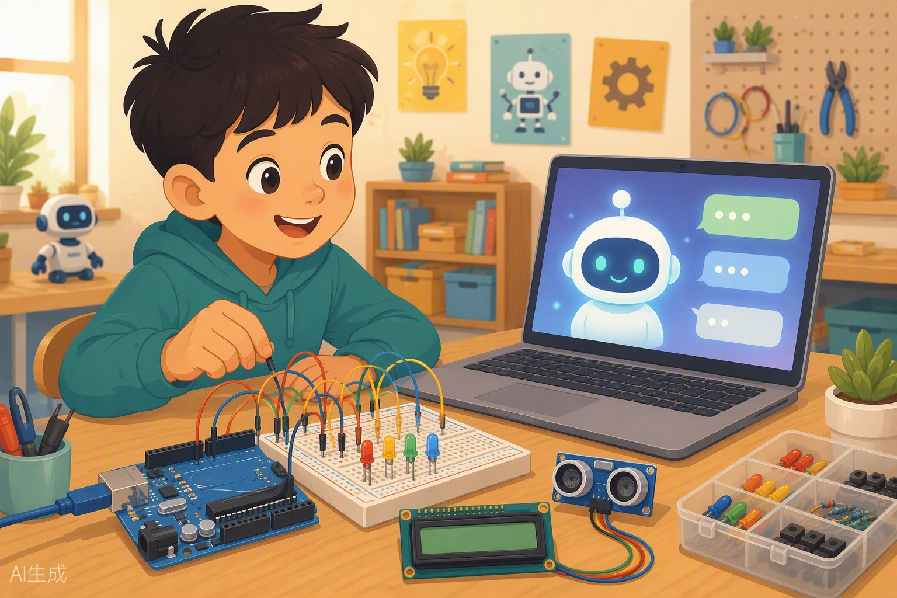

# Programar con IA: Gemini como tu copiloto + Proyecto Final 🚁



¡Llegamos a la última clase del curso, capitanes! 🎉 Y la vamos a cerrar por todo lo alto: hoy aprenderás a usar la inteligencia artificial como tu copiloto de programación y, además, construirás tu **Proyecto Final**, ese invento que demostrará todo lo que has aprendido desde que encendiste tu primer LED. Sí, vas a combinar cerebro humano + cerebro artificial + Arduino. Prepárate, que hoy la clase huele a futuro. ⚡

---

## 🎯 Objetivos de la clase

Al terminar esta clase serás capaz de:

1. Explicar con tus palabras qué es la IA generativa y qué es Gemini.
2. Escribir **prompts buenos** para pedirle a la IA código de Arduino que realmente funcione.
3. Analizar, corregir y probar código generado por IA (porque sí, a veces se equivoca 😅).
4. Usar la IA como detective para entender y resolver errores del compilador.
5. Diseñar, construir y presentar tu **Proyecto Final** del curso.

---

## 🧰 Materiales que usaremos

- Placa Arduino UNO (compatible) + cable USB
- Breadboard y cables dupont
- LEDs (varios colores) y resistencias de 220Ω
- Pulsadores y resistencias de 10kΩ
- Potenciómetro
- LED RGB
- Buzzer (zumbador)
- Pantalla LCD 16x2
- Sensor ultrasónico HC-SR04
- Sensor DHT11 (temperatura y humedad)
- **Un ordenador con conexión a internet** (hoy es una herramienta más del kit 🌐)
- Papel y lápiz (sí, en serio: el diseño empieza en papel ✏️)

---

## 🧠 Conceptos

### 🤖 ¿Qué es la IA generativa?

Imagina que tienes un amigo que ha leído **millones** de libros, tutoriales, foros y códigos de programación. No entiende el mundo como tú (nunca ha quemado un LED por ponerlo sin resistencia 😂), pero es increíblemente bueno encontrando patrones y escribiendo texto y código que "suenan" correctos.

Eso es la **IA generativa**: un programa entrenado con montañas de texto que puede *generar* respuestas nuevas: explicaciones, historias, traducciones y, lo que nos interesa hoy, **código de Arduino**.

### 💬 ¿Qué es Gemini?

**Gemini** es el chat de IA de Google. Es gratuito y lo usas desde el navegador en 👉 **gemini.google.com** (necesitas una cuenta de Google; pide permiso a un adulto si hace falta). Funciona como una conversación: tú escribes una pregunta o petición (eso se llama **prompt**) y Gemini responde. Puedes seguir la conversación, pedir cambios, aclaraciones... como hablar con un compañero muy empollón que nunca se cansa.

### 🛠️ ¿En qué puede ayudarte la IA con Arduino?

| Tarea | Ejemplo de lo que puedes pedirle |
|---|---|
| ✍️ Generar código | "Escríbeme un sketch que parpadee un LED en el pin 13" |
| 📖 Explicar código | "Explícame línea a línea este código, tengo 12 años" |
| 🐞 Encontrar errores | "El compilador me da este error: ... ¿qué significa?" |
| 💡 Ideas de proyectos | "Dame 5 ideas de proyectos con un sensor ultrasónico" |
| 🔌 Ayuda con conexiones | "¿Cómo conecto un pulsador al pin 2 con resistencia pull-down?" |

### 👑 La regla de oro: la IA es copiloto, TÚ eres el piloto


Fíjate en la imagen: el robot copiloto señala el mapa, pero **quien agarra los mandos eres tú**. Esta es la idea más importante de toda la clase:

> 🥇 **REGLA DE ORO:** La IA propone, tú dispones. Nunca copies código sin leerlo, entenderlo y probarlo.

¿Por qué? Porque la IA **a veces se equivoca**. Y no se equivoca poco: puede inventarse pines que no existen, olvidar una resistencia, confundir `INPUT` con `OUTPUT`, o darte un código que compila pero no hace lo que pediste. La IA no tiene tu placa delante; tú sí. Si el código huele raro, huele raro, aunque lo haya escrito un robot muy listo. 🤖👃

**Checklist del piloto** (úsela SIEMPRE con código generado por IA):

- ✅ ¿Los pines del código coinciden con mis conexiones reales?
- ✅ ¿Entiendo qué hace cada bloque del código?
- ✅ ¿Compila sin errores?
- ✅ ¿Hace lo que pedí cuando lo pruebo en la placa?
- ✅ ¿Hay algo peligroso (LED sin resistencia, cortocircuito)?

### ✍️ Cómo escribir buenos prompts para Arduino

Un prompt es como una receta que le das a un cocinero. Si le dices "hazme comida", puede traerte cualquier cosa. Si le dices "hazme una tortilla de patatas para dos personas, sin cebolla, en sartén antiadherente", acertará mucho más.

Un buen prompt de Arduino incluye **siempre**:

1. 🟦 **La placa:** Arduino UNO
2. 🔌 **Los componentes:** qué sensores/actuadores usas
3. 📍 **Los pines:** dónde está conectado cada cosa
4. 🎬 **El comportamiento:** qué debe hacer exactamente, paso a paso

**❌ Prompt malo:**

```
hazme un código con un led y un botón
```

¿Por qué es malo? No dice la placa, ni los pines, ni qué debe pasar al pulsar. La IA adivinará... y adivinando es como se queman LEDs.

**✅ Prompt bueno:**

```
Tengo un Arduino UNO. Conecté un LED rojo al pin 8 con una resistencia
de 220 ohmios y un pulsador al pin 2 con resistencia pull-down de 10k.
Escribe un sketch comentado en español que haga esto: mientras mantengo
pulsado el botón, el LED parpadea rápido (cada 200 ms); cuando lo suelto,
el LED se apaga del todo. Explícame el código línea a línea al final.
```

¿Ves la diferencia? El prompt bueno no deja nada a la imaginación. Y encima le pide que te **explique** el código: así aprendes el doble. 🧠💪

### ⚖️ Ética y uso responsable de la IA

Hablemos en serio un momento (prometo que poco):

- **La IA es para aprender, no para fingir.** Si le pides a la IA que haga tu tarea entera y la entregas sin entenderla, te engañas a ti mismo. En el examen de la vida (y en el Proyecto Final de hoy) la IA no podrá sostener el soldador por ti. 😉
- **Di cuándo la usaste.** Si Gemini te ayudó con una parte de tu proyecto, menciónalo. Los ingenieros de verdad documentan sus herramientas; es honesto y profesional.
- **Verifica siempre.** La IA puede dar datos equivocados con muchísima seguridad. Confía... pero comprueba.
- **Tus datos importan.** No pegues contraseñas, direcciones ni datos personales en ningún chat de IA.

Usada bien, la IA es como tener un profesor disponible a las 11 de la noche. Usada mal, es como copiar los deberes de alguien que a veces suspende. Tú eliges. 😎

---

## 💻 Código

### Ejemplo 1: lo que la IA te puede dar (con un fallo típico 🐛)

Imagina que usaste el prompt bueno de arriba y la IA te responde algo así. Ojo: **este código tiene un error típico de la IA** que encontraremos en la Práctica 1. ¿Lo ves ya?

```cpp
// === CÓDIGO GENERADO POR IA (¡contiene un error a propósito!) ===
const int PIN_BOTON = 2;      // pulsador en el pin 2
const int PIN_LED = 8;        // LED rojo en el pin 8 (con resistencia 220Ω)

void setup() {
  pinMode(PIN_BOTON, INPUT);  // el botón es una entrada
  pinMode(PIN_LED, OUTPUT);   // el LED es una salida
}

void loop() {
  if (digitalRead(PIN_BOTON) == HIGH) {   // ¿botón pulsado?
    digitalWrite(PIN_LED, HIGH);          // enciende
    delay(200);                           // espera 200 ms
    digitalWrite(PIN_LED, LOW);           // apaga
    delay(200);                           // espera 200 ms
  } else {
    digitalWrite(PIN_LED, HIGH);          // <-- 🐛 ERROR: debería ser LOW
  }
}
```

### Ejemplo 2: la versión corregida por el piloto (tú ✈️)

```cpp
// === VERSIÓN CORREGIDA: parpadea solo mientras pulsas ===
const int PIN_BOTON = 2;      // pulsador en el pin 2
const int PIN_LED = 8;        // LED rojo en el pin 8 (con resistencia 220Ω)

void setup() {
  pinMode(PIN_BOTON, INPUT);  // el botón es una entrada
  pinMode(PIN_LED, OUTPUT);   // el LED es una salida
}

void loop() {
  if (digitalRead(PIN_BOTON) == HIGH) {   // ¿botón pulsado?
    digitalWrite(PIN_LED, HIGH);          // enciende el LED
    delay(200);                           // espera 200 milisegundos
    digitalWrite(PIN_LED, LOW);           // apaga el LED
    delay(200);                           // espera 200 milisegundos
  } else {
    digitalWrite(PIN_LED, LOW);           // ✅ CORREGIDO: botón suelto = LED apagado
  }
}
```

### Ejemplo 3: código con error de compilación (para la Práctica 2 🔍)

Este sketch **NO compila a propósito**. Lo usaremos para practicar la depuración asistida por IA. Cópialo tal cual en el IDE durante la práctica:

```cpp
// === CÓDIGO CON ERROR DE COMPILACIÓN (no lo corrijas todavía) ===
const int PIN_LED = 13        // 🐛 aquí falta algo... ¿ves qué?

void setup() {
  pinMode(PIN_LED, OUTPUT);
  Serial.begin(9600);
}

void loop() {
  digitalWrite(PIN_LED, HIGH);
  Serial.println("LED encendido");
  delay(500);
  digitalWrite(PIN_LED, LOW);
  Serial.println("LED apagado");
  delay(500);
}
```

---

## 🔧 Manos a la obra

### 🔨 Práctica 1: El ciclo completo piloto-copiloto

**Misión:** pedirle a Gemini un código, analizarlo, corregirlo y probarlo en la placa. ¡El ciclo completo!

**Paso 1 — Conecta el circuito** (antes de tocar la IA, ¡primero el hardware!):

| Componente | Conexión |
|---|---|
| LED rojo ánodo (pata larga) | Pin 8 mediante resistencia de 220Ω |
| LED rojo cátodo (pata corta) | GND |
| Pulsador (un lado) | Pin 2 |
| Pulsador (otro lado) | 5V |
| Resistencia 10kΩ (pull-down) | Entre el pin 2 y GND |

**Paso 2 — Escribe tu prompt.** Abre gemini.google.com y escribe el "prompt bueno" de la sección de conceptos (el del LED rojo en pin 8 y pulsador en pin 2). Personalízalo si quieres.

**Paso 3 — Analiza la respuesta.** Antes de copiar nada, usa la **checklist del piloto**: ¿los pines coinciden con tu circuito? ¿entiendes cada línea? Si hay algo que no entiendes, pregúntale: *"¿qué hace exactamente la línea X?"*

**Paso 4 — Caza el error.** La IA puede darte un código como el del Ejemplo 1, donde al soltar el botón el LED **se queda encendido** en vez de apagarse. Compáralo con lo que pediste. ¿Está bien? ¡Tú mandas! Corrígelo (Ejemplo 2).

**Paso 5 — Carga y prueba.** Sube el código corregido a tu placa.

**✅ Qué debería pasar:** con el botón suelto, el LED está apagado. Al mantenerlo pulsado, parpadea rápido (5 veces por segundo).

**🚑 Si no funciona:**

- El LED no enciende nunca → revisa la polaridad del LED y la resistencia de 220Ω.
- El LED parpadea solo, sin pulsar → probablemente te falta la resistencia pull-down de 10kΩ (el pin "flota" y lee valores locos).
- Compila pero hace otra cosa → vuelve a la checklist: ¿el código dice lo mismo que tu circuito?
- La IA te dio un código muy distinto → ¡normal! Cada respuesta es un poco diferente. Por eso el piloto eres tú.

---

### 🔨 Práctica 2: Depuración asistida — el detective y su ayudante

**Misión:** pegarle a Gemini un error del compilador y entender su respuesta.

**Paso 1 — Provoca el error.** Copia el **Ejemplo 3** tal cual en el IDE de Arduino y dale a "Verificar" (✓). Verás un mensaje rojo parecido a:

```
error: expected ',' or ';' before 'void'
```

**Paso 2 — Pregunta a la IA.** Copia el código completo + el mensaje de error y pégalo en Gemini con este prompt:

```
Tengo este código de Arduino UNO y el compilador me da este error:
[pega aquí el mensaje de error]
Código:
[pega aquí el código]
¿Qué significa el error y cómo lo arreglo? Explícalo para un niño de 12 años.
```

**Paso 3 — Entiende la respuesta.** Gemini debería decirte algo como: "te falta un punto y coma `;` al final de la línea `const int PIN_LED = 13`". Fíjate en el truco: el compilador se queja de la línea `void setup()` pero el error real está en la línea **anterior**. Los compiladores son así de dramáticos. 🎭

**Paso 4 — Corrige y verifica.** Añade el `;` y verifica de nuevo. Debería compilar.

**Paso 5 — Prueba en la placa.** Cárgalo: el LED integrado del pin 13 parpadeará y el Monitor Serie (9600 baudios) mostrará "LED encendido" / "LED apagado".

**✅ Qué debería pasar:** compilación limpia, LED parpadeando cada medio segundo y mensajes en el Monitor Serie.

**🚑 Si no funciona:** si el Monitor Serie muestra jeroglíficos, revisa que esté a **9600 baudios**. Si la respuesta de la IA te confunde, pídele: *"explícalo más fácil, con un ejemplo"*.

---

### 🏆 PROYECTO FINAL DEL CURSO: "Mi primer invento con copiloto"

Ha llegado el momento, inventor. Vas a crear tu propio proyecto, de principio a fin. Las reglas del juego:

**Paso 1 — Elige tu proyecto** (o propón uno tú con mi aprobación):

| Proyecto | Componentes principales | Dificultad |
|---|---|---|
| 🌡️ Estación meteorológica | DHT11 + LCD 16x2 | ⭐⭐ |
| 🚨 Alarma de proximidad | HC-SR04 + buzzer + LED | ⭐⭐ |
| 💡 Lámpara inteligente | LED RGB + LDR + potenciómetro | ⭐⭐ |
| 🎹 Piano electrónico | Buzzer + 4 pulsadores | ⭐ |
| 🚗 Semáforo inteligente | LEDs + HC-SR04 | ⭐⭐⭐ |

**Paso 2 — Diseña en papel tu prototipo mínimo.** Dibuja el circuito, lista los pines que usarás y escribe en 3 frases qué hará tu invento. Regla: el prototipo mínimo debe funcionar con UNA sola función principal (primero que funcione, luego que brille ✨).

**Paso 3 — Pide ayuda a Gemini.** Escribe un prompt bueno (placa + componentes + pines + comportamiento). Guarda la conversación: forma parte de tu documentación.

**Paso 4 — Construye y prueba.** Monta el circuito, carga el código, aplica la checklist del piloto, corrige lo que haga falta. Itera: prueba → falla → pregunta → corrige → prueba. Eso ES ingeniería.

**Paso 5 — Preséntalo.** 3 minutos por inventor: qué hace, demo en vivo, qué le pediste a la IA, qué se equivocó la IA y cómo lo arreglaste tú. ¡Esa última parte es la más valiosa!

**📊 Rúbrica de evaluación (sobre 20 puntos):**

| Criterio | Puntos | ¿Qué valoro? |
|---|---|---|
| 🔌 Funcionamiento | 6 | El proyecto hace lo prometido en la demo |
| 🧠 Comprensión | 4 | Explicas TU código sin leerlo como un loro |
| ✍️ Calidad del prompt | 4 | Prompt completo: placa, pines, componentes, comportamiento |
| 📐 Diseño en papel | 3 | Esquema claro y prototipo mínimo bien pensado |
| 🎤 Presentación | 3 | Claridad, entusiasmo y "qué aprendí de los errores de la IA" |

---

## 🚀 Retos

1. **Reto bronce 🥉:** pídele a Gemini que mejore el código de la Práctica 1 para que, al soltar el botón, en vez de apagarse del todo, el LED parpadee lento (cada 1 segundo). Prueba el resultado y verifica que funciona como pediste.
2. **Reto plata 🥈:** pídele un sketch que use el potenciómetro en A0 para controlar la velocidad de parpadeo del LED del pin 8. Antes de cargarlo, escribe en tu cuaderno qué crees que hará cada línea. ¿Acertaste?
3. **Reto oro 🥇 — "Atrapa a la IA":** pídele a Gemini un código para el sensor ultrasónico HC-SR04 que encienda un LED si hay algo a menos de 20 cm. Léelo con lupa buscando errores (pines confundidos, unidades, lógica invertida...). Cada error que encuentres y corrijas vale un punto extra en la rúbrica. 🕵️

---

## 📝 Mini-quiz

1. ¿Qué es un "prompt"?
2. ¿Cuáles son los 4 ingredientes de un buen prompt para Arduino?
3. ¿Cuál es la regla de oro al usar IA para programar?
4. El compilador dice "error: expected ';' before 'void'" en la línea de `void setup()`. ¿Dónde está probablemente el error real?
5. Menciona dos formas honestas de usar la IA en tus estudios.

<details>
<summary>👉 Ver respuestas</summary>

1. El texto que le escribes a la IA con tu pregunta o petición. Es tu "receta" para el cocinero.
2. La placa (Arduino UNO), los componentes, los pines de conexión y el comportamiento exacto que debe tener el programa.
3. La IA es el copiloto, tú eres el piloto: hay que leer, entender y probar todo lo que genera, porque a veces se equivoca.
4. En la línea anterior (falta el `;` al final de la declaración anterior). Los compiladores a menudo señalan la línea siguiente al error real.
5. Por ejemplo: usarla para entender conceptos y errores (no para copiar tareas enteras), y reconocer/documentar cuándo te ayudó en un proyecto. También vale: verificar siempre sus respuestas.

</details>

---

## 🏠 Para la casa

1. **Entrevista a tu copiloto:** pídele a Gemini que te explique 3 diferencias entre Arduino UNO y ESP32 "como si tuvieras 12 años". Escribe en tu cuaderno, con tus palabras, lo que entendiste. La próxima vez que nos veamos, me lo cuentas.
2. **Mejora tu Proyecto Final:** añade UNA función extra a tu invento (un LED de aviso, un mensaje en el LCD, un sonido...). Usa el ciclo completo: prompt bueno → analizar → corregir → probar. Trae el resultado funcionando... o los errores que encontraste por el camino (que también cuentan 🐞).

---

## ⏭️ Y ahora... ¿qué sigue?

Esta ha sido la última clase del curso, pero tu viaje maker acaba de despegar. 🚀 Los próximos pasos naturales: el **ESP32** (un Arduino con WiFi y Bluetooth incorporado, para que tus inventos hablen con internet), el mundo **IoT** (casas y ciudades inteligentes), la **impresión 3D** (para fabricar las carcasas de tus proyectos) y, por supuesto, seguir soldando y construyendo. Tienes el kit, tienes el criterio, tienes un copiloto de IA... y sobre todo, tienes las ganas. Ha sido un placer ser tu profesor. ¡Nos vemos en los próximos inventos, piloto! ✈️👨‍✈️
